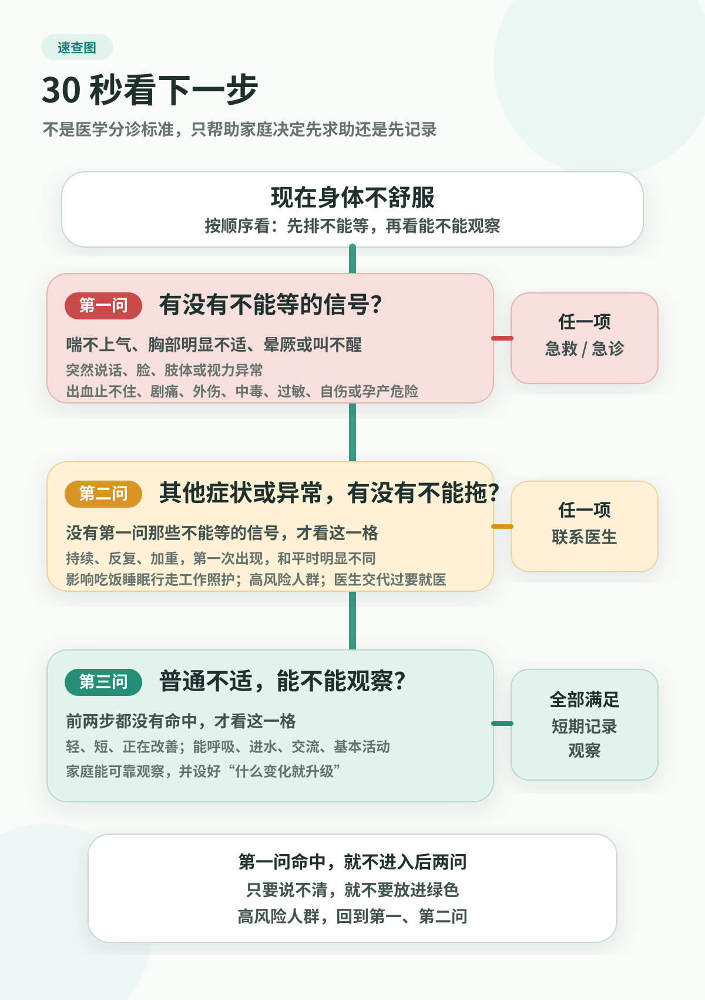

# Medical Boundaries and Warning Signs 中文验收页

本页是英文页面的中文验收辅助，翻译/回译英文读者版内容，不是中文版源稿。

第一章 · 身体在说什么：从信号到指标

# 1. 危险信号：先分急缓，不要先搜病名

> 本页不是医疗建议。它不能替代诊断、治疗、用药决定、停药决定、筛查决定或急救判断。出现胸痛、晕厥、卒中症状、严重疼痛、异常出血、呼吸困难、自伤风险、自杀风险或其他危险信号时，请及时就医或联系当地急救服务。

真正让家庭不安的时刻，常常不是已经确诊的病，而是那些没有人知道算不算严重的时刻。

父亲说胸口紧一阵，后来又好了。母亲突然头晕、说话含糊。伴侣连续几天情绪崩溃，开始说“我不想活了”。产后家人胸闷、头痛或出血。老人摔了一跤，坚持说没事。孩子高热后反应变慢。

这些时刻最危险的问题不是“不懂医学”，而是把问题放错层级：该急救时上网搜索，该找医生时习惯性拖延，该记录复查时又被放大成灾难。

普通人不需要诊断自己或家人，也不应该这么做。你真正需要的是边界感：哪些不能等，哪些需要及时临床判断，哪些可以记录、复查并带去沟通。

如果你已经面对一个具体症状，想直接看下一步动作表，可以先用 [Symptom Action Guide](../handbook/playbooks/symptom-action-guide.md)。本章解释它背后的边界原则。

## 家庭为什么会犹豫

第一种犹豫，是把“症状轻”当成“风险低”。有些心梗、卒中或严重感染早期并不戏剧化，尤其在老人、糖尿病患者、孕产期人群或已有慢病的人身上。

第二种犹豫，是把“症状消失”当成“问题消失”。短暂说话含糊、单侧无力、胸痛胸闷反复出现，即使一时好转，也可能仍然需要及时医学评估。

第三种犹豫，是把搜索结果当成分诊工具。搜索会同时给你最轻和最重的可能，但它不知道这个人的年龄、基础病、用药、生命体征、检查结果和现场变化。

第四种犹豫，是把关心变成争论。家庭常常在“要不要去医院”上拉扯太久。危险信号出现时，家庭规则应该简单：先求助，再讨论。

## 三层边界：红色、黄色、绿色

可以先把健康问题分成三层行动：红色是急救或紧急照护，黄色是及时联系临床人员，绿色是记录和复查。

这三层不是诊断。它们是行动优先级。只要红色信号出现，或你无法判断等待是否安全，就不要因为“看起来没那么严重”或“刚刚又好了一点”而降级到绿色。

### 红色：急救或紧急照护

这一层的关键词是：可能危及生命、可能造成不可逆损害、正在快速加重，或你无法确定等待是安全的。遇到这类情况，不要把本书、搜索结果、短视频或亲友经验当作照护方案。请及时联系当地急救服务或进入急诊系统。

在美国，常见急症入口包括 911 和 emergency department；有些时间敏感但相对不那么严重的问题可能适合 urgent care，心理健康危机可联系 988。Poison Control 可以帮助处理中毒暴露指导，但严重症状仍需急救服务。美国以外地区，请使用所在地急救电话、危机热线和急诊系统。

先记住几类入口信号：

- 胸痛、胸口发紧、胸部压迫感，尤其伴气短、冷汗、恶心、头晕，或疼痛放射到手臂、背部、颈部、下颌或上腹部；
- 突然脸歪、单侧肢体无力或麻木、说话含糊、理解困难、视力改变、走路困难、严重眩晕或突发剧烈头痛，即使后来缓解也不要自行降级；
- 突然失去反应、呼吸异常、明显意识改变、叫不醒、抽搐后恢复不好、严重呼吸困难、嘴唇发紫，或喉咙/胸口紧到喘不过气；
- 无法控制的出血、呕血、咳血、黑便、大量便血、突发剧烈疼痛、严重过敏、严重外伤、中毒、溺水、触电或烧伤；
- 明确表达自伤、自杀或伤害他人的想法，已经采取相关行动，或家庭无法保证现场安全；
- 孕期或产后一年内出现持续或加重的剧烈头痛、视物异常、晕厥、胸痛、呼吸困难、严重腹痛、明显出血、胎动明显减少，或伤害自己/婴儿的念头；
- 感染后整个人明显变差，例如明显糊涂、反应变慢、呼吸急促、皮肤湿冷、极度疼痛或不适、心跳很快、脉搏弱、状态迅速下降，需要警惕严重感染或脓毒症风险。

这不是完整清单。更完整的红色速查在 [Red Flags](../handbook/playbooks/red-flags.md)。如果想按胸痛、发热、腹痛、跌倒、情绪崩溃等常见情况分层，使用 [Symptom Action Guide](../handbook/playbooks/symptom-action-guide.md)。先建立一个习惯：只要你觉得“这个人可能撑不到明天”“路上可能变坏”“我无法安全搬动或观察”，就不要靠继续阅读来决定。

### 黄色：尽快联系临床人员

这一层的关键词是：不一定是急症，但需要临床判断，不能自己解释过去。

例如：

- 症状持续存在、反复出现或逐渐加重；
- 体检或检查结果明显异常，尤其和既往相比差异很大；
- 新出现神经系统问题，例如麻木、无力、记忆明显下降、走路不稳或反复跌倒；
- 心悸、胸部不适、气短或疲劳反复出现，但未达到红色急症线；
- 睡眠、情绪、焦虑或抑郁持续影响工作、学习、照护或关系；
- 用药后明显不适、疑似副作用，或不知道几种药能不能一起用；
- 老年人跌倒、食欲或体重明显变化、认知变化或日常功能下降；
- 慢病指标反复异常，或家庭不知道怎样复查、记录和长期随访。

这一层的正确动作不是“找到答案”，而是“准备信息，安排临床判断”。记录症状时间线、既往病史、用药、过敏、检查结果和最想问的问题，然后联系 primary care、门诊、护士热线、urgent-care triage、telehealth、专科办公室或其他本地医疗入口。

### 绿色：记录和复查

这一层的关键词是：暂时稳定、没有危险信号，记录可以提高下一次沟通质量。

例如：

- 体检报告有轻度异常，但没有危险信号，需要理解趋势和复查安排；
- 血压、血糖、体重、睡眠、活动或其他长期指标需要持续跟踪；
- 偶发轻微不适，没有快速加重，可以记录时间、诱因、持续多久和什么有帮助；
- 想和医生讨论筛查、疫苗、生活方式或慢病管理，但当前没有急症。

记录和复查不是拖延。它的价值是把模糊感受变成临床人员能使用的信息，也让家庭不被单次指标或单次症状牵着走。

但绿色不是永久状态，也不是“我们可以自己处理”的保证。绿色通常需要同时满足：没有红色危险信号；不是婴幼儿、孕产期人群、老人、免疫低下者或有严重基础病的人；症状轻、短暂、正在改善；当事人能呼吸、饮水、交流并完成基本活动。只要症状加重、反复、不改善，发生在高风险人群身上，或家人明显觉得“不对劲”，就应升级到黄色或红色。

## 先约定家庭规则：红色信号不争论

每个家庭都应先定一个简单规则：红色危险信号不争论。

这条规则不需要争吵。它可以放在一张共同看的图里。家人按顺序读：先排除不能等，再看不能拖，最后才讨论能不能短期观察。

<figure class="book-figure">
  
</figure>

图里的绿色只表示短期记录观察可能合理，不代表“安全”。高风险人群、原因说不清、家人强烈觉得不对劲，都要回到前两个问题。

家庭成员真正需要协作的，不是谁更懂医学，而是分工：谁联系急救，谁带证件和资料，谁记录症状开始时间，谁照看孩子或老人，谁准备药物和过敏信息。

## 就医前最有用的信息

如果情况允许，去急诊或门诊前尽量准备这些信息：

- 症状什么时候开始，是否突然出现；
- 症状怎样变化，是否越来越重，是否反复出现；
- 是否有胸痛、呼吸困难、意识改变、单侧无力、异常出血、自伤风险等危险信号；
- 既往诊断、手术史和过敏史；
- 正在使用的处方药、非处方药、补剂和草药；
- 最近检查结果、体检报告、影像或出院小结；
- 这次最希望临床人员帮助回答的 1-3 个问题。

如果疑似卒中，尽量记下症状最早出现的时间。如果是心理健康危机，不要让当事人独处，并及时联系专业危机支持或急救服务。

## 今天就能准备好的三件事

把所在地急救电话、附近急诊、常用医院或门诊、primary care 入口、危机热线和心理健康支持热线写进家庭紧急信息页。

给每个家庭成员做一份最小医疗信息：慢病、过敏、长期用药、重大病史和紧急联系人。

在家庭群里约定一句话：红色触发器不争论，先求助。

然后把 [Red Flags](../handbook/playbooks/red-flags.md) 放在家庭健康档案首页，把 [Symptom Action Guide](../handbook/playbooks/symptom-action-guide.md) 留给那些“不像急症，但又不知道该不该等”的时刻。

## 公开资料

截至 2026-06-28，本章主要使用以下资料校准危险信号边界：

- American Heart Association: [Heart Attack, Stroke and Cardiac Arrest Symptoms](https://www.heart.org/en/about-us/heart-attack-and-stroke-symptoms)
- NHLBI/NIH: [Heart Attack Symptoms](https://www.nhlbi.nih.gov/health/heart-attack/symptoms)
- CDC: [Signs and Symptoms of Stroke](https://www.cdc.gov/stroke/signs-symptoms/index.html)
- MedlinePlus: [Recognizing medical emergencies](https://medlineplus.gov/ency/article/001927.htm)
- SAMHSA: [988 Suicide & Crisis Lifeline](https://www.samhsa.gov/find-help/988)
- CDC HEAR HER Campaign: [Urgent Maternal Warning Signs and Symptoms](https://www.cdc.gov/hearher/maternal-warning-signs/index.html)
- CDC: [About Sepsis](https://www.cdc.gov/sepsis/about/index.html)
- Poison Control: [Poison Control](https://www.poison.org/)

更多来源登记见 [source registry](../references/source-registry.md)。本书的证据规则见 [evidence policy](../references/README.md)。

这些资料用于校准“什么时候阅读和观察已经不够”。它们不应被改写成自我诊断表，也不能替代当地急救、急诊或临床分诊。

## 小结

- 普通人最重要的任务不是诊断，而是分清急救红线、及时临床照护和记录复查。
- 症状轻、症状好转，或搜索结果看起来不吓人，都不能自动说明风险低。
- 红色危险信号出现时，不争论，先求助。
- 黄色情况需要准备信息和临床判断。
- 绿色记录不是拖延，而是让下一次沟通更清楚。

Health Youpu 的第一课，不是学会自己给自己看病，而是知道什么时候不该再只靠自己。

---

## 阅读导航

- [回到英文主书目录验收页](README.md)
- 上一章：[Start Here 中文验收页](00-start-here.md)
- 下一章：[Healthspan 中文验收页](part-1-healthspan-risk-and-markers/healthspan-and-risk-curve.md)
