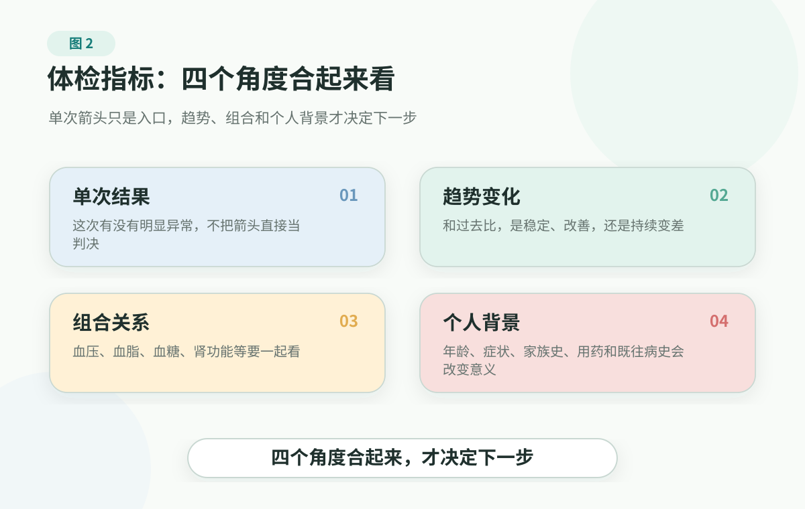

# Checkup Markers Are Risk Language 中文验收页

对应英文页：[Checkup Markers Are Risk Language](../../../../en/book/part-1-healthspan-risk-and-markers/checkup-markers.md)

本页是英文页面的中文验收辅助，翻译/回译英文读者版内容，不是中文版源稿。

# 3. 体检指标：不是判决书，而是风险语言

> 本页不是医疗建议。体检报告、化验结果、筛查结果和影像提示，需要由临床人员结合症状、病史、体征、既往结果和其他检查判断。不要根据本页自行诊断、改药、停药或推迟就医。

对很多家庭来说，体检报告是第一次真正看见风险曲线的地方。

第一反应往往不是阅读，而是截图。图片发到家庭群里，红箭头像警报。有人搜索缩写，有人问“严重吗”，有人安慰“去年也差不多”，也有人把没有箭头的一页当成通关证明。

但报告通常没有回答最让人焦虑的问题：下一步做什么？

一个红箭头可能只是一次波动，也可能是长期风险的早期信号；看起来正常的一页，也不能解释胸痛、晕厥、突然说话不清，或持续消瘦乏力。报告给的是线索，不是最终判决。它需要和症状、年龄、家族史、既往病、用药、生活方式和过去几次结果放在一起，才真正有用。

所以拿到报告后，不要先逐个搜索缩写。没有危险症状时，第一问不是“哪个箭头最吓人”，而是这些数字是不是在讲同一件事。

指标不是判决书，而是风险语言。关键不是一个箭头，而是它出现在什么人身上，持续多久，和哪些指标一起出现，会改变什么行动。

<figure class="book-figure">
  
</figure>

## 先看组合，后看箭头

体检报告里最常见的箭头，大多可以先归到几条风险线。

| 风险线 | 常见指标 | 先看哪一页 |
|---|---|---|
| 心血管和代谢 | 血压、血脂、血糖、A1C、尿酸、体重、腰围 | [Blood pressure](../../../../en/handbook/playbooks/common-checkup-markers.md#blood-pressure)、[lipids](../../../../en/handbook/playbooks/common-checkup-markers.md#blood-lipids)、[glucose/A1C](../../../../en/handbook/playbooks/common-checkup-markers.md#blood-glucose-a1c)、[uric acid](../../../../en/handbook/playbooks/common-checkup-markers.md#uric-acid) |
| 肾脏 | 肌酐、eGFR、尿蛋白、尿白蛋白、尿潜血 | [Kidney function and urine tests](../../../../en/handbook/playbooks/common-checkup-markers.md#kidney-urine) |
| 肝胆和药物安全 | ALT、AST、胆红素、白蛋白、脂肪肝提示 | [Liver function](../../../../en/handbook/playbooks/common-checkup-markers.md#liver-function) |
| 血液和感染线索 | 白细胞、血红蛋白、血小板和相关 CBC 指标 | [Blood count](../../../../en/handbook/playbooks/common-checkup-markers.md#blood-count) |
| 癌症筛查和影像 | 乳腺、宫颈、结直肠、肺癌高风险筛查、结节、肿瘤标志物 | [Tumor markers and imaging findings](../../../../en/handbook/playbooks/common-checkup-markers.md#tumor-imaging)，筛查选择看 [Before A Checkup](../../../../en/handbook/playbooks/checkup-planning-guide.md) |

真正值得注意的，经常不是“一个箭头”，而是“几条风险线同时指向同一个方向”。

例如：

- 血压高 + 血脂异常：不只是少盐少油，而是心梗、卒中和肾脏风险；
- 血糖边缘 + 腰围增加 + 甘油三酯升高：不只是有没有糖尿病，而是代谢系统可能已经变紧；
- 尿酸高 + 血压高 + 肾功能边缘：不只是海鲜啤酒，而是肾脏清除、体重、饮酒和用药要一起看；
- 糖尿病 + 血压或血脂异常：不只是控糖，而是心血管、肾脏、眼底、神经和足部并发症都要预防。

一个更容易记住的画面是：两个人同时在家庭群里晒体检报告。

第一个人只有一项血脂轻微超出参考范围，红箭头很醒目，于是全家都盯着那一项。第二个人报告看起来没那么吓人，但年龄更大，血压、血糖、腰围、吸烟史和家族史都在同一个方向上累积。对临床人员来说，第二个人未必更轻。真正要讨论的不是谁的箭头更红，而是谁的整体风险更高，过去几年是不是在变坏，下一步需要记录、复查、临床沟通还是进一步评估。

血糖也类似。一次空腹血糖正常，不等于整个糖代谢没有压力；一次偏高，也不能脱离前一天饮食、睡眠、感染、压力、用药和既往结果就下诊断。报告是一个窗口，不是整部电影。

如果这些组合反复出现，不要只在家庭群里讨论“吃什么能降”。更好的动作是把它们放进 [Chronic Marker Log](../../../../en/handbook/templates/family-health-record.md#_2-chronic-marker-log)，带着趋势去复诊。

## 30 秒先分三类

先分三类：

- **急事：** 有胸痛、卒中样症状、严重呼吸困难、晕厥、意识改变、异常出血、严重疼痛、自伤风险等危险信号时，报告正常也不能等。
- **门诊或复查事：** 明显异常、持续异常、成组异常，适合整理资料后问临床人员。
- **记录观察事：** 单次轻微异常，先看是不是第一次、近期背景有没有变化、过去结果是否也这样。

这一步的目的，是先把情绪降下来。报告一出来，人最容易在两个极端之间摆动：要么觉得自己完了，要么觉得没有箭头就彻底没事。先分三类，能让你知道哪些要马上处理，哪些交给医生，哪些先变成记录。

危险信号看 [Red Flags](../../../../en/handbook/playbooks/red-flags.md)。具体症状下一步看 [Symptom Action Guide](../../../../en/handbook/playbooks/symptom-action-guide.md)。如果只是报告看不懂，再往下读。

## 拿到报告后的 20 分钟

拿到报告后，不需要马上把每个缩写都查一遍。先用 20 分钟做一件事：把报告整理成临床人员能理解、家人也能看懂的几条线索。

第一，先看有没有危险信号。有胸痛、卒中样症状、严重气短、晕厥、意识改变、异常出血、严重疼痛或自伤风险时，报告正常也不能等。

第二，标出异常项目，但不要立刻下诊断。先看它是第一次出现，还是过去 1-3 次一直这样。

第三，看它是一个指标，还是一组指标。血压、血脂、血糖、尿酸、体重腰围、肾功能常常要一起看。

第四，写下近期背景。熬夜、饮酒、感染、剧烈运动、脱水、经期、孕产、压力、药物或补剂，都可能影响结果解释。

第五，只准备三个问题：这代表什么风险？多久复查？什么情况需要提前就医？

这些动作不是让你自己当医生，而是让报告从“吓人的数字”变成“能带去门诊讨论的信息”。

一份有用的报告整理可以很短：

```text
Main abnormalities this time: two lipid markers abnormal, waist increased.

Prior similar results from the last 1-3 reports: slightly high last year, more obvious this year.

Recent context: less sleep, less exercise, weight gain; no chest pain, shortness of breath, or other emergency signs.

Questions for the clinician: What risk do these changes mainly suggest? When should I repeat tests? What should make me seek care earlier?
```

这不是让普通人替临床人员判断，而是把零散数字整理成一段能被医生快速理解的背景。

## 最容易踩的六个坑

1. **把参考范围当疾病边界。** 参考范围不是绝对健康线。不同实验室、检测方法、人群背景和个人情况，都会影响解释。范围外不一定等于疾病；范围内也不等于没有任何风险。
2. **把单次结果当长期趋势。** 一次异常不等于疾病，一次正常也不等于长期没风险。看趋势比看一次箭头更重要。
3. **只盯一个指标。** 血压、血脂、血糖、尿酸、肾功能、体重和腰围常常要看组合。单个数字像一个词，组合起来才更接近一句话。
4. **用体检替代有症状时的就医。** 有症状时，体检不是急诊、门诊或专科评估的替代品。报告正常不能解释胸痛、卒中样症状、严重气短、晕厥、异常出血、严重疼痛或意识改变。
5. **被“全套筛查”带着走。** 很多项目不是越查越好。真正有价值的筛查通常要看目标人群、证据、后续检查路径和个人风险。查出来之后不知道怎么解释、确认或处理的项目，容易带来新的焦虑。
6. **看到异常就乱补乱停药。** 准备开始、停用或更换药物、补剂、草药或治疗时，要问临床人员或药师。报告异常可以成为沟通理由，但不应该变成自己改药、停药或乱补的理由。

## 什么时候不要自己解释

下面这些情况，适合交给临床人员或合格专业人员判断：

- 指标明显异常、持续异常或短期变化很大；
- 多个心血管、代谢或肾功能相关指标一起异常；
- 已经有糖尿病、高血压、心血管病、肾病、癌症、免疫系统疾病或其他重大疾病；
- 儿童、老人、孕期、产后，或正在使用多种药物；
- 体检异常伴随胸痛胸闷、呼吸困难、晕厥、意识改变、单侧无力、言语不清、严重疼痛、异常出血或自伤风险；
- 报告中出现 positive、suspicious、mass、needs further evaluation、specialist follow-up recommended 等表述，而你不知道下一步。

“Positive”“suspicious”“abnormal”也不一定等于最终诊断。它通常意味着需要复查、进一步检查，或结合症状、病史和其他检查解释。

## 下一次体检前，别只问套餐贵不贵

读报告，是体检后的事；选项目，是体检前的事。两件事可以放在同一章，但不是同一个问题。

很多家庭选体检套餐时，会被名字带着走：basic、upgraded、premium、executive、whole-body、deep scan。名字越贵，似乎越接近安全。但体检真正有价值的地方，不是把项目堆满，而是让检查匹配这个人的风险，并且查出问题后有清楚的承接路径。

体检前可以只问三层。

第一层，是基础背景有没有说清楚：身高、体重、腰围、血压、用药、既往病、家族史、生活方式和近期症状。这些背景会影响报告解释。

第二层，是年龄和性别相关筛查是否合适。血压、糖尿病风险、结直肠癌、乳腺癌、宫颈癌、肺癌高风险、骨质疏松等项目，都不适合只看别人查什么。

第三层，是个人风险加项是否真的有理由。有症状、既往病、家族史、长期用药、吸烟、肥胖、职业暴露或慢病时，检查项目要跟着风险走；没有对应风险时，不必把“更贵”和“更安心”画等号。

肿瘤标志物、全身 CT、PET-CT、多癌种早筛血液检测、基因检测等项目，尤其不适合用“越多越安心”理解。它们有各自的使用场景，也有假阳性、过度检查、费用和后续决策成本。

具体怎么选，先看 [Before A Checkup](../../../../en/handbook/playbooks/checkup-planning-guide.md)。这页会把基础项、年龄性别项和个人风险加项拆开讲。

## 细项可以慢慢查

体检指标很多，真正重要的不是把每一项都背下来，而是先掌握读报告的方法：看趋势、看组合、看背景、看行动。

::: tip 下一步工具
- 体检前不知道怎么选项目，看 [Before A Checkup](../../../../en/handbook/playbooks/checkup-planning-guide.md)。
- 已经拿到报告，想查常见指标，看 [Common Checkup Markers](../../../../en/handbook/playbooks/common-checkup-markers.md)。
- 指标需要长期跟踪，用 [Chronic Marker Log](../../../../en/handbook/templates/family-health-record.md#_2-chronic-marker-log)。
:::

先把方法记住，报告就不会只剩一堆箭头。

## 公开资料

以下资料用于校准本章对体检、化验结果、慢病指标和筛查边界的解释。截至 2026-06-28，本章主要参考：

- MedlinePlus: [How to Understand Your Lab Results](https://medlineplus.gov/lab-tests/how-to-understand-your-lab-results/)
- MedlinePlus: [Medical Tests](https://medlineplus.gov/lab-tests)
- USPSTF: [Hypertension in Adults: Screening](https://www.uspreventiveservicestaskforce.org/uspstf/recommendation/hypertension-in-adults-screening)
- USPSTF: [Prediabetes and Type 2 Diabetes: Screening](https://www.uspreventiveservicestaskforce.org/uspstf/recommendation/screening-for-prediabetes-and-type-2-diabetes)
- CDC: [Diabetes Testing](https://www.cdc.gov/diabetes/diabetes-testing/index.html)
- CDC: [About Cholesterol](https://www.cdc.gov/cholesterol/about/index.html)
- CDC: [Cancer Screening Tests](https://www.cdc.gov/cancer/prevention/screening.html)
- NIDDK: [Chronic Kidney Disease Tests & Diagnosis](https://www.niddk.nih.gov/health-information/kidney-disease/chronic-kidney-disease-ckd/tests-diagnosis)
- NCI: [Tumor Markers](https://www.cancer.gov/about-cancer/diagnosis-staging/diagnosis/tumor-markers-fact-sheet)

这些资料帮助理解指标和筛查能做什么、不能做什么，但不能替个人解释报告、诊断疾病、决定用药或设计个体化体检清单。更多来源登记见 [source registry](../../../../../shared/source-registry.md)。本书的证据规则见 [evidence policy](../../../../en/references/README.md)。

## 小结

- 体检指标不是判决书，而是风险语言。
- 拿到报告先看组合，后看箭头。
- 拿到报告后的 20 分钟，先整理危险信号、异常项目、趋势、组合、近期背景和 3 个临床问题。
- 体检项目不是越多越好，要看基础背景、年龄/性别和个人风险。
- 有症状或危险信号时，不要用体检报告替代就医。

下一章开始，我们进入身体主风险线。第一条就是很多报告都会碰到的血压、血脂、血糖和尿酸：代谢健康和“四高”。

---

## 阅读导航

- [回到英文主书目录验收页](../README.md)
- 上一章：[Healthspan 中文验收页](healthspan-and-risk-curve.md)
- 下一章：[Metabolic Health 中文验收页](../part-2-body-risk-map/metabolic-health.md)
