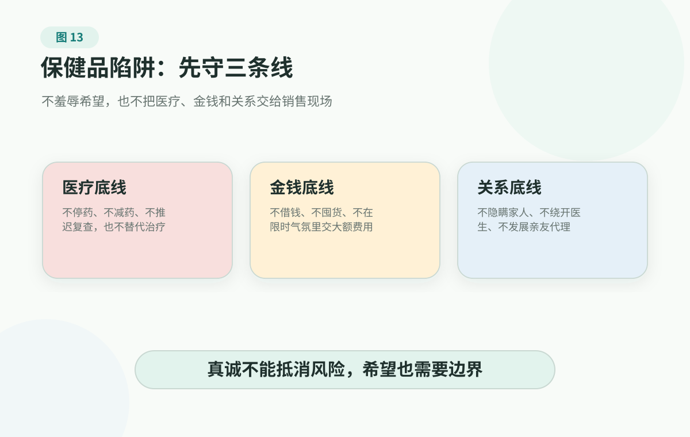

<p class="chapter-subtitle">第四部分 · 不被推着走：健康信息防御</p>

# 1. Supplement Evidence Traps: "Trying It" Is Not Always Harmless 中文验收页

本页是英文页面的中文验收辅助。它翻译/回译的是英文 adaptation，不是《健康有谱》中文版源稿。

> 补剂、草药和膳食产品可能和药物、疾病、手术、孕产期照护以及肝肾功能相互影响。不要用任何产品替代正规诊断、治疗、随访或急救。正在用药、有慢病、准备手术、孕产期、儿童、老人或肝肾功能异常时，先问医生或药师。

当一个家庭开始把事实、边界、下一步和分工放到桌面上，健康购买就更难判断了。

因为进入家里的往往不只是一个产品，而是一种听起来很温和的承诺。

晚饭后，家里有人拿出一个链接、一盒彩色包装，或者一段家庭群转来的视频：这不是药，是支持；不是治病，是维护健康；不是让你停药，只是帮你把底子打好。接着出现很多词：抗氧化、免疫、微循环、肠道菌群、细胞修复、抗衰通路。再配上几个“吃了睡得更好”“指标稳定了”“以前爬楼费劲现在能上楼”的故事，它就不再像粗糙骗局，而像一整套科学解释。

你听得警铃大作，对方却觉得你太冷。你说“别被骗”，对方听成“你又觉得我糊涂”。你说“没有证据”，对方听成“你不让我有希望”。

补剂营销真正厉害的地方，不是让人完全相信它能治病，而是让人觉得：试试大概没坏处，万一有用呢？

产品黑名单解决不了这个问题，也不能替家庭判断某个具体产品是否适合。更常见的问题是：当健康焦虑、希望、熟人推荐和销售系统一起出现时，家庭怎样先挡住风险？

## 它卖的往往不是一瓶东西

很多人买补剂，并不只是相信广告。

有些人长期疲惫，想吃点什么让身体好一点；有些人慢病多年，觉得天天吃药也没有解决根本原因；有些人害怕衰老、癌症或以后成为负担；还有些人很久没有被认真听见，突然有讲师、群主或老朋友每天问候、解释、鼓励，情绪上会觉得被照顾。

所以家庭争论一开始就说“这都是骗局”，通常很难推进。你以为自己在反驳一瓶东西，对方感受到的可能是：你否定了他的担心、希望和选择能力。

但理解这些情绪，不等于放松边界。正因为补剂常常贴着焦虑和希望进入家庭，家人才需要一种不羞辱人、也不放任风险的判断方法。

我见过这样的信任关系陷阱。

一个朋友开始代理某个补剂品牌。最初只是转发链接，说自己吃了睡眠好了、精神好了，家里老人也觉得状态不错。后来她约人吃饭，很真诚地说：这不是推销，只是觉得好东西应该先告诉熟人。再后来，她建议对方买入门套装、进学习群、听线上分享。如果觉得好，也可以一起做代理，“既帮家人，又多一份收入”。

这件事难拒绝，是因为她不是陌生销售。她知道你家有人血脂高、睡不好，也知道你一直担心父母健康。她说的每句话都像关心，但每一步都把人推向购买、入会、囤货和拉亲友。你一质疑，她会受伤：我好心告诉你，你为什么觉得我在骗你？

我不想把所有推荐补剂的人都写成骗子。很多人也许真相信自己在帮别人，甚至已经先说服自己：这是一个好产品，也是一个好机会。但真诚不能抵消风险。只要一个产品开始要求大额付款、长期囤货、发展亲友、绕开医生，或影响治疗和随访，它就不再只是“买点东西试试”，而是家庭需要认真拦一下的风险。

## 先看它把你带到哪里

判断补剂，不要先问“有没有用”。先问一个更朴素的问题：这套话最后想让我做什么？

它可能只是让你买一小瓶营养产品。也可能让你长期订购、办会员、交套餐费、进私域群、听更多课、帮朋友转发、发展亲友做代理。更危险的是，它可能让你越来越怀疑医生、随访、处方药和正规治疗。

同一句“支持免疫”，可能把人带向完全不同的方向。

如果出口只是低价、短期、不过度承诺、不影响就医，它可能只是需要记录的普通消费。如果出口变成“别让医生知道”“药可以慢慢减”“医院只会治标”“优惠名额只剩几个”“你不买就是不重视健康”，它就不再是普通消费，而是在改变家庭健康决策权。

健康消费里最重要的问题不是“这句话有没有一点道理”，而是它会不会把一个人从医生、家人和稳定记录旁边带走，带到销售现场、群体压力和单一产品里。

## 拆开“试试也没坏处”

“试试也没坏处”至少藏着三层风险。

第一，“试试”经常不是一次。

很多补剂项目不是买一次就结束。它先让你体验，再复购、加量、叠加产品、升级套餐。等家里发现时，可能已经不是几美元的小实验，而是一整年的持续支出。

第二，“没坏处”不等于真的安全。

膳食补充剂和药品不是一回事。药品在疾病治疗、疗效和安全性方面要面对更严格的证据和监管要求。补剂通常不是用来治疗疾病的，上市也不等于像药品那样已经被证明对某种疾病安全有效。

天然成分也可能影响凝血、血压、血糖、肝肾功能、麻醉、手术安排或处方药。越是老人、慢病患者、正在用药者、准备手术者、孕期或哺乳期、儿童和癌症治疗期间，越不能把“食品”“天然”“传统”“植物提取”当作安全证明。

第三，“万一有用”忽略了机会成本。

如果一个人因为它推迟随访、减少用药、拒绝检查，或把有限的钱和注意力都投给产品，真正损失的不是那瓶东西，而是本来可以更早做的医疗行动。

补剂最大的风险往往不是“没效果”，而是让人错过真正该做的事。

## 五个常见证据陷阱

第一个陷阱：机制讲得通，不等于人吃了有用。

“抗氧化”“免疫调节”“代谢支持”“修复”“细胞激活”听起来很科学。有时它们确实来自真实研究，也可能是合理的研究线索。

但从一条机制，到证明普通人每天吃某个产品后疾病更少、寿命更长、住院更少、心梗卒中更少、骨折更少或生活质量更好，中间隔着很长一段路。广告最擅长把“值得研究”变成“值得购买”。

第二个陷阱：指标变化不等于健康结局。

有些宣传会说某种成分改善了化验指标，或者让“年龄”“炎症”“活性”“免疫”数字更好看。

但家庭真正关心的不是一个中间数字，而是重要健康结局：能不能减少心梗、卒中、骨折、癌症进展、严重并发症、住院和死亡，能不能改善真实生活功能。

指标可以提示风险，也可以支持研究，但不能自动变成“吃了就更健康”。

第三个陷阱：“有研究”不等于证据足够。

研究有很多种。细胞实验、动物研究、小样本人群研究、观察性研究、随机试验、系统综述，分量完全不同。广告只说“国外研究发现”“某大学证明”“专家团队发表论文”远远不够。

还要问研究对象是谁，吃了什么，剂量多少，吃了多久，看的是感觉、指标还是重要健康结局，有没有对照组，结果能不能重复，风险有没有被认真记录。

多数家庭没有时间读论文，这很正常。所以先记住一句：越接近疾病治疗、用药改变或高价长期消费，证据要求越高。

第四个陷阱：研究里的材料，不等于你买到的产品。

一项研究可能使用特定纯度、剂量、形态和生产条件的成分，研究对象也可能是某种疾病或风险人群。到了货架、直播间或熟人手里，产品可能已经换了配方、剂量、来源、搭配和使用人群。

“某个成分有研究”不等于“这瓶产品有同样效果”。“某类人可能受益”也不等于“你家所有人都适合”。

第五个陷阱：天然不等于安全，安全也不等于值得买。

有些产品即使风险不大，也未必值得长期花钱；有些东西看起来温和，却可能因为药物、手术或慢病而变得重要。

所以不要把问题简化成“有没有毒”。更好的问题是：对我家这个人，放在他已经在用的药、已有疾病、随访计划和家庭经济承受能力里，整体风险是否可控？

## 先守住三条家庭边界

家庭不必一开始就争论“它到底有没有用”。先守三条边界。

<figure class="book-figure">
  
</figure>

守住这三条边界后，很多冲突会更清楚：我们不是要夺走谁的希望，而是不能把医疗决定、家庭积蓄和亲友关系交给销售现场。

## 三个风险等级

- **较低风险：** 价格适中，不替代医疗，不影响用药和随访，没有夸张承诺，使用者也不是老人、儿童、孕产期、慢病患者、复杂用药者或癌症治疗期人群。
- **需要确认：** 只要使用者有慢病、正在用药、年龄较大、准备手术或牙科处理、有肝肾问题、出血风险、孕产期、儿童青少年、癌症治疗或康复期，都不要只凭销售话术判断。
- **高风险：** 要求停药、减药、停检查或推迟治疗；宣称治愈或逆转疾病；使用限时、会员代理、拉人头或投资返利压力；或者告诉你不要问医生。

需要更细核查时，把包装、成分、剂量、购买渠道、价格和使用者健康背景拍下来，再用 [health product checklist](../../handbook/templates/health-product-checklist.md) 逐项看。涉及用药、手术、慢病、孕产期、儿童、老人或癌症治疗时，先问医生或药师。

## 怎样和家人谈

直接说“骗局”通常没用。它会把问题从“产品有没有越界”变成“你是不是看不起我”。

换成冲突更低的说法：

“我不是反对你支持身体。我先想确认它会不会影响现在的药或随访。”

“套餐先不急着付。把成分和说明拍下来，下次问医生或药师。”

“如果只是普通营养支持，我们可以一起看。但如果它说能治病或替代药，就不能按普通食品买。”

“我支持你想舒服一点这个目标。先把高风险部分拦住：不大额付款，不停药，不拉别人一起买。”

谈话目标不是一次就让家人承认自己被骗，而是先制造一个暂停：不大额付款、不改变医疗安排、把信息拿出来一起看。

只要家人愿意停一下，家庭就已经从销售节奏里退出来一步。

## 买之前，先问三个问题

看到一个补剂，不必一上来就查清所有成分、论文和监管名词。先问三个更能守边界的问题。

第一，它会不会替代医疗？只要它暗示可以停药、减药、推迟随访、拒绝检查，或者替代医生、手术、筛查和治疗，就不能按普通消费处理。

第二，它会不会制造长期付费和关系压力？如果它要求办会员、囤套餐、进群听课、做代理、发展亲友，或者用限时名额和恐惧催付款，它就已经不只是“一瓶东西”。

第三，使用者是不是高风险人群？老人、儿童、孕产期、慢病患者、癌症治疗或康复期、肝肾功能异常、出血风险、准备手术或牙科处理、正在使用多种药物的人，都不适合只听销售话术判断。

问完仍不清楚，就不要急着买。健康消费里，能等一等，常常就是最重要的保护。

问医生或药师时，不要只说“我想吃个补剂行不行”。带上产品名称、完整成分、剂量、照片、购买渠道、当前用药和已有疾病。专业人士看到越完整，越容易判断风险。

## 先处理最值得担心的产品

这个月不需要把家里所有补剂都研究一遍。先找出三类最值得担心的：最贵的、承诺最大的、和现有用药关系最不清楚的。

这三类产品最容易造成真正损失：长期花钱，挤掉本该做的随访和治疗，或让家人开始隐瞒、争吵、互相拉扯。把它们的包装、付款记录、推荐来源、正在用的药和已有疾病放在一起看，比把每一瓶都争出真假更有用。

如果家里已经因为补剂争吵，不要从“你被骗了”开始。从这句话开始：

```text
Let's not argue yet about whether it works. First let's confirm that it will not affect medicines, delay follow-up, or cost the family a large amount of money.
```

这句话不完美，但它能把家庭从真假争吵拉回风险控制。

## 参考资料

截至 2026-06-15，本章主要使用 FDA 关于膳食补充剂和健康欺诈的消费者资料、NIH Office of Dietary Supplements 的消费者资料、NCCIH 关于明智使用膳食补充剂的资料，以及 FTC 关于膳食补充剂宣称的资料，来校准补剂和药物区别、补剂风险、健康骗局和购买前判断边界。

这些资料帮助家庭识别补剂证据陷阱和销售话术。它们不应用来判断某个具体人是否适合使用某个具体产品，也不提供用药、停药、替代治疗或个体化筛查建议。

可直接查看：[FDA Dietary Supplements](https://www.fda.gov/food/dietary-supplements)、[FDA Health Fraud Scams](https://www.fda.gov/consumers/health-fraud-scams)、[NIH Office of Dietary Supplements](https://ods.od.nih.gov/factsheets/WYNTK/)、[NCCIH Using Dietary Supplements Wisely](https://www.nccih.nih.gov/health/using-dietary-supplements-wisely)、[FTC Dietary Supplements](https://consumer.ftc.gov/articles/dietary-supplements)、[source registry](../../references/source-registry.md) 和 [evidence policy](../../references/evidence-policy.md)。

## 小结

补剂问题最危险的部分，不只是买错一瓶东西，而是让一个家庭把健康判断交给销售现场。

---

## 阅读导航

- [回到英文主书目录验收页](../README.md)
- 上一章：[4. Elder Care Basics: Protect Daily Independence 中文验收页](../part-3-family-health-os/elder-care-basics.md)
- 下一章：[2. Health Devices, Tests, And Longevity Marketing: Numbers Do Not Automatically Make It Worth Buying 中文验收页](devices-tests-and-longevity-marketing.md)
