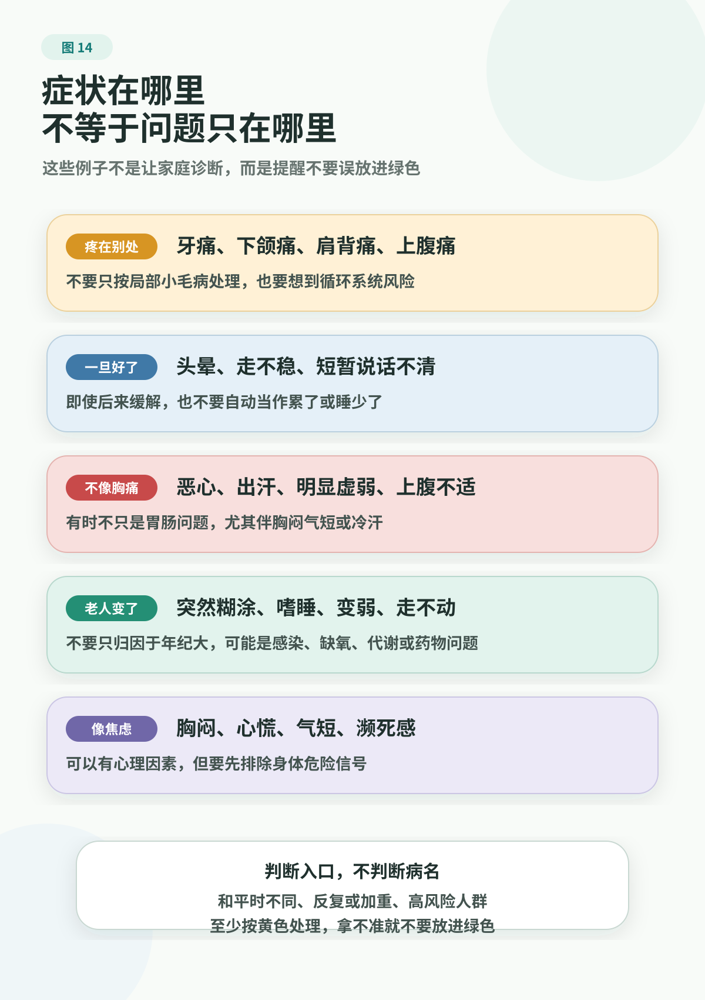

# Red Flags 中文验收页

对应英文页：[Red Flags](../../../../en/handbook/playbooks/red-flags.md)

本页是英文 Red Flags 页的中文回译，用于验收 U.S.-first adaptation；它翻译英文改写稿，不复制中文版源稿。

# 危险信号

> 本页不是诊断表，也不是医疗建议。只要可能是紧急情况，请联系当地急救服务或去急诊。不要为了搜索、问熟人或整理记录而延误。

## 这一页只回答一个问题

这个人现在是否应该进入医疗系统？

它不判断“这是什么病”，也不判断“还能不能再忍一忍”。当一个信号已经足够危险，家庭最重要的动作不是解释，而是求助。

本页只处理红色情况。如果没有明显红旗，但仍想把症状分到下一步行动，请使用 [Symptom Action Guide](../../../../en/handbook/playbooks/symptom-action-guide.md)。

## 家庭短版

可以把下面这段放在家庭群或家庭健康档案最上方：

危险信号：胸痛或胸部发紧；疑似卒中信号，例如突然脸歪、说话含糊、一侧无力或麻木；严重呼吸困难，例如喘不过气、不能完整说话或嘴唇发青；意识改变，例如叫不醒、明显糊涂或反应和平时很不一样；无法控制的出血；突发剧烈疼痛；严重过敏反应；中毒或严重外伤；自伤或自杀风险；孕期或产后危险信号。不要在家庭群投票。不要等到明天。即使症状暂时缓解，也先联系急救、急诊或本地分诊入口确认下一步。

紧急时只做三件事：

1. 先求助：联系当地急救或急诊系统。
2. 记录时间：症状什么时候开始，是否突然出现。
3. 带最小信息：重要疾病、用药、过敏和紧急联系人。

## 30 秒说清

联系急救、急诊分诊或医院入口时，不需要先讲完整病史。先说能帮助判断急缓的事实：

```text
地点：
是谁：年龄、性别、是否孕期/产后、老人、儿童，或有严重基础病
现在发生什么：胸痛 / 呼吸困难 / 叫不醒或非常糊涂 / 出血 / 跌倒 / 中毒 / 自伤风险等
什么时候开始：大概时间，突然出现还是逐渐加重
当前状态：能不能说话、呼吸、站立、喝水，是否越来越差
重要背景：心脏病、卒中、糖尿病、肾病、癌症治疗、抗凝药、过敏
```

如果急救调度、急诊分诊或医院入口给出指示，按当地流程执行。不要挂断电话去等家人回复，也不要为了把记录补全而继续搜索。

## 常见急症：先抓入口信号

下面不是诊断清单，而是家庭最容易漏掉的急症入口。当这些信号出现，优先事项不是给疾病命名，而是尽快进入急诊照护。

### 心梗或严重心脏事件

- 看什么：胸部压迫、挤压、发紧或持续不适；疼痛放射到手臂、肩背、颈部、下颌或上腹部；气短、冷汗、恶心、头晕或无反应。
- 现在做什么：联系急救或急诊；不要让当事人自己开车。

### 卒中或短暂性脑缺血发作

- 看什么：突然脸歪、一侧无力或麻木、说话含糊、理解困难、视力改变、走路不稳、严重头晕或突发剧烈头痛。
- 现在做什么：记录最早出现症状的时间；即使后来好转，也联系急救或急诊。

### 严重感染或脓毒症风险

- 看什么：感染后整个人明显变差，例如明显糊涂、反应变慢、呼吸急促、皮肤湿冷、极度虚弱、尿量显著减少、严重疼痛或快速恶化。
- 现在做什么：老人、慢病患者或免疫低下者尤其要尽快就医或急诊。

### 严重过敏反应

- 看什么：呼吸困难、喉咙发紧、面部或舌头肿胀，或全身风团伴头晕、虚弱、晕厥。
- 现在做什么：联系急救；不要继续等待观察。

### 严重脱水或胃肠道红旗

- 看什么：喝不进或留不住水，尿量明显减少，精神状态变差；呕血、黑便、便血；严重或加重的腹痛。
- 现在做什么：尽快就医或急诊；不要用止痛药或家庭偏方把问题压下去。

### 外伤、中毒或无法控制的出血

- 看什么：头、颈、脊柱损伤；严重外伤；疑似骨折；止不住的出血；中毒；触电；溺水；严重烧伤。
- 现在做什么：先求助；如果可能有头、颈或脊柱损伤，不要随意搬动。

## 容易漏掉的其他红线

有些危险信号不一定看起来像“天塌下来”，但犹豫仍可能错过窗口。

<figure class="book-figure">
  
</figure>

### 好转了，也不要自动降级

反复胸痛或胸部发紧、突然说话含糊、单侧无力后来好转，都不能因为“现在看起来好了”就回到简单观察。先联系急救、急诊或分诊入口确认。

### 心理健康危机

- 明确的自伤、自杀或伤害他人的想法、计划或行为；
- 危险行为，例如告别、赠送物品或寻找工具；
- 严重精神症状，已经无法保证自己或他人的安全。

在美国，可联系 988 获得危机支持；如果存在立即安全风险，联系 911 或去急诊。在其他地区，使用当地危机热线、急救服务或急诊。

### 孕期和产后一年内要更谨慎

孕期和产后一年内，严重头痛、视物变化、胸痛、呼吸困难、严重腹痛、异常出血、胎动明显减少、严重肿胀、晕厥、抽搐、自伤想法，或强烈感觉“很不对劲”，都应及时就医或急诊。

### 没有红旗，但仍不安心

不明原因体重下降、长期发热、反复出血、新出现的肿块、老人跌倒后状态改变、慢病指标持续异常，或新药后明显不适，不一定都需要急诊，但也不该长期拖延。使用 [Symptom Action Guide](../../../../en/handbook/playbooks/symptom-action-guide.md) 分到黄色或绿色；拿不准时按黄色处理，尽快联系医生或分诊入口。

## 急诊最小信息包

进入急诊照护时，不要追求完美记录。尽量带四类信息：

- 发生了什么：症状、开始时间、是否加重；
- 既有疾病：心血管病、糖尿病、肾病、癌症、心理健康问题、孕期/产后等；
- 当前使用：处方药、非处方药、补剂、草药、过敏；
- 联系谁：紧急联系人、常去医院、最近医生或检查。

如果没有时间整理，先求助。记录服务于照护，不应服务于拖延。

如果急救调度、急诊分诊或医院入口给出具体指示，遵循专业判断和当地流程。

## 看完这页，下一步

| 当前情况 | 下一步 |
|---|---|
| 已经出现红旗 | 先联系急救、急诊或本地医疗入口；只带最小信息，不为整理记录拖延 |
| 没有明确红旗，但仍不确定能不能等 | 打开 [Symptom Action Guide](../../../../en/handbook/playbooks/symptom-action-guide.md)，分成红、黄、绿 |
| 准备联系医生或去门诊 | 用 [Doctor Visit Checklist](../../../../en/handbook/playbooks/doctor-visit-checklist.md) 整理症状时间线、用药和问题 |
| 想让家里下次少混乱 | 做一张 [One-Page Family Health Card](../../../../en/handbook/templates/family-health-record.md#_1-one-page-family-health-card) |

## 参考资料

截至 2026-06-15，英文页主要使用：

- American Heart Association: Heart Attack, Stroke and Cardiac Arrest Symptoms
- CDC: Signs and Symptoms of Stroke
- NHLBI/NIH: Heart Attack Symptoms
- MedlinePlus: Recognizing medical emergencies
- CDC: About Sepsis
- CDC HEAR HER Campaign: Urgent Maternal Warning Signs and Symptoms
- SAMHSA: 988 Suicide & Crisis Lifeline
- Poison Control

更多来源条目见 [source registry](../../../../../shared/source-registry.md)。本书的证据规则见 [evidence policy](../../../../en/references/evidence-policy.md)。

## 一句话

红旗出现时，先求助，再解释。
