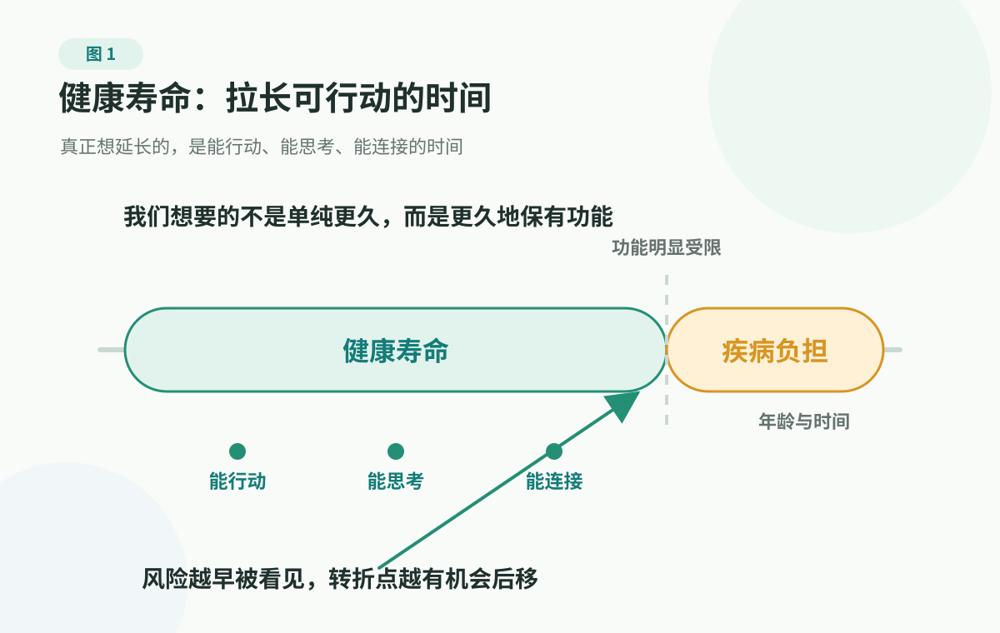

# 2. Healthspan: Who Is Your Body Counting Down For?

> This page is not medical advice. It cannot replace diagnosis, treatment, medication decisions, stopping medication, screening decisions, or emergency judgment. If warning signs appear, seek medical care or contact local emergency services promptly.

## What Are We Actually Trying To Extend?

Warning signs should go to the medical system first. But many health problems do not sound an alarm immediately; they change a person and a family over years or decades.

"Live to 100" sounds like a blessing. At birthdays, when someone says "may you live a long life," everyone smiles. But many families are not mainly afraid of the age number itself.

Someone may say, "What is the point of living that long if the last years are spent unable to move, unable to remember, going to hospitals all the time, suffering yourself and exhausting the kids?" It sounds gloomy, but it is real. What we fear is not a few more years. We fear extra time dominated by bedrest, pain, repeated hospitalizations, cognitive decline, falls and fractures, uncontrolled chronic disease, and family chaos.

At the same time, anti-aging products, longevity drugs, genetic testing, precision checkups, and "reverse-aging" packages keep telling us that the right purchase can win a longer life. When health information multiplies, it is easy to be pulled along.

So the first question is simple: what are we actually trying to extend?

If the goal is only "more years," health information easily turns into anxiety and spending: one day longevity drugs, the next day anti-aging tests, the day after that a new study. But if the goal is "more time when I can act, think, care for myself, and stay connected with family," judgment becomes much clearer.

Do not start by chasing one miracle method, and do not promise lifespan extension. Long-term health is better split into honest lines: how function declines, how major disease risk accumulates, and how the family prepares early.

What is truly worth extending is not age by itself. It is time with movement, thinking, connection, and fewer early interruptions by major illness.

<figure class="book-figure">
  
</figure>

## Where Longevity Talk Goes Wrong

The first distortion is treating lifespan as a trophy. A few more years are precious, of course. But what families really care about is not whether the calendar flips a few more pages; it is whether those pages can still be used: going out, eating, sleeping, expressing one's wishes, and participating in life.

The second distortion is treating "no diagnosis" as "low risk." Many long-term risks do not begin on the day of diagnosis. Blood pressure, lipids, glucose, weight, sleep, physical ability, mood, and social connection may change the risk curve long before a disease name appears.

The third distortion is treating healthspan as a contest of personal willpower. Health is not decided by discipline alone. Genes, age, environment, income, caregiving resources, access to care, work pressure, and family relationships all matter. How much ability a person keeps late in life involves choices, but also environment and luck.

The fourth distortion is outsourcing healthspan to products. Tests, devices, supplements, and medicines each have their place. But if a plan cannot explain whether it improves function, major risk, or family coordination, and only promises "anti-aging," "reverse aging," or "activation," it deserves caution.

Healthspan is not a mysterious package. It is more like a question a family asks in advance: ten or twenty years from now, what daily abilities do we hope we and our parents still have? Which risks are most likely to interrupt those abilities early? Can we prepare records, habits, and communication a little better now?

## The Three Layers Of Healthspan: Function, Risk, Coordination

You can understand healthspan through three layers first.

  <section class="decision-card decision-card-blue">
    
Function

    <h3>Can I still live my own life?</h3>
    
Movement, sleep, memory, expression, social connection, and independent daily living are closer to what families mean by healthspan than "looking young."

  </section>
  <section class="decision-card decision-card-yellow">
    
Risk

    <h3>Can major events be delayed?</h3>
    
Heart attack, stroke, cancer, falls, kidney decline, cognitive decline, and other risks cannot be erased, but records, follow-up, and clinical collaboration can reduce sudden drops.

  </section>
  <section class="decision-card decision-card-green">
    
Coordination

    <h3>Will the family become chaotic at the key moment?</h3>
    
When history, medicines, allergies, reports, visit support, and roles are clearer, delays, omissions, and last-minute arguments decrease.

  </section>

### Layer One: Functional Ability

When the World Health Organization talks about healthy ageing, it emphasizes "functional ability": whether a person can meet basic needs, move around, learn, make decisions, build and maintain relationships, and participate in society.

That is closer to what families really care about than "all markers are normal."

Two 75-year-olds can live very different lives. One can go downstairs to buy groceries, cook a meal, take a bus to see friends, remember medicines, and discuss decisions with family. Another falls once, stays in bed for weeks, loses leg strength, becomes afraid to go out, sleeps worse, and sinks emotionally. There is no moral judgment here, and it does not mean the first person must have done everything right or the second person must have done something wrong. Disease, accidents, environment, and luck are all involved.

The comparison reminds us that healthspan first asks how much reserve the body and brain still have, and whether that reserve can support a person in continuing to live their own life.

So the first healthspan question can become:

- Which daily abilities do I want to keep?
- Which abilities, once lost, would clearly change quality of life?
- What risks are already spending down those abilities early?

For a younger adult, those abilities may be recovery after long workdays, sleep, emotional steadiness, exercise capacity, and attention. For parents, they may be stairs, groceries, cooking, toileting, medicines, going outside, remembering things, seeing, hearing, and staying willing to connect with people. They look ordinary until they are lost; then each one becomes a pillar of life.

### Layer Two: Delaying Major Risks

What many families fear most is not minor discomfort. It is major events: heart attack, stroke, cancer, serious diabetes complications, kidney decline, dementia, severe falls, and long-term disability.

Some of these events contain a lot of randomness and cannot be fully prevented. Others are linked to long-term risk factors, and the curve can sometimes be pushed back through recording, repeat testing, lifestyle work, screening, and clinical collaboration.

That is the point of a risk curve. Risk is not a switch, not 0 today and 1 tomorrow. It is more like a curve shaped over time by age, lifestyle, underlying disease, family history, and environment.

Often, the body changes upstream first: blood vessels take more pressure, the metabolic system struggles more, sleep and recovery weaken, weight and muscle ratio shift, emotional stress never fully turns off, social contact narrows. By the time a disease name appears, the curve may have been moving for a long time.

The goal of long-term health management is not to make risk zero, and not to enslave life to markers. It is to lower the slope when possible, push back turning points, and reduce sudden drops.

For example, a person's blood vessels do not start having problems only at the moment of a heart attack. The body does not first struggle with sugar on the day diabetes is diagnosed. Balance, muscle, and home environment do not suddenly become important only after a parent falls and fractures a bone. The painful part of many health problems is realizing that signals existed years earlier, but the family did not read them as a line.

### Layer Three: Family Coordination

Healthspan is not a solo project.

After an older adult falls, does anyone know their medicines and allergies? When a checkup result is abnormal, are there prior results to compare with? Are parents willing to say how they actually feel? Can adult children turn concern into coordination instead of control? When major illness appears, who handles records, visits, costs, caregiving, and communication?

Family coordination cannot replace clinicians. But it can reduce delays, missing facts, and confusion. Its direction is simple: fewer last-minute scrambles at key moments; the parent's autonomy and clinician judgment remain at the center.

## Modern Life Quietly Rewrites The Risk Curve

Healthspan is difficult not because ordinary people fail to understand common sense, but because modern life itself can move risk earlier.

In the past, many activities were built into life: walking, carrying things, cooking, gardening, climbing slopes, seeing people. Now many people sit most of the day; food is easier to get, tastier, and more calorie-dense; sleep is squeezed by work and phones; stress stays switched on; social life increasingly depends on screens. Activity, recovery, relationships, and rhythm that the body needs are gradually taken away.

A more realistic question than "How can I be more disciplined?" is: is my daily life helping my body keep reserve, or spending that reserve for years?

For parents, activity can be more ordinary than running or going to the gym: walking to buy groceries, cooking, taking a walk after meals, doing some housework, practicing balance and flexibility, and keeping contact with friends are already ways to maintain functional ability. For younger adults, sleep, stress, sitting, weight, smoking, alcohol, exercise, and mood all shape the future curve together.

So whenever you see health advice, first ask whether it can return to function, risk, and action. If it cannot, it may be lively but not very useful for family decisions.

## How The Risk Curve Helps Judgment

When you encounter health advice, a checkup result, or a new product, ask three questions.

First, what function does it protect?  
For example: movement, sleep recovery, cognition, emotional steadiness, vision, hearing, or independent daily living.

Second, which major risk line does it affect?  
For example: metabolic, cardiovascular, brain, cancer, fall, kidney, or mental health crisis risk.

Third, what action will change?  
If a test or product only makes you more anxious but does not change repeat testing, clinical care, lifestyle, or family preparation, its value shrinks.

These three questions pull health information that looks sophisticated back into reality: what exactly does it help?

## Do Not Start With Products. Start With Daily Ability.

Many long-term health decisions are pushed backward from products: first you see a test, device, supplement, course, or checkup package, and then you search for reasons to buy it.

A steadier order goes the other way:

1. first ask which daily abilities you want to keep;
2. then ask which risk lines are most likely to interrupt those abilities;
3. only then ask whether a test, product, or plan will truly change action.

If a plan cannot explain which function it protects, which risk line it affects, and what different decision it will create, it should not become the starting point for family health management, even if it looks advanced.

::: tip Start With The Question, Then Choose The Tool
This does not reject medical tests, devices, medicines, or new technology. They can be important in the right setting. The real issue is order: clarify the question first, then choose the tool. Do not get attracted by a tool first and then invent a problem for it.
:::

## Do A 30-Minute Family Healthspan Check

Every family can try a 30-minute healthspan check.

Do not start with "Should we buy this product?" Start with life goals:

- What daily abilities do parents most want to keep?
- Which two or three risks most need attention over the next year?
- Can the family's checkup reports, medical history, and medicine information be found quickly?
- Which health problems are already affecting sleep, movement, mood, social connection, or caregiving burden?
- Which questions need clinical judgment, and which simply need better family records?

This turns health management from "chasing what is hot" into "protecting the life that actually matters."

If you want to keep the check, start with a light [One-Page Family Health Card](../../handbook/templates/family-health-record.md#_1-one-page-family-health-card): history, medicines, allergies, recent risks, and emergency contacts. Being able to find it matters more than making it complete on day one.

## A Long-Term Frame Cannot Handle Emergencies

Healthspan is a long-term frame. It is not for emergencies.

If chest pain or pressure, stroke-like symptoms, severe breathing trouble, fainting or altered consciousness, uncontrolled bleeding, sudden severe pain, serious injury, poisoning, severe allergic reaction, self-harm or suicide risk, pregnancy/postpartum warning signs, or rapid decline after infection appears, return to [1. Warning Signs: Sort Urgency Before Searching Disease Names](../medical-boundaries.md) or [Red Flags](../../handbook/playbooks/red-flags.md), and prioritize medical care or local emergency services.

If you already have a diagnosed disease, ongoing symptoms, clearly abnormal checkup results, current medication use, or an upcoming screening decision, do not use the broad idea of healthspan as a substitute for clinician advice.

## Public Sources

The following sources calibrate this chapter's frame for healthspan, healthy ageing, and chronic disease risk. As of 2026-06-28, this chapter mainly refers to:

- WHO: [Healthy ageing and functional ability](https://www.who.int/news-room/questions-and-answers/item/healthy-ageing-and-functional-ability)
- CDC: [Healthy Aging at Any Age](https://www.cdc.gov/healthy-aging/about/index.html)
- CDC: [About Chronic Diseases](https://www.cdc.gov/chronic-disease/about/index.html)
- MedlinePlus: [Healthy Aging](https://medlineplus.gov/healthyaging.html)

More source entries are in the [source registry](../../references/source-registry.md). This book's evidence rules are in the [evidence policy](../../references/evidence-policy.md).

## Summary

- What we truly want to extend is not age alone, but time when we can move, think, connect, and participate in life.
- Healthspan can first be read through three layers: functional ability, delayed major risks, and family coordination.
- A risk curve is not a switch, and long-term management is not about making risk zero.
- Modern life quietly rewrites the risk curve, so daily activity, sleep, stress, relationships, and clinical collaboration need to be read together.
- When you meet any health advice, first ask what function it protects, which risk line it affects, and what action changes.
- Emergencies cannot be handled with a long-term frame. When warning signs appear, seek help first.

---

## Reading Navigation

- [Book contents](../README.md)
- Previous chapter: [1. Warning Signs: Sort Urgency Before Searching Disease Names](../medical-boundaries.md)
- Next chapter: [3. Checkup Markers: Not A Verdict, But A Risk Language](checkup-markers.md)
- Related tools: [One-Page Family Health Card](../../handbook/templates/family-health-record.md#_1-one-page-family-health-card)
