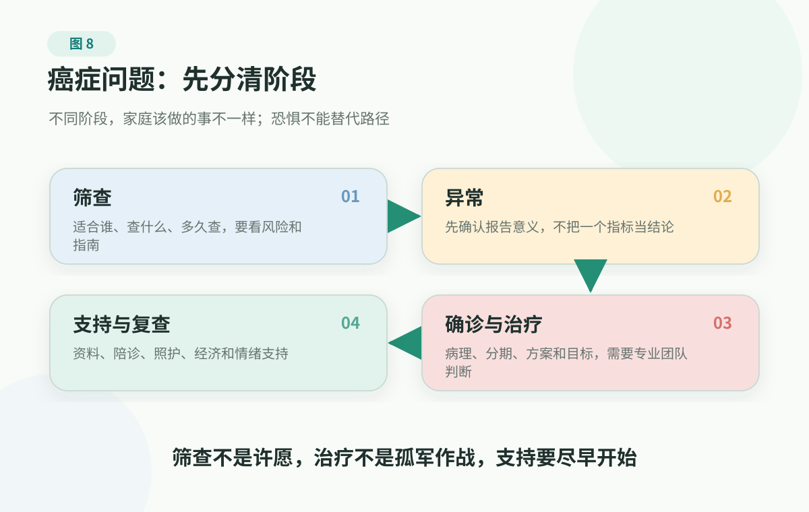

# 6. Cancer And Major Illness: Separate The Stage Before Fear Decides For You

> Cancer screening, diagnosis, staging, treatment, follow-up, and care must be judged by professional medical teams in the context of the individual person. This page helps families understand the problem, prepare records, ask about goals, and keep boundaries. It does not replace medical advice, and it should not be used to delay standard care.

Metabolic, vascular, upstream, sleep, and brain risks often make people think of long-term accumulation. When the topic turns to cancer, many families suddenly feel something different: risk no longer feels like a curve; it feels like a verdict.

On a Friday night, a parent posts a checkup report in the family chat: lung nodule, positive stool blood test, elevated tumor marker, further evaluation recommended. Within minutes, the family has four voices: one person says to do a whole-body scan immediately, one says not to scare everyone, one forwards remedies and "anti-cancer foods," and one starts searching the worst outcome.

The words on the report have not yet been explained by a clinician, but fear has already convened the family meeting.

That fear does not come from nowhere. NCI's 2025 U.S. cancer statistics estimate about 2,041,910 new cancer cases and 618,120 cancer deaths in the United States in 2025, and IARC/GLOBOCAN estimated almost 20 million new cancer cases and 9.7 million cancer deaths worldwide in 2022. Cancer is not distant news. It eventually enters many families through checkup reports, medical records, conversations about relatives and friends, and caregiving roles.

But serious does not mean the only response is panic. Cancer is not a mysterious curse that suddenly falls from the sky. It is more like a long timeline: risk and cellular change come earlier, screening, symptoms, and abnormal reports sit in the middle, and diagnosis, staging, treatment, follow-up, and care come afterward.

When a family faces cancer, the most important task is not to do the most things immediately. It is to first separate the stage: where are we on the timeline now? What is the next step that belongs to this stage?

Cancer is serious, so it cannot be smoothed over with comfort phrases. Precisely because it is serious, it should not be driven by fear, remedies, whole-body testing, or expensive early-detection marketing. The thing to protect is this: connect fear back to the diagnostic pathway and clinician communication, instead of letting fear make family decisions.

## Open The Black Box First

Many people fear cancer first because the word "cancer" is too large.

In daily speech, many things are mixed together: nodule, hyperplasia, tumor, precancerous lesion, malignant tumor, leukemia, lymphoma, metastasis. They all sound frightening, but they are not the same thing.

A tumor is not always cancer. Tumors can be benign or malignant. What makes malignant tumors dangerous is that abnormal cells no longer follow the body's original boundaries: they can invade nearby tissue, and they can travel through blood or lymph to other parts of the body. That process is metastasis. Metastasis is dangerous not only because there are "more lumps," but because it can affect the lungs, liver, bones, brain, digestive tract, blood production, and whole-body energy state, making treatment goals much more complex.

Cancer is hard to treat not because medicine understands nothing about it, but because it has several especially difficult features.

First, cancer cells come from the body itself. Bacteria and viruses are outsiders, and many medicines can use the differences between them and human cells. Cancer cells were originally our own cells, gradually losing control through copying, damage, and evolution. Treatment must attack them while protecting normal tissue as much as possible, so tradeoffs are always present.

Second, cancer is not one disease. "Lung cancer," "breast cancer," and "colon cancer" are only entrances. In actual diagnosis and treatment, clinicians still need pathology type, stage, whether there is spread, molecular features, body condition, and treatment goal. The same disease name can mean very different problems for different people.

Third, cancer changes. After treatment works for a while, sensitive cells may be suppressed while less sensitive cells remain. The disease may stabilize, shrink, recur, or develop resistance. Medical progress is increasingly about identifying these changes, not about one method solving all cancers.

Taken together, these points lead to an important judgment: cancer should neither be mystified nor simplified. It deserves respect, but fear, folk remedies, advertising language, and other people's stories cannot replace professional diagnosis and treatment.

## A Better Model: Put It Back On A Timeline

When facing cancer and major illness, a family can put the problem onto a five-stage timeline.

<figure class="book-figure">
  
</figure>

Separate the stage first, and fear will not compress every problem into one knot.

## Three Common Mistakes

The first mistake is treating screening as diagnosis.

The purpose of screening is to find clues earlier in specific groups of people who do not have symptoms. An abnormal screening result does not mean cancer has been diagnosed; a normal screening result does not mean safety forever. It usually only tells you whether further evaluation is needed.

The second mistake is thinking more tests automatically mean more safety.

Tests have benefits, but they also have costs: false positives, false negatives, overdiagnosis, radiation, invasive-test risks, anxiety, and money. Some screening tests were widely discussed and later found not to fit everyone as a blanket approach; some tiny findings in checkups can also create overtreatment risk. Screening is most dangerous when used in two wrong ways: people who should not be screened get over-tested, while people with symptoms use screening to delay diagnosis.

The third mistake is treating "new technology" as automatically better.

Early-detection tests, genetic testing, tumor markers, imaging packages, targeted therapy, and immunotherapy all sound advanced, which makes people feel they cannot miss them. But the real questions are always: for whom, what can it find, what happens after a positive result, does it improve outcomes, and what are the risks and costs?

## Prevention: Stop Adding Load To Risk

Cancer prevention is not a guarantee that cancer will not happen.

Some people live carefully and still get cancer; some people have long-running unhealthy habits and do not. Age, genes, environment, randomness, and access to care all play roles. Admitting this matters, because it prevents two harmful statements: one blames the patient by saying "you must have done something wrong," and the other says "it is all luck, so nothing matters."

A steadier understanding is this: health actions change overall risk; they do not sign a personal guarantee.

For ordinary families, the actions most worth doing first are usually not expensive tests, but a few areas with steadier evidence:

- do not smoke, and avoid secondhand smoke when possible;
- avoid or reduce alcohol, and do not treat alcohol as health care;
- maintain physical activity and relatively stable weight;
- follow public-health recommendations and clinician judgment on relevant vaccines, such as HPV and hepatitis B vaccination;
- pay attention to occupational exposures, air pollution, ultraviolet radiation, and unnecessary high-dose radiation;
- know whether multiple close relatives have had the same type of cancer, or whether cancer appeared unusually young in the family, and tell clinicians proactively;
- handle and follow up on infections related to some cancer risks, such as hepatitis B, hepatitis C, and Helicobacter pylori, according to clinician advice.

WHO materials list tobacco, alcohol, unhealthy diet, physical inactivity, air pollution, and some infections among important risk factors, and also note that a meaningful share of cancers can be reduced by avoiding risk factors and using evidence-supported prevention strategies. What is reliable is not "magic"; it is "long-term, basic, and sustainable."

With parents, avoid opening with "you need to prevent cancer." It is often more effective to bring the words down to concrete issues: blood in stool should not always be assumed to be hemorrhoids; coughing blood should not be dismissed as "heat"; hepatitis B and liver disease should not be managed with random supplements; gastrointestinal symptoms, weight loss, and persistent pain should not be delayed again and again.

## Screening: More Testing Is Not More Peace

Screening has value. Cervical cancer, colorectal cancer, breast cancer, lung cancer in some higher-risk groups, and certain other cancers depending on region and risk background can have screening or early-detection pathways.

But screening is not "buy a few more items and get another layer of insurance."

When choosing screening, do not start with "how many tests are in this package." Better questions are: has this test been used for the relevant group in formal guidelines over time? If positive, can the health system connect follow-up testing, endoscopy, imaging, pathology, or specialist evaluation? If a test makes large promises but cannot clearly say who it is for or how abnormal results are handled, at least do not treat it as "buying reassurance."

A screening test should survive at least five questions:

1. Is it supported by authoritative institutions or professional guidelines?
2. Who is it recommended for? Do age, sex, anatomy, smoking history, family history, infection history, prior disease, or local risk matter?
3. What is the next step after a positive screening result? Is further testing, biopsy, endoscopy, imaging, or specialist evaluation needed?
4. What false positives, false negatives, overdiagnosis, invasive testing, and anxiety may it bring?
5. If symptoms already exist, should this be diagnostic evaluation rather than a way to "rule out disease" through screening?

Tumor markers, whole-body imaging, multi-cancer early-detection tests, and genetic tests are especially easy to market as "peace of mind." The medical questions are: is it appropriate for asymptomatic people? Can a negative result rule out risk? What confirms a positive result? Is there evidence that it improves outcomes? Could it push low-risk people into a chain of unnecessary testing?

If you are arranging an annual checkup for yourself or a parent, and there are no clear symptoms, start with [Before A Checkup](../../handbook/playbooks/checkup-planning-guide.md) before deciding which screening questions are worth taking to a clinician.

For older adults, ask one more layer: if an abnormality is found, does the person want to, and can they, tolerate the diagnostic and treatment steps that follow? Screening is not isolated. Behind it may be biopsy, surgery, anesthesia, hospitalization, repeat testing, costs, and quality of life.

## Abnormal Report: Connect Fear To The Diagnostic Chain

The scariest part of a report is that it gives you a word, but not a story.

Lung nodule, thyroid nodule, breast finding, mass, positive stool blood test, positive HPV, abnormal Pap or cytology, elevated tumor marker. Each word feels like a danger signal, but they are not the same problem and should not be handled with the same emotion.

A lung nodule needs size, shape, location, number, prior change, and individual risk. Tumor markers cannot diagnose cancer by themselves and may be affected by benign disease, inflammation, smoking, liver or kidney function, and other factors. A positive stool blood test is a clue for further evaluation and should not be lightly covered over by "maybe hemorrhoids." HPV or Pap abnormalities are often not "already cervical cancer," but they need follow-up or further testing according to gynecologic advice.

After an abnormal report, families most often make two opposite mistakes: treating one word as a verdict, or treating one word as nothing.

A steadier response is to connect the diagnostic chain:

- get the complete report, not only one screenshot of the conclusion;
- for imaging tests, keep original images or the patient portal/cloud images when possible;
- find prior similar tests for comparison;
- write down whether there are symptoms, when they began, and whether they changed;
- tell the clinician about family history, smoking and alcohol, chronic infections, prior cancer, and long-term medicines;
- ask whether the clinician recommends repeat testing, further testing, specialist referral, or whether the diagnostic pathway has already begun.

When accompanying a parent to discuss a report, the most useful thing is not to search "is this word serious?" online. It is to ask four questions clearly:

- Does this abnormality look more like a screening clue, a possible diagnosis, or a highly suspicious finding right now?
- What question does the next test need to answer?
- How soon should it be completed, and what should make us seek care earlier?
- If my parent does not want to continue testing, what is the clinician most worried we might miss?

These questions do not replace clinician judgment, but they pull the family back from guessing into a process.

## After Diagnosis: Move From A Name To A Profile

If a clinician already suspects or confirms cancer, the family instinctively grabs the name: lung cancer, stomach cancer, colon cancer, breast cancer.

But a name is far from enough.

Modern cancer care depends more and more on a finer profile: pathology type, stage, whether there is metastasis, key imaging and endoscopy results, whether molecular or biomarker testing is needed, whether the person's body condition and other diseases can tolerate treatment, and what the patient most cares about: chance of cure, longer time, less pain, preserved function, or maintaining quality of life as much as possible.

The clearer this profile is, the less easily the family is pulled away by "someone else had the same cancer and that drug worked well."

Prepare a major-illness information card:

| Item | Content |
| --- | --- |
| Confirmed diagnosis | Disease name, pathology result, stage or subtype |
| Key tests | Imaging, pathology, labs, endoscopy, genetic or molecular testing |
| Current goal | Cure, lower recurrence risk, control progression, relieve symptoms, improve quality of life |
| Treatment plan | Surgery, radiation, chemotherapy, targeted therapy, immunotherapy, hormone therapy, supportive care, etc. |
| Main risks | Side effects, infection risk, bleeding risk, nutrition problems, psychological stress |
| Urgent contacts | Treating team, next appointment, and what symptoms require immediate contact |

This card does not replace the medical record. It helps family members stop restarting the story from memory in every conversation. More complete record organization can go into the [Family Health Record And Chronic Marker Log](../../handbook/templates/family-health-record.md).

## Treatment Communication: Ask The Goal Before The Weapons

Cancer treatment is not a competition for the "strongest plan."

Surgery, radiation, chemotherapy, targeted therapy, immunotherapy, hormone therapy, and supportive care are all tools. They appear at different points, have old and new names, and cannot be ranked simply for a specific patient.

In the past, some cancer surgeries went through a period of "the more tissue removed, the safer." Over time, medicine learned that what matters is the margin, stage, metastasis risk, function preservation, and combined treatment, not expanding harm at all costs. Drug treatment is similar: chemotherapy should not be demonized, and targeted or immunotherapy should not be mythologized. New treatments bring real hope, but hope comes from identifying cancer-cell weaknesses more precisely, not from the fact that something is new, expensive, or sounds advanced.

After diagnosis, bring these questions to the clinician:

- Is the diagnosis and stage clear enough now? What information could still change the plan?
- What is the main goal of treatment at this stage?
- What are the standard treatment options? What are the benefits and risks of each?
- Given this person's current body condition, which side effects matter most?
- What should make us call the hospital or go to the emergency department immediately?
- If we want a second opinion, which records must we bring?
- What is the schedule for follow-up, response assessment, and surveillance?

A second opinion is a normal option, especially when the plan is complex, risk is high, cost is large, family disagreement is strong, or the patient has not understood the goals and side effects. A second opinion is not about finding the answer you prefer. It is a more complete review with pathology, imaging, stage, key testing, prior treatment, and current plan in hand.

Do not interrupt standard treatment with folk remedies, supplements, herbs, or so-called "immune boosting packages." Anything that may affect surgery, radiation, chemotherapy, targeted therapy, immunotherapy, hormone therapy, or drug interactions should be disclosed to the care team first.

## Family Support Is Not Only Treatment Choice

Major illness changes the whole family's life.

Someone organizes records, someone attends visits, someone handles payment and insurance, someone manages food and daily care, someone watches mood and sleep. The earlier roles are clear, the less chaos there is.

For parents and older adults, treatment especially needs to be put back into life: can the person eat, walk, and sleep; is pain controlled; is there obvious frailty, falling, or cognitive change; how are heart, lung, liver, and kidney function; can they tolerate anesthesia, surgery, radiation, chemotherapy, or long-term medicines; what is treatment most likely to bring, and what might it take away?

This is not pessimism. On the contrary, it makes active treatment clearer: if the goal is cure, the family prepares for treatment and follow-up; if the goal is disease control, the family knows how to assess response, side effects, and next options; if the goal is symptom relief, the family puts pain, breathing, eating, sleep, bowel function, mood, and dignity on the table.

Palliative care does not mean giving up. It focuses on symptoms, suffering, psychological stress, communication, and quality of life for people with serious illness, and it can work alongside cancer treatment at different stages. Families do not need to simplify the question into "treat or not treat." They should ask: how can this person suffer less, make decisions more clearly, and keep family and medical team aligned?

The patient should also be allowed not to be strong all the time. Fear, anger, exhaustion, numbness, and hope that rises and falls are all possible reactions. Family members do not need every sentence to sound positive. Sometimes being steady and helping clarify the next step is already substantial support.

This is where I often think of one friend's family story.

One of her relatives had cancer. After diagnosis, the family used almost every option they could think of: getting appointments with more authoritative specialists, bringing images and pathology for different opinions, asking about new medicines and treatment chances, and arranging round after round of tests. Everyone was exhausted, but nobody dared slow down. In that family, "keep looking for options" almost meant "we have not given up on you."

The patient rarely objected. When family asked whether she was in pain, whether she could eat, whether she wanted to keep pushing a bit longer, she mostly nodded. Until later, one time she finally said that of course she hoped the disease could improve, but she also wanted some time that was not spent among roads, waiting rooms, hospital rooms, and reports. She wanted to go somewhere near the sea and stay quietly with family for a while. It was not refusing treatment or refusing doctors; it was hoping that her life still had something not completely occupied by disease.

The family later helped transfer her care to a place more suitable for rest. Clinicians continued to handle pain, nutrition, infection, breathing, and other problems, and family continued visits and communication. But the theme of that period was no longer only "is there another new plan?" It also included whether she slept well today, what she wanted to eat, whether she wanted to go outside for air, and whom she wanted to speak with.

This story does not decide for any family when to continue treatment or when to stop. Such decisions must be made by the patient, family, and clinicians together. It reminds us that "for your own good" in major illness cannot be only treatment intensity. It should also include the patient's own wishes, suffering, and quality of life. The easiest family mistake is not insufficient love; it is being so eager to prove we have not given up that we forget to ask the patient: what do you want most right now?

## Danger Boundaries

Do not delay in these situations:

- abnormal bleeding, coughing blood, blood in stool, black stool, trouble swallowing, persistent hoarseness;
- unexplained weight loss, persistent fever, night sweats, severe or persistent pain;
- a lump grows quickly, feels unusual, or comes with other symptoms;
- a report says highly suspicious, or a clinician recommends further testing or specialist referral, but follow-up has not been connected;
- during cancer treatment: fever, chills, breathing difficulty, chest pain, altered consciousness;
- persistent vomiting or diarrhea, inability to eat or drink, clearly reduced urine;
- major bleeding, severe rash, severe pain, or any urgent situation specifically named by the care team;
- the patient or caregiver develops severe anxiety, depression, insomnia, self-harm, or suicide risk.

The worst mistake in cancer and major illness is to replace standard diagnosis and treatment with folk remedies, supplements, one news article, friend-and-family experience, or commercial testing. When unsure, contact the medical team responsible for treatment first instead of letting the family chat vote.

## First Write Down The Stage

If you are facing a screening or major-illness question, do only one thing today: write down the stage you are in.

| Current stage | Most important next step |
| --- | --- |
| Considering screening | Check authoritative recommendations and confirm whether screening should be discussed |
| Abnormal screening or symptoms | Book a clinician visit, bring complete reports, clarify the next test |
| Diagnosed | Organize diagnosis, pathology, stage, treatment goal, and urgent contacts |
| In treatment | Record symptoms, side effects, food and fluid intake, medicines, and urgent boundaries |
| Follow-up after treatment | Confirm surveillance schedule, warning signs, and family roles |

Separate the stage first, and the family is less likely to be pushed around by fear. Before an appointment, use the [Doctor Visit Checklist](../../handbook/playbooks/doctor-visit-checklist.md). If there is an emergency or obvious warning sign, start with [Red Flags](../../handbook/playbooks/red-flags.md).

## References

As of 2026-06-28, this chapter mainly uses WHO cancer information, IARC/GLOBOCAN 2022 global burden data, NCI statistics and pages on what cancer is, screening, diagnosis, treatment, and palliative care, and CDC materials on cancer prevention and screening to calibrate cancer definitions, public-health burden, risk factors, screening boundaries, diagnostic pathways, and treatment-goal communication. For specific cancer types, U.S. readers should generally start with USPSTF, CDC, NCI, and clinician guidance, then interpret recommendations based on age, anatomy, family history, smoking history, infection history, prior disease, and local care pathways.

These materials are used to understand stages, boundaries, and family collaboration in cancer and major illness. They should not be used to choose screening tests for an individual, interpret reports, judge stage, decide treatment plans, or replace oncology advice.

Start directly with: [NCI Cancer Statistics](https://www.cancer.gov/about-cancer/understanding/statistics), [WHO Cancer](https://www.who.int/news-room/fact-sheets/detail/cancer), [IARC/GLOBOCAN All cancers fact sheet 2022](https://gco.iarc.who.int/media/globocan/factsheets/cancers/39-all-cancers-fact-sheet.pdf), [NCI What Is Cancer?](https://www.cancer.gov/about-cancer/understanding/what-is-cancer), [NCI Cancer Screening Overview](https://www.cancer.gov/about-cancer/screening/patient-screening-overview-pdq), [NCI Tests and Procedures Used to Diagnose Cancer](https://www.cancer.gov/about-cancer/diagnosis-staging/diagnosis), and [NCI Palliative Care in Cancer](https://www.cancer.gov/about-cancer/advanced-cancer/care-choices/palliative-care-fact-sheet). More sources are in the [source registry](../../../../shared/source-registry.md). This book's evidence rules are in the [evidence policy](../../references/evidence-policy.md).

## Summary

Cancer is not one single word. It is a timeline from risk, screening, abnormal report, diagnosis and staging, treatment tradeoffs, to family care. When facing cancer, the most important thing is not to immediately do the most things, but to connect the right next step at the right stage.

---

## Reading Navigation

- [Back to English book contents](../README.md)
- Previous chapter: [5. Brain And Mental Health: Start With Safety, Function, And Support](brain-and-mental-health.md)
- Next chapter: [7. Children And Adolescents: Body And Mind Grow Together](children-and-adolescent-health.md)
