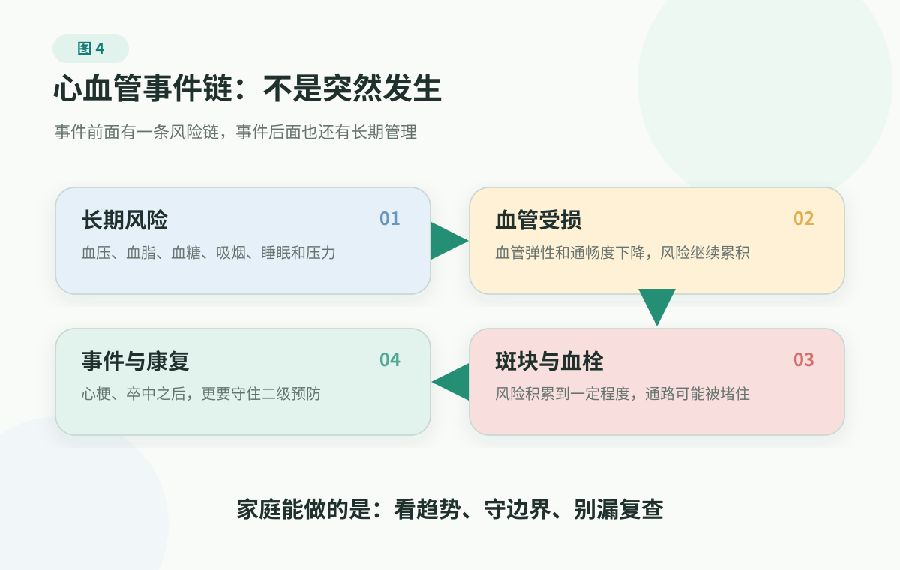
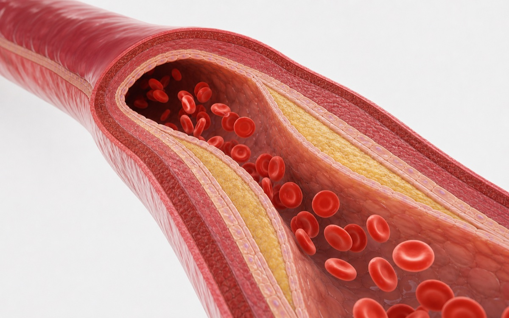

# 2. Cardiovascular Event Chain: The Chain Reaction From Blood Pressure To Heart Attack

> This page is not medical advice. It cannot replace clinician diagnosis, testing, medication decisions, medication changes, procedures, surgery, cardiac rehabilitation, or stroke rehabilitation. If chest pain, chest pressure, stroke-like symptoms, severe shortness of breath, fainting, or altered consciousness appears, seek emergency care or contact local emergency services promptly.

Blood pressure, cholesterol and triglycerides, glucose/A1C, and uric acid on a report are not just four abnormal flags. They are upstream signals from several body systems.

The heavier question is this: why do those signals, which often do not hurt at all, connect to major events such as heart attack and stroke?

The World Health Organization's 2025 cardiovascular disease fact sheet reports that in 2022, about 19.8 million people worldwide died from cardiovascular diseases, roughly 32% of all global deaths; 85% of those deaths were due to heart attack and stroke. In the United States, heart disease and stroke also remain major public-health burdens. In family language, this is not distant news. It is a risk line many families eventually have to face seriously.

Yet many families first truly notice cardiovascular risk only after a sudden event: a relative is hospitalized with chest pain, a friend has an ischemic stroke, an older parent falls and later turns out to have long-running atrial fibrillation, or someone who seemed to eat and sleep normally is suddenly told a stent may be needed. At that point the family often says one sentence:

"They were fine yesterday. How did this happen so suddenly?"

The final moment really can be fast. A vessel blocks, blood flow to the brain stops, or heart-muscle ischemia worsens, leaving the family little time to react. But before that moment, risk has often been moving inside the body for a long time. It just did not hurt, make noise, or force action the way an emergency does.

The heart is not an isolated pump. Together with arteries, veins, capillaries, lung circulation, nerve regulation, the kidneys, and metabolic systems, it forms a whole-body supply network. Every day it sends oxygen and nutrients to the brain, muscles, kidneys, and other organs, and carries waste away. During exercise it must increase supply; during sleep it should lower load; during infection, late nights, emotional stress, overeating, and surgery, it has to reallocate resources temporarily.

So cardiovascular health is not only "whether the heart has a disease." The more important questions are: can this supply network work steadily? Have vessel walls changed over time? When the person climbs stairs, walks fast, has an infection, loses sleep, or faces emotional shock, is there still reserve? Being able to eat and sleep normally does not prove the network has no pressure. Many risks do not warn through pain first; they first show up through markers, exercise tolerance, and traces on testing.

Blood pressure, cholesterol and triglycerides, glucose, smoking, weight, waist circumference, activity, and sleep are all upstream signals for this network. They look ordinary most days, but they help shape heart attack, stroke, heart failure, peripheral vascular problems, and recurrence risk.

This chain can be split roughly into four parts: upstream load, vessel change, acute event, and recurrence prevention. The first two are easiest to ignore, yet often decide whether the later parts suddenly become major events.

## The Final Moment Can Be Fast; The First Half Is Usually Slow

Heart attack and stroke frighten families because the acute stage can leave very little time to respond. But a cardiovascular event does not appear from nowhere. It is more like a chain.

Someone in their twenties, thirties, or forties may only have abnormal cholesterol or triglycerides, elevated blood pressure, and increasing waist circumference on routine labs, without feeling sick at all. Work stays busy, social drinking continues, sleep stays short, and repeat testing keeps getting postponed. By the time they sit in a cardiology clinic, the question is no longer "Is this abnormal flag serious?" It is a heart attack, an ischemic stroke, or a blood-vessel problem that now needs long-term management.

Not everyone with high cholesterol or high blood pressure reaches that point. The point is that risk and time multiply. Long-unmanaged upstream risk is most likely to appear at the final moment as an acute event. What feels "sudden" is often only the last segment. The first half has been moving quietly for years.

<figure class="book-figure">
  
</figure>

The first segment is upstream load.

High blood pressure, high LDL-C or other lipid abnormalities, diabetes, smoking, obesity, sedentary time, poor sleep, family history, and similar factors raise risk over time. The metabolic markers from the previous section are common entrances to this segment. The family's job is not to separate abnormal flags from living patterns, but to ask clinicians about overall risk.

The second segment is vessel change.

**The vessel wall is injured, lipid particles and other materials form plaque, and blood-flow reserve declines. Families should pay attention when clinicians mention plaque, narrowing, ischemia, and also to changes in activity tolerance.**

The third segment is the acute event.

Plaque may rupture, a clot may form, and blood supply to the heart or brain may suddenly stop; serious rhythm problems may also appear. Families should not try to prove the exact disease name at home. Suspected heart attack, stroke, fainting, or severe shortness of breath means seeking help first.

The fourth segment is recurrence prevention.

After an event, the baseline risk remains. Medications, procedures or surgery, rehabilitation, and follow-up work together to lower the chance of another event. Families should not stop medications on their own, should not skip follow-up, and should treat rehabilitation and lifestyle work as part of treatment.

This chain explains a common confusion: why clinicians talk about heart attack and stroke while looking at blood pressure, cholesterol and triglycerides, and glucose.

Because these markers are not isolated numbers. They are fuel for the first half of the event chain. The metabolic cluster tells you which upstream signals are present; the cardiovascular event chain explains why those signals should not be reduced to "the report looks bad."

## Upstream Risk Is Not A Minor Problem

High blood pressure often has no symptoms. High cholesterol usually does not hurt. Borderline glucose can seem easy to postpone. Smoking, sitting, late nights, and weight gain are easily filed under "lifestyle." But inside the cardiovascular event chain, these are not small things.

High blood pressure puts long-term pressure on vessels, heart, brain, and kidneys. Cholesterol and triglyceride abnormalities can participate in plaque formation. Diabetes magnifies risk in blood vessels, kidneys, and nerves. Smoking damages vessels and raises clot and cardiovascular-event risk. Sedentary days, too little activity, poor sleep, chronic stress, and obesity can worsen blood pressure, glucose, cholesterol and triglycerides, and inflammatory conditions together.

Those words sound like a string of medical terms, but inside the body they mean the vessel environment is changing: pressure is higher, glucose swings are larger, lipid transport is more disordered, sleep and activity do not provide enough repair, and visceral fat and chronic stress keep adding load to the system. A blood vessel is not a dead pipe. It is living tissue. It can repair, and it can also be worn down repeatedly.

The reason these markers deserve to be read together is that they often converge on the same road: long-term vessel pressure, plaque formation, and gradually less safe blood supply.

At the upstream stage, the family's most useful work is not to list every marker again. It is to change the question: have these risks already put vessels under long-term pressure? Are there clues of plaque, narrowing, atrial fibrillation, heart failure, ischemia, or reduced activity tolerance? Is the next step repeat testing, lifestyle work, medication, more testing, or referral?

## Vessel-Wall Changes Often Come Before Symptoms

Atherosclerosis is not the simple story of "oil clogging a pipe."

The NHLBI describes atherosclerosis as plaque gradually forming inside artery walls; as plaque builds up, arteries narrow and blood flow decreases; if plaque ruptures, a clot can form and lead to heart attack or stroke.

You can think of the inner vessel wall as a thin, active lining. When it is smooth, materials in the blood keep flowing where they should. But when long-term high pressure, glucose swings, smoking, inflammatory conditions, and metabolic load keep appearing, that lining becomes less even. Lipid particles can enter the vessel wall more easily, and the immune system participates in cleanup and repair. Plaque does not grow overnight. It is more like a mark left after years of repeated damage and repair.

<figure class="book-figure">
  
</figure>

So <strong>if testing already mentions plaque, calcification, narrowing, ischemia, or if a clinician clearly says there are atherosclerosis-related changes, it is no longer just one abnormal flag on a report.</strong> It means risk has already left a trace on the blood vessels. The next step is not to panic or search online for medications. It is to upgrade the issue to a yellow light in family health management: bring the report and past markers to a clinician, confirm overall risk, follow-up timing, and whether medical treatment is needed, and move upstream factors such as blood pressure, cholesterol and triglycerides, glucose, smoking, weight, waist circumference, sleep, and activity from "we know about it" to "we are actually recording and adjusting it."

This process can move slowly and may cause no obvious symptoms for a long time. Some people first learn their vessels have a problem only when an acute event happens. Others notice earlier functional changes: three flights of stairs used to be fine, but now one flight causes chest tightness and shortness of breath; fast walking used to recover quickly, but now recovery takes much longer; exercise used to feel only tiring, but now brings chest pressure, palpitations, dizziness, or unusual fatigue.

Reduced activity tolerance does not automatically mean heart disease. Anxiety, anemia, lung problems, thyroid problems, recovery after infection, muscle loss, and poor sleep can all contribute. But it is worth recording, especially in someone with clustered metabolic markers, smoking, family history, abnormal kidney function, or previous cardiovascular disease.

Do not write the family record as "Is my heart bad?" More useful information is:

- when it started;
- what activity brings it on;
- how long it lasts;
- whether rest relieves it;
- whether it comes with chest tightness, chest pain, shortness of breath, sweating, nausea, dizziness, palpitations;
- what is different compared with the past.

That information helps clinicians more than "I have been a little tired lately."

## In The Acute Stage, Do Not Wait For It To Look Typical

The easiest mistake in the acute stage is that the family keeps looking for a definite disease name.

Whether chest pain is angina, heart attack, stomach pain, anxiety, or muscle pain is not something an ordinary family needs to prove at home. Whether sudden one-sided weakness, slurred speech, face drooping, vision change, or trouble walking is one type of stroke or another is also not something the family should discuss fully before acting.

The family needs to recognize entrance signals that cannot wait. Do not wait until it "looks exactly like a heart attack," and do not wait until it is "definitely a stroke." In the acute stage, the most important job is not proving the name; it is acting quickly when danger cannot be ruled out.

Several kinds of signals are especially easy to delay and should be remembered in advance: chest pain, chest pressure, or chest heaviness, especially with shortness of breath, sweating, nausea, dizziness, or pain spreading to the arm, back, shoulder, neck, jaw, or upper abdomen; sudden face drooping, one-sided weakness or numbness, slurred speech, vision change, unsteady walking, or sudden severe headache; fainting, altered consciousness, severe breathing difficulty, or abnormal heartbeat with obvious distress; and in someone with known cardiovascular disease, chest discomfort, clearly worse activity tolerance, or possible recurrence signals that are different from usual.

When these happen, contact local emergency services or the emergency care system first. A fuller list of warning signs is in [Medical Boundaries And Warning Signs](../medical-boundaries.md) and [Red Flags](../../handbook/playbooks/red-flags.md), so this page does not expand it again.

Heart attacks do not always begin with sudden, severe chest pain. Symptoms can be mild, come and go, and vary by person. Strokes do not always mean someone collapses to the ground. Sudden loss of balance, trouble walking, sudden blurred or double vision, sudden facial asymmetry, sudden weakness or numbness in one arm or leg, sudden slurred speech, words that do not come out right, or suddenly not understanding others should not be watched at home to "see how it goes." Older adults, people with diabetes, women, and people with prior cardiovascular disease may not match the movie version of "typical chest pain."

Another situation is especially easy to dismiss: symptoms begin suddenly and then improve on their own. It is tempting to say, "It got better, so it is fine." But for possible stroke or transient ischemic attack signals, improvement does not equal safety. It is more like a warning and should enter medical evaluation promptly, not wait for the next, possibly worse, episode.

The steadiest acute-stage rule is this: you do not need to prove you definitely have a disease. If danger cannot be ruled out, do not wait at home.

## Treatment Is Not A One-Time Repair

Many people imagine cardiovascular treatment as "open the blockage, then it is fixed." That underestimates the work in the second half of the chain.

Stents, bypass surgery, medications, rehabilitation, exercise, sleep, nutrition, smoking cessation, and follow-up sit at different points in the event chain. They do not replace one another.

If the person is still in the upstream stage, the focus is reducing risk factors: blood pressure, cholesterol and triglycerides, glucose, smoking, weight, and activity. Once narrowing or ischemia is present, clinicians may need more testing or treatment for blood supply. When an acute event happens, time matters most. After the event, baseline risk does not disappear automatically; long-term medications, visits, rehabilitation, and lifestyle work share the job of preventing recurrence.

Especially when diabetes, high blood pressure, lipid abnormalities, kidney problems, or smoking stack together, the vessel problem is often not one point but a long-running environment. One procedure can handle an immediate danger, but it cannot erase years of risk exposure with one click.

There are two common mistakes here.

First, symptoms improve and the person stops medications on their own.

Many cardiovascular medications are not mainly for making today feel better. They are used to lower long-term risks such as clots, recurrence, heart failure, stroke, or death. Stopping, changing, or missing medications should be checked with clinicians first.

Second, rehabilitation is treated as optional.

After a cardiovascular event, recovering activity ability, reducing rehospitalization, and rebuilding a daily rhythm often depend on stepwise rehabilitation, exercise boundaries, and family support, not simply on "resting in bed" or "pushing through exercise."

Activity deserves a clear boundary here. For most people without warning symptoms, regular activity and less sedentary time can help reduce upstream risk; the next section covers how to bring that into daily life. Here the more important point is the boundary: people with previous cardiovascular disease, chest tightness or shortness of breath with activity, fainting, rhythm problems, recent heart attack or stroke, or stent/bypass history should not simply follow generic fitness advice. Chest pain, marked shortness of breath, near-fainting, or cold sweat during exercise means stop immediately and treat it as a warning sign.

If someone in the family has had a heart attack, stroke, stent, bypass, atrial fibrillation, heart failure, or another cardiovascular event, follow-up questions can be more specific:

- which part of the event chain this diagnosis belongs to;
- what each medicine is preventing;
- which tests need repeating, and how often;
- whether there are boundaries around exercise, travel, late nights, alcohol, sex, and work intensity;
- which symptoms should mean calling emergency services or going to the emergency department rather than waiting for the next appointment.

## The Family Can Agree On A Few Things In Advance

The worst part of cardiovascular problems is often on-the-spot confusion. A few agreements made in advance can prevent a lot of panic.

First, do not debate warning signs.

Chest pain or pressure, possible stroke symptoms, fainting, severe shortness of breath, altered consciousness, or major abnormal symptoms in someone with known cardiovascular disease should not become a family debate about whether someone is overthinking. Seek help first.

Second, someone owns the follow-up records.

Prior diagnoses, surgery or procedure history, medications, allergies, recent tests, trends in blood pressure, glucose, cholesterol and triglycerides, and changes in activity tolerance go into the [Family Health Record](../../handbook/templates/family-health-record.md). Long-running markers can be tracked with the [Chronic Marker Log](../../handbook/templates/family-health-record.md#_2-chronic-marker-log).

Third, recurrence prevention is not one person's willpower project.

After a cardiovascular event, medicine reminders, follow-up scheduling, rehabilitation boundaries, sleep, food, smoking cessation, and emotional support all require family collaboration. Do not turn it into "why don't you listen again?" Turn it into "how do we interrupt this risk chain earlier?"

## References

As of 2026-06-28, this chapter mainly refers to:

- [WHO: Cardiovascular diseases](https://www.who.int/news-room/fact-sheets/detail/cardiovascular-diseases-(cvds))
- [CDC: Heart Disease Risk Factors](https://www.cdc.gov/heart-disease/risk-factors/index.html)
- [CDC: About Coronary Artery Disease](https://www.cdc.gov/heart-disease/about/coronary-artery-disease.html)
- [NHLBI: Atherosclerosis](https://www.nhlbi.nih.gov/health/atherosclerosis)
- [NHLBI: Heart Attack Causes and Risk Factors](https://www.nhlbi.nih.gov/health/heart-attack/causes)
- [NHLBI: Heart Attack Symptoms](https://www.nhlbi.nih.gov/health/heart-attack/symptoms)
- [CDC: Stroke Signs and Symptoms](https://www.cdc.gov/stroke/signs-symptoms/index.html)
- [American Heart Association: Heart Attack, Stroke and Cardiac Arrest Symptoms](https://www.heart.org/en/about-us/heart-attack-and-stroke-symptoms)
- [American Heart Association: Life's Essential 8](https://www.heart.org/en/healthy-living/healthy-lifestyle/lifes-essential-8)
- [Project source registry](../../references/source-registry.md)
- [Project evidence policy](../../references/evidence-policy.md)

## Summary

The final moment of a heart attack or stroke can be sudden, but the risk chain usually started earlier. Upstream load, vessel change, acute event, and recurrence prevention are different stages on the same road.

So blood pressure, cholesterol and triglycerides, glucose, smoking, weight, sleep, and activity need to be read together. In the acute stage, do not wait for symptoms to look "typical." If danger cannot be ruled out, seek help first. Treatment is not a one-time repair; recurrence prevention needs medications, visits, rehabilitation, lifestyle work, and family coordination.

The next section looks at these common upstream drivers: before risk becomes disease, how can a family pull the trend back? Later, we will spend a full page on one of the most underestimated pieces: sleep and recovery.

---

## Reading Navigation

- [Back to English book contents](../README.md)
- Previous chapter: [Metabolic Health: Blood Pressure, Cholesterol, Glucose, And Uric Acid](metabolic-health.md)
- Next chapter: [Common Upstream: Pull Risk Back Before It Becomes Disease](common-upstream.md)
- Related tools: [Red Flags](../../handbook/playbooks/red-flags.md), [Symptom Action Guide](../../handbook/playbooks/symptom-action-guide.md), [Chronic Marker Log](../../handbook/templates/family-health-record.md#_2-chronic-marker-log)
