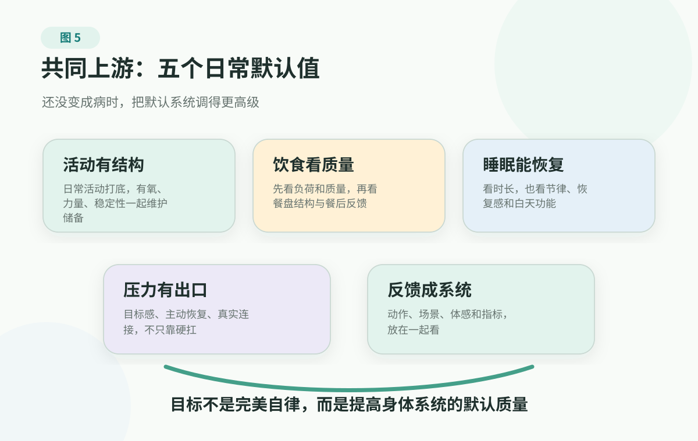

# 3. Common Upstream: Pull Risk Back Before It Becomes Disease

> This page is not medical advice. It cannot replace clinician diagnosis, treatment, medication decisions, medication changes, follow-up, rehabilitation, an exercise prescription, or a nutrition plan. If you already have a diagnosed chronic condition, are using medication, have clearly abnormal markers, have several abnormal markers, belong to a higher-risk group, or develop warning signs such as chest pain or pressure, obvious shortness of breath, fainting, stroke-like symptoms, altered consciousness, severe pain, abnormal bleeding, seek medical care or emergency help promptly.

After the first two sections, many people feel a little tense.

Blood pressure, lipids, glucose, and uric acid are not four isolated numbers after all; major events such as heart attack and stroke are also often not sudden without any earlier signals. Risk is like a slope moving forward. Sometimes it has been moving for a long time before a person first notices the arrow on a report.

So next, instead of pushing the atmosphere further down, bring the question back to daily life: if things have not yet become severe disease, the body often gives us some time to adjust the trend back.

The most typical scene is after a checkup, when a clinician says, "Work on lifestyle first, then recheck in a while."

That sentence sounds gentle, but at home it is hard to act on. It is not an emergency order, and it does not carry the weight of a diagnosis, so many people understand it as "probably not a big problem." But for chronic risk, that sentence often means exactly that you still have active room: not yet at the stage of complex treatment decisions, but no longer a stage where the old default life should continue unchecked.

The next question is: improve what, exactly? Less seafood, or less alcohol? Run every day, or sleep first? If weight, uric acid, triglycerides, blood pressure, and waist are all changing, does it mean nothing can be eaten starting today?

Many people get stuck here. If they take it lightly, they think they are not sick anyway. If they take it heavily, they immediately design a plan they cannot sustain. More commonly, they buy supplements, save ten recipes, download an exercise app, push hard for the first week, and return to the old pattern when life gets busy in week two.

I prefer to call this pulling the trend back, not treating a specific disease through lifestyle. It does not replace clinicians, medicines, or follow-up; but before many risks become serious consequences, daily life really does provide a window where intervention is possible.

That window is not in one magical action. It is in a set of daily defaults: whether the body is called on often, whether food and drink keep making systems work overtime, whether sleep has a recovery window, whether stress and relationships keep a person in alert mode for too long, and whether feedback lets you see change.

Put these five entrances together, and lifestyle is no longer four sets of prohibitions. It becomes a daily map for lowering upstream load: adjust what happens often before obsessing over what happens occasionally; adjust what can be repeated before designing perfection; adjust what affects several markers before believing in one isolated trick. Activity has structure, food has quality, recovery has a window, stress has an exit, and feedback can show a trend.

First, lower the pressure a little: you do not need to become a highly disciplined person before you are allowed to manage health. Many chronic risks are not pushed up by one indulgent day. They are pushed up little by little by default life. Change the default a little, and the body has to work overtime a little less.

<figure class="book-figure">
  
</figure>

## Adjust The Defaults First

When you get to lifestyle, put the four highs back into the same daily background first: behind these markers, is there a set of default living patterns repeatedly adding load?

Blood pressure, lipids, glucose, uric acid, weight and waist, fatty liver, sleep, and mood often do not worsen one line at a time. Long sitting, low muscle use, takeout and late-night meals, sweet drinks and alcohol becoming routine, compressed sleep, and pressure that never comes down can all push the body toward the same high-load background.

So do not start by trying to be impressive, and do not expect to become a "health person" overnight. A steadier idea is to give the body a new daily default: the body is used often, the plate does not push the system into high load every day, night provides recovery, stress has an exit, and changes in markers and body feeling can be seen.

A sweet drink consumed every day is more worth changing first than dessert a few times a year. Sleep delayed every night is more worth rescuing than one occasional dinner gathering. Sitting for ten-plus hours every day is more worth addressing first than one intense weekend workout. Chronic risk is usually less afraid of one imperfect day than of a high-load day copied for years.

## First Thing: Put The Body Back Into The Day

The strangest part of modern life is not that people do not work hard enough. It is that the body goes unused for too long.

Many people are busy all day while hardly moving. Morning commute, desk work, takeout meals, evening sofa and phone. The body seems always online, but what truly participates in life is mostly eyes, fingers, and brain. Legs, hips, back, lungs, heart, and muscles briefly appear only when climbing stairs, catching a train, or carrying something.

That is very different from how the body was built to work. Glucose needs muscles to help handle it. Blood pressure and vessels need activity-driven regulation. Weight and waist need an energy outlet. Sleep also needs enough daytime body use to build rhythm.

So the first step is not necessarily "start exercising." It is first to let the body appear again during the day.

Walking, stairs, grocery trips, cooking, cleaning, carrying things, walking after meals, standing for phone calls, taking family outside on weekends: these do not look like training, but they are the foundation of daily body use. If someone's day goes from bed to car, car to chair, chair to sofa, even the best training plan becomes something outside of life.

So do not begin by asking, "What program should I do?" Ask a more honest question first: how many times did my body actually appear in my day?

Can I walk for ten minutes after a meal before sitting back down? Can I turn a commute segment, one flight of stairs, or one phone call into a chance to stand? Can "go outside for a walk" become a family weekend default rather than something done suddenly only after a checkup abnormality? For glucose, after-meal movement helps muscles receive the meal. For blood pressure and vessels, daily activity gives the regulatory system some flexibility. For weight and uric acid, it gives energy and metabolism an outlet. You are not using a walk to "cancel out" a meal; you are telling the body that energy from this meal has somewhere to go right away.

Once that foundation is steadier, then talk about exercise structure.

<figure class="book-figure">
  
</figure>

For people who have begun paying serious attention to health, what is worth maintaining is not "did I check in today," but whether several body abilities are being used over time. In the figure, the foundation is daily activity: walking, stairs, housework, after-meal walks, less sitting. Above that come sustainable aerobic activity, strength work that makes muscles truly work, and balance, flexibility, and movement control.

The order in the figure is simple: first let the body appear in life, then give the heart and lungs, muscles, and movement ability a chance to be maintained. Progress should also be safe. Someone who has not moved much for a long time does not need one brutal session to prove repentance. Five minutes or ten minutes is not embarrassing; what matters is whether the action can still happen next week and next month.

The World Health Organization defines physical activity broadly: body movement during work, transportation, housework, and leisure all count. It also emphasizes repeatedly that any activity is better than none, and all activity can accumulate. This matters for ordinary families because it moves "exercise" out of ritual and back into life.

Of course, activity has boundaries. If exercise brings chest pain or pressure, obvious shortness of breath, near-fainting, cold sweat, severe palpitations, or if the person already has cardiovascular disease, recent heart attack or stroke, heart failure, atrial fibrillation, severe joint pain, or develops face drooping, one-sided weakness, speech problems, or other possible neurologic signs, do not force generic fitness advice onto the situation. Activity is meant to increase reserve, not prove discipline through danger.

## Second Thing: Make Food And Drink Less System Overtime

Ordinary families do not need to calculate every gram of nutrition first, and they do not need to start by studying every food's glycemic index, purine table, or fatty-acid ratio. It is more useful to ask two questions first: is the repeated daily load too high, and does the plate contain enough for the body to handle this meal gradually?

The first things worth adjusting are often the defaults that appear frequently: has sweet drink become routine, is alcohol common, are late-night meals getting later, are takeout broth and sauces getting heavier, are refined grains and processed snacks arriving meal after meal? One item alone may not look dramatic. Connected together, they mean the body is handling high load every day.

So plate structure is more useful than a list of taboos. Let vegetables, beans, whole grains, and good protein take the main roles first; then look at how much staple food is needed. Oil, salt, sugar, alcohol, and processed foods should mostly become supporting characters. Carbohydrates, fat, and meat are not enemies by nature, but source, combination, and frequency decide whether a meal is handled calmly or pushes the system into high load from the start.

Glucose control is a good example. Once you understand the glucose curve, a lower-risk and easier starting point is not to let starch and sweets always appear alone: have a few bites of vegetables, beans or tofu, eggs, fish or meat, dairy, or another protein food in the meal before the staple; if you want something sweet, put it after a meal rather than as an empty-stomach snack; when eating staple foods, pair them with some fiber, protein, or healthy fat. A gentle walk after eating is also closer to how the body works than sitting down immediately after a meal.

<figure class="book-figure">
  
</figure>

Often, action does not need to begin with "quit everything." It can start with making this meal less of a shock. People who already have diabetes or use medication still need to manage according to clinician advice.

Uric acid also illustrates the point well. Many people hear "high uric acid" and think only of seafood and beer. But uric acid also relates to body production, kidney clearance, weight, alcohol, sweetened drinks, insulin resistance, certain medicines, and genetic background. NIAMS information on gout also lists alcohol, sugary drinks, obesity, metabolic syndrome, kidney problems, certain medicines, and family background among risk factors rather than focusing on one food.

That reminds us that lifestyle change is better started from repeated load. If someone with high uric acid only focuses on seafood while continuing alcohol, sweet drinks, late nights, weight and waist gain, the direction can easily drift. In contrast, taking alcohol out of the routine first, replacing sweet drinks, avoiding dehydration and extreme dieting, pulling back late-night meals and oversized staples, using less takeout broth and heavy sauces, and bringing vegetables, beans, whole grains, good protein, and enough fluids back into daily life are usually closer to the upstream. Every food does not need to be judged; what deserves attention is the habit that appears every day and repeatedly raises load.

There is no need to promise "this will lower the number by X." The body is not a vending machine where one action is inserted and one number comes out. The steadier judgment is this: if the eating and drinking pattern is more stable over time, weight and waist, glucose, lipids, uric acid, fatty liver, and daytime energy have a better chance of moving in the right direction together.

People with diabetes, gout, high blood pressure, kidney disease, cardiovascular disease, or those using glucose-lowering, blood-pressure, lipid, uric-acid, diuretic, anticoagulant, or similar medicines should not treat diet changes as a replacement for treatment. What to eat, when to recheck, whether medicines are needed, and what targets apply should be discussed with clinicians.

## Third Thing: Leave The Body A Recovery Window

Sleep is not the reward after a hard day. It is the body's daily maintenance window.

Long-term insufficient sleep, disrupted rhythm, and sleep that does not restore can affect blood pressure, glucose regulation, appetite, weight, mood, attention, and willingness to move. When sleep is poor, the next day is more likely to be held together by coffee, sweets, short videos, and forcing oneself through. The more chaotic the day becomes, the harder the night is to recover. After this loop repeats, many people think they are simply lazy, greedy, or undisciplined, when the recovery system has not been connected.

Put sleep in the common upstream first. It affects not only "am I sleepy," but also metabolism, cardiovascular health, brain function, and family mood. The next section spends a full page on sleep and recovery because it is common and because it is easily distorted by single data points, late-night culture, and the idea that "catching up on sleep" solves everything.

Remember one judgment first: if a lifestyle plan continues sacrificing sleep, it is unlikely to protect health long term. A person who sleeps less, trains more, eats less, and pushes harder for short-term markers often only moves the body from one kind of load to another.

So the starting point for sleep is protecting a recovery window. Handle fewer work messages in the last half hour before bed. Do not let short videos become tomorrow's fatigue. Do not let caffeine, alcohol, late-night meals, and overtime squeeze sleep every day. You are not wasting time; you are reserving repair time for blood pressure, glucose, appetite, mood, and tomorrow's ability to act. A "health plan" purchased with chronic sleep sacrifice may be wrong from the beginning.

## Fourth Thing: Do Not Rely Only On Willpower; Give Stress An Exit

Stress management is too easily written as one empty sentence: relax, do not be anxious.

That sentence usually does not help. A person in real stress does not lack understanding. The body is already in alert mode: heart beating faster, breathing shallower, neck and shoulders tight, thinking at bedtime, exhausted but still scrolling, knowing movement would help but unable to start, wanting to speak well with family but sounding accusatory instead.

At that point, continuing to scold yourself for lack of discipline usually only adds another layer of stress. Many bad loops do not happen because people do not know what to do. They happen because people are tired enough to reach for the fastest comfort: sweets, alcohol, short videos, revenge bedtime procrastination, and more delay.

A better approach is to design a life in which the body can recover.

People are not machines driven only by reason. Body and brain respond to progress, connection, calm, and safety. These are not magic keys, but they explain one thing: if an action brings a small sense of progress, real connection, body relaxation, or a little positive experience, it is easier to continue.

That is why purpose and relationships are not empty inspiration. If someone is only "reducing risk," fatigue comes quickly. If there are projects they want to finish, people they want to accompany, and a life they still want to participate in, then exercise, food, sleep, and follow-up are more likely to become long-term actions. Health behavior is not floating discipline. It needs to fit into reasons a person wants to keep living, taking responsibility, and staying connected.

Recovery also has active and passive forms.

Short videos, sweets, and alcohol can make someone feel better briefly, but the problem is that they are too fast, too dense, and too easy to repeat. They are more like short anesthesia than recovery. What slowly supports people is often lower-stimulation but repeatable: walking, sunlight, regular rhythm, real conversation, cooking, tidying a room, taking a child or parent outside, finishing one small task.

Active recovery means the person participates rather than being pushed by information. Walk outside for a few minutes after dinner without debating whether it meets a standard. Start one small piece of a hard task so you can see, "I have begun." When stress is high, speak a few sentences with a real person rather than continuing to scroll.

These actions are small, but they have real meaning. They help the body confirm three things again: I still have a little agency, I am still connected with others, and I can still recover a little from real life. The value of a stress exit is that the body lives with a little less long-term alert.

If stress, anxiety, low mood, panic, sleep problems, or physical symptoms are persistently affecting life, or if there is any self-harm or suicide risk, do not carry it alone as a lifestyle problem. That has entered the boundary of professional help.

## Fifth Thing: Use Feedback To See Trends, Not Guess From Feelings

Lifestyle fails most easily when it relies only on feelings.

Feelings are very good at deceiving. A more tired day makes all effort look useless. Two days without weight change makes the direction feel wrong. One uric-acid or lipid result that has not improved sends someone searching for another remedy. One better-energy day makes follow-up feel unnecessary.

A steadier approach is to turn lifestyle into a set of small experiments.

A small experiment is not self-treatment, and it is not turning life into a daily report. It only puts action, context, and result together: this week, if I walk ten minutes after dinner, do sleep and next-day energy change? If sweet drinks are replaced for two weeks, what happens to afternoon sleepiness, weight, and uric-acid trend? If I eat vegetables and protein first, then decide how much staple I need, do I feel less sleepy after meals? If I handle fewer work messages before bed, are blood pressure, mood, and focus different the next day?

The most important word here is not "restriction," but "discovery."

You may discover that a ten-minute walk after meals is easier to keep than hard evening workouts; that replacing sweet drinks with unsweetened tea makes afternoons a little less foggy; that eating vegetables and protein first makes post-meal sleepiness milder; that continuing work messages before sleep worsens blood pressure and mood the next day; that uric acid, weight, alcohol, sweet drinks, and late nights may be related. These discoveries are more useful than slogans. They let the family move from "you should be disciplined" to "what pattern do we see, and what small thing do we change next?"

Feedback does not need to be complicated. You can look at only a few lines: whether weight and waist are slowly changing, whether blood pressure has a trend, whether glucose or A1C, lipids, and uric acid move after clinician-recommended repeat testing, whether sleep and daytime energy improve, whether activity can be maintained, and which situations most easily make you lose control.

CDC materials on prediabetes include a direction worth borrowing: lifestyle change is not one burst of determination. It is small, manageable steps, learning healthier eating, increasing activity, managing stress, staying motivated, and solving problems. This applies beyond glucose. Many chronic risks need methods that can fit into life.

## If You Do Only One Thing: Try A Seven-Day Experiment

After reading this, do not renovate your whole life immediately. One small experiment is enough.

For the next seven days, do not change ten things at once. Choose one category:

- Body: walk 10 minutes after meals each day, or turn one phone call, one commute segment, or one housework task into standing and moving;
- Food and drink: remove one high-frequency load first, such as sweet drinks, late-night snacks, alcohol, takeout broth, or empty-stomach sweets;
- Recovery: leave the last half hour before bed free from work messages and late short-video scrolling.

Do not grade yourself, punish yourself, or hurry to announce a plan online. After seven days, ask only three questions: which small action was easiest to keep? Did the body give a little feedback? Can this action fit into the next seven days?

If after-meal walking is easiest, keep that first. If replacing sweet drinks is most obvious, keep that first. If fewer work messages before bed makes the next day feel better, start there. A small action that can continue is more valuable than a perfect plan that cannot. What changes the trend is often not one heroic day, but one small action repeated quietly for a long time. You do not need a ceremony to start: the next meal, the next time you stand after sitting too long, or tonight's last half hour is enough.

That is the plainest meaning of common upstream: you do not have to wait for a disease name. The body can also tell you through trends where things are becoming heavier and where there is still room to pull back.

## When Lifestyle Alone Is Not Enough

Common upstream work matters, but it is not a safety cushion.

Do not rely only on self-adjustment in three types of situations.

First, markers are already clearly abnormal, persistently abnormal, or abnormal in clusters. Second, there is already a diagnosed chronic disease, medication use, or a situation that needs more professional judgment: childhood, older age, pregnancy or postpartum, abnormal liver or kidney function, immunosuppression, multiple medicines, recent surgery or hospitalization. Third, chest pain or pressure, obvious shortness of breath, fainting, one-sided weakness, slurred speech, altered consciousness, severe pain, abnormal bleeding, or clear worsening after lifestyle changes appears.

The best place for lifestyle is in collaboration with medical judgment: before care, it can help lower load; during care, it helps clinicians see trends; after care, it supports chronic-disease management and rehabilitation over time. It is not a replacement for diagnosis, medicine, follow-up, or emergency judgment.

## References

As of 2026-06-28, this chapter mainly uses WHO information on physical activity and sedentary behavior, WHO information on healthy diet, the American Heart Association's Life's Essential 8, CDC information on lifestyle intervention for prediabetes, and NIAMS information on gout causes and risk factors to calibrate the boundaries around activity, food and drink, sleep recovery, stress management, and feedback records in the "common upstream" frame.

These materials help families understand how lifestyle affects long-term risk. They should not be used to design an individual exercise prescription, nutrition plan, medication plan, screening plan, or treatment priority.

Start directly with: [WHO Physical activity](https://www.who.int/news-room/fact-sheets/detail/physical-activity), [WHO Healthy diet](https://www.who.int/news-room/fact-sheets/detail/healthy-diet), [American Heart Association Life's Essential 8](https://www.heart.org/en/healthy-living/healthy-lifestyle/lifes-essential-8), [CDC On Your Way to Preventing Type 2 Diabetes](https://www.cdc.gov/diabetes-prevention/lifestyle-change-program/on-your-way-to-preventing-type-2-diabetes.html), and [NIAMS Gout Symptoms, Causes, and Risk Factors](https://www.niams.nih.gov/health-topics/gout/symptoms-causes-risk-factors). More sources are in the [source registry](../../../../shared/source-registry.md). This book's evidence rules are in the [evidence policy](../../references/evidence-policy.md).

## Summary

Common upstream work is not making people memorize more health discipline. It pulls risk out of disease names and markers and back into daily life. Many long-term risks hide inside repeated daily defaults: the body is rarely used, food and drink repeatedly create high load, sleep keeps getting squeezed out, stress has no exit, and nobody records change.

If you remember only one direction, start with what repeats every day. Lifestyle can pull a trend back, but it cannot replace clinician judgment, medicine, follow-up, or emergency care.

The next section looks at sleep and recovery on its own. It is one of the most underestimated parts of the common upstream: not laziness, and not blank time, but daily system maintenance for the body and brain.

---

## Reading Navigation

- [Back to English book contents](../README.md)
- Previous chapter: [Cardiovascular Event Chain: Heart Attack And Stroke Do Not Come From Nowhere](cardiovascular-event-chain.md)
- Next chapter: [Sleep And Recovery: Recovery Is Not Laziness, But System Maintenance](sleep-and-recovery.md)
- Related tools: [Chronic Marker Log](../../handbook/templates/family-health-record.md#_2-chronic-marker-log), [Before A Checkup](../../handbook/playbooks/checkup-planning-guide.md), [Common Checkup Markers](../../handbook/playbooks/common-checkup-markers.md)
