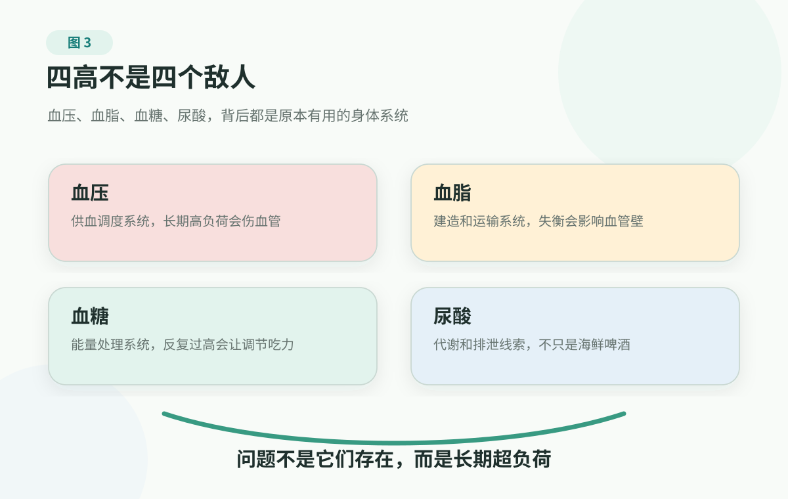

Chapter 2 · The Risk Lines Most Worth Watching

# 1. Metabolic Health: Four Useful Systems, And Why They Lose Balance

> This page is not medical advice. Diagnosis, repeat testing, treatment targets, medications, medication changes, and urgent handling for blood pressure, cholesterol, triglycerides, glucose, A1C, uric acid, and related markers need to be decided by clinicians in context. Do not use this page to set targets, change medication, stop medication, or delay care.

A checkup report should not be read as a verdict. It is more like a risk language. One arrow is not a conclusion, and one report is not destiny. What matters is whether the marker keeps appearing, which other markers appear with it, and which long-running risk line it points toward.

The most common cluster, and one many families underestimate, is the group often called the "four highs": blood pressure, blood lipids, blood glucose, and uric acid.

For many families, the first real encounter with a body risk line is not in the emergency department, and not after a clear diagnosis. It is in an ordinary-looking checkup report. Each number alone may look like "just a little high." Seen in the same person, the same family, and the same stretch of life, they often suggest that long-term load is starting to gather.

Imagine someone spreading a checkup report on the kitchen table after dinner: blood pressure is a little high, triglycerides are a little high, fasting glucose is near the edge, and uric acid has a red arrow too.

The person is not too worried: "I don't feel sick. High blood pressure means less salt, high cholesterol means less fat, high glucose means less sugar, high uric acid means less seafood. Let's just do that."

That sentence is common, and it is risky. It is not completely wrong; it is too narrow. It cuts the body into four little boxes, as if each number has its own switch: turn off salt and blood pressure calms down; turn off fat and cholesterol calms down; turn off sugar and glucose calms down; turn off seafood and uric acid calms down. So it is easy to treat a checkup report like a few sticky notes, then feel the matter has been understood.

The body does not work that way.

Blood pressure, blood lipids, blood glucose, and uric acid are not enemies first. Behind them are abilities the body accumulated over a long evolutionary history to help us survive.

To stand, walk, run, and carry things, the brain and muscles cannot be short of blood. Food and salt were once hard to get, so the body learned to value energy, retain salt, and store surplus. After a meal, glucose needs to rise so energy can go somewhere useful. Cells renew every day, and metabolic waste has to be produced, transported, and cleared.

The trouble is that modern life changed the environment. Salt is no longer scarce. Calories are denser. Refined carbohydrates, alcohol, sweet drinks, sedentary work, late nights, and stress are common. Systems that helped the body survive are now placed in an environment of frequent oversupply and too little real use of the body. They do not fail all at once. They start by working overtime; after enough overtime, blood pressure, lipids, glucose, and uric acid begin to show the traces.

So the four highs are not four isolated numbers. They are four body languages often saying the same thing: long-term risk may be forming. One number alone can sometimes be a temporary fluctuation. Read together, they may form a risk web involving the heart, brain, kidneys, blood vessels, joints, and long-term ability to live. The truly concerning part is not that one arrow looks ugly; it is that these arrows keep lighting up like a row of small lamps while nobody takes ownership.

Behind these markers are not four bad things. They are four useful systems pushed by modern life into long-term overload.

<figure class="book-figure">
  
</figure>

## Do Not Rush To Diagnose Yourself

Markers related to the four highs share one feature: they often cause no obvious symptoms, and they often need repeat testing, family records, and a clinician's view of overall risk.

If abnormal markers come with chest pain or pressure, obvious shortness of breath, fainting, one-sided weakness, trouble speaking, altered consciousness, severe headache, or severe pain, treat it as a warning-sign situation first. Do not wait for a repeat test.

If it is only an abnormal checkup result, the steadiest move is not to search for folk remedies or set your own targets. It is to turn the report into material a clinician can understand quickly.

It also helps to translate a common clinic sentence clearly. When a clinician says, "work on diet and exercise first, then recheck later," that does not mean "put this back in the drawer." It is more like a yellow light: maybe it is not an emergency or a complex treatment decision yet, but it is already time to look at trend, combination, and upstream life load. Especially when the same type of marker has been borderline or high for several years, or when it appears with family history, waist gain, fatty liver, and blood pressure, glucose, and lipids all moving the wrong way, it should no longer be treated as small noise in one checkup.

First separate a few layers.

First, is this a one-time fluctuation or a repeated trend?

How has the same marker changed in the last two or three tests? Could late nights, alcohol, infection, pain, stress, missed medication, measurement technique, or recent illness have affected it?

Second, is this one abnormal item, or are several items worsening together?

Blood pressure, lipids, glucose, uric acid, weight and waist, kidney function, fatty liver, and family history mean something very different when they are read together.

Third, which long-term risk line is it pointing toward?

Is it pressure on blood vessels, plaque risk, a strained insulin system, diabetes management, or uric-acid and kidney clearance?

## Blood Pressure: A Supply System Under Long-Term Tension

Blood pressure is not two fixed numbers. It is the pressure curve of the body's blood-supply system.

You can picture it as a water-supply system that adjusts pressure all the time. The heart pumps blood out, the blood vessels carry pressure through the body, the kidneys and salt-water regulation act like pressure valves, and the nervous system keeps sending instructions based on the situation. When you are sitting and talking, the brain still needs stable blood flow. When you stand suddenly, blood cannot all stay in the lower body. When you walk quickly, climb stairs, or carry things, muscles need more oxygen. When you sleep, the system needs to lower the load again.

If we could see blood pressure continuously, it would not look like the two numbers on a checkup report. It would be a constantly moving curve. During sleep, when standing up, while walking, during pain, under stress, and right after exercise, the curve changes. The "top" and "bottom" numbers we record are only two representative points taken from that curve for practical use. They matter, but they are not the whole story.

That is why blood pressure measurement cares about quiet rest, sitting position, cuff size, arm position, and repeated readings. One reading is not the whole truth; the long-term trend is closer to the body's state.

Stress, pain, lack of sleep, alcohol, caffeine, recent exercise, missed medication, and poor measurement posture can all affect a reading. A single high reading cannot explain everything. A single normal reading cannot erase long-term exposure either.

Salt is not the enemy by nature. The body needs sodium to maintain blood volume and support nerves and muscles. The issue is that today salt is easy to take in: soup bases, sauces, cured foods, processed foods, takeout, and salty snacks can make someone feel they are "not eating that salty" while intake is still high. Add weight, sleep, stress, alcohol, and kidney factors, and a flexible pressure-control system may spend too much time in a high-load gear.

The real problem with high blood pressure is not one ugly number on one day; it is long-term instability and load. Vessel resistance rises. The heart works harder. The brain, kidneys, retina, and blood vessels throughout the body carry pressure over time. A person can feel nothing, but pipes and organs do not stop carrying load just because the alarm is quiet. No symptoms means only that the alarm is quiet; it does not mean the load is absent.

So the value of family blood-pressure records is not to let one number scare everyone every day. It is to let a clinician see the trend:

- whether readings are repeatedly elevated;
- whether clinic readings are high but home readings are normal, or the opposite;
- whether readings relate to sleep, stress, pain, alcohol, or missed medication;
- whether lipids, glucose, kidney function, weight and waist, and family history are also part of the picture.

Blood pressure management should not be understood as "just eat less salt." Salt, weight, activity, sleep, stress, alcohol, medicines, and kidney factors can all be involved. When medication is needed, it is not proof that discipline has failed; it is one tool to lower long-term load and reduce the probability of events such as stroke, heart attack, heart failure, and kidney damage.

## Blood Lipids: The Transport System That Can Carry Risk Into The Vessel Wall

Blood lipids are easily misunderstood as "too much oil in the blood." But blood is not soup, cholesterol is not oil floating on top, and plaque is not a piece of meat stuck directly to the artery wall. Lipids themselves are not enemies: cell membranes need them, hormone production needs them, and the nervous system and energy storage also depend on them. A body with no fats at all could not work normally.

The real issue is transport. Lipids do not travel well on their own in watery blood, so they move through the body in lipoprotein particles. You can roughly picture a transport fleet: some vehicles deliver cholesterol and triglycerides to tissues, while others participate in collection and redistribution. The fleet itself is not bad. Trouble comes when certain vehicles are too numerous, routes are disordered, cargo is out of balance for a long time, and the vessel wall is also facing injury, inflammation, or other risk factors. Then cargo is more likely to stop where it should not.

Clinics often see a confusing situation: two people get checkups together. One report has a red arrow, and the clinician recommends lifestyle work and rechecking. The other report looks less dramatic, yet the clinician spends more time discussing overall cardiovascular risk. It can sound like someone read the wrong report, but that may not be the case.

Because the meaning of lipids is not determined by one arrow. Age, blood pressure, glucose, smoking, kidney function, family history, and previous cardiovascular disease can all change the weight of the same lipid number.

So LDL-C, non-HDL-C, triglycerides, and HDL-C on a report are not answering only "Did you eat too much fat?" They are more like clues about whether the transport system is pushing blood vessels toward higher risk over time. Long-term abnormalities in LDL-C, non-HDL-C, triglycerides, and related markers, especially with age, high blood pressure, diabetes, smoking, kidney function issues, family history, and previous disease, can raise atherosclerotic risk.

Atherosclerosis is not "oil suddenly blocking a blood vessel." It is closer to a slow process. The inner lining of a vessel, originally smooth, is affected over time by blood pressure, glucose, smoking, inflammatory conditions, and other factors. Lipids and other substances enter the vessel wall. Immune responses participate. The body keeps clearing and repairing. Plaque gradually forms, the vessel can narrow, and if a plaque ruptures, a blood clot may form and cause a heart attack or stroke.

That is why mildly abnormal lipids are most easily underestimated not because of one number, but because of time. Several years of "just a little high" looks like a small line on a report. Put it into the blood-vessel timeline, and it is like the same transport vehicles repeatedly taking the wrong route and stopping on the same shoulder. You do not need to scare yourself or name a disease from one number. The useful move is to upgrade it from "a small problem without symptoms" to "a risk clue worth tracking seriously."

That is also why a lipid report should not be read only through "total cholesterol" or one red arrow. The more important questions are:

- what is happening with LDL-C, non-HDL-C, triglycerides, and HDL-C;
- whether high blood pressure, diabetes, smoking, obesity, abnormal kidney function, or family history of early cardiovascular disease is also present;
- whether the clinician is thinking about short-term rechecking or long-term reduction of heart and brain vascular events;
- which part belongs to lifestyle, medication, and follow-up.

The purpose of lipid management is not to make numbers look prettier. It is to have fewer heart and brain vascular events that actually matter.

## Blood Glucose: An Early Alarm From The Insulin System

Blood glucose matters before diabetes is diagnosed. It is more like a curve the body handles every day.

Picture an ordinary morning: someone rushes out after a few bites of rice porridge, a bagel, toast, cereal, or a sweet drink with a snack. At work, it feels as if energy has been patched in. Then around 10:30 or 11:00, hunger, sleepiness, brain fog, and a craving for coffee or something sweet suddenly arrive.

That is not necessarily poor willpower, and it is not always "not eating enough." Sometimes it looks more like a glucose roller coaster: starch and sugar from a meal become glucose quickly and enter the blood, glucose rises, the body mobilizes insulin to move glucose into muscle, liver, and other tissues, and then glucose falls again. The person may feel sleepy, hungry, irritable, or eager to eat more.

Glucose is not a bad thing. The brain, muscles, and many organs need it. A rise in blood glucose after eating is not a mistake; it is part of normal food handling. The trouble comes when the curve repeatedly rises too fast, falls too sharply, and repeats day after day.

So glucose cannot be judged only by the fasting moment. Fasting glucose is like a morning snapshot. A1C is more like an average impression over a period of time. Post-meal glucose and an oral glucose tolerance test are closer to how the body handles a meal or a glucose load. If a routine checkup only looks at fasting glucose, it may miss post-meal abnormalities or prediabetes; but that does not mean readers should diagnose themselves at home. The point is simply this: glucose problems cannot be explained by one screenshot.

Many families react to glucose with, "I do not even like sweets. How could I have a glucose problem?" But glucose is not a vote on dessert. Rice, noodles, pasta, tortillas, congee, bread, pastries, drinks, and late-night snacks can all affect the curve. Sedentary days, sleep, stress, visceral fat, and muscle mass affect the body's ability to receive glucose.

That is why "I am thin," "I have a fast metabolism," and "I do not like sweets" are not safety certificates by themselves. Body size is an important clue, but it is not the only clue. Family history, activity, muscle mass, sleep, stress, fatty liver, blood pressure, lipids, and post-meal reactions can all change what the same glucose number means. For many people, the useful early habit is not glucose anxiety. It is long-term observation of energy-handling capacity: after a meal, does the body receive the load calmly, or is it forced into sharp swings again and again?

Once you understand this, the first section can stop at one judgment: glucose is not a single "eat less sugar" button. It is the body's ability to handle one meal, a whole day, and long-term life load. How to make meals steadier belongs in the third section, "Common Upstream."

<strong>Prediabetes deserves special attention.</strong> It is an easily missed window. Some people treat it as a prompt: they start tracking weight and waist, adjust food structure, increase activity, and repeat glucose testing. Others think "it is not diabetes yet," and years later find that glucose, blood pressure, lipids, and vascular risk have all become more complicated. This is not meant to frighten anyone. It is a reminder: the earlier you see the trend, the more chance you have to catch risk upstream.

After diabetes is diagnosed, the question is no longer just "glucose is a little high." It becomes long-term chronic-disease management: blood pressure, lipids, kidney function, eye exams, nerves, feet, infection risk, medicines, and follow-up all need to sit in the same system. People using glucose-lowering medicines, pregnant or postpartum people, children and adolescents, older adults, people with liver or kidney problems, and anyone with repeated low blood glucose should not treat small diet actions as treatment substitutes.

So when glucose-related abnormalities appear, do not ask only, "Can I still eat fruit?" More useful questions are: Is this one fluctuation, prediabetes, or diabetes management? What needs repeating? Which markers should be read together? How much lifestyle work should happen before reassessment? Does a clinician need to plan medication and complication monitoring?

## Uric Acid: Not Just Gout, And Not Just Seafood

Uric acid is often treated as a gout issue, but it does not come only from seafood and beer.

Uric acid is a product of purine metabolism. Cells renew every day, food brings in some purines, and all of it enters a balance of production, transport, and clearance. You can roughly picture a drainage system: water flows in every day, and it also needs to drain out smoothly. If inflow rises or outflow slows, the water level climbs.

The tricky part about high uric acid is that it can be quiet. Many people never have a gout attack; they just see a number on a checkup report. Others first take it seriously when a toe, ankle, or other joint suddenly becomes red, hot, swollen, and painful. During the pain the whole family is anxious; after a few days without pain, everyone feels the matter has passed. Others control food very carefully, eat less meat and avoid seafood, yet uric acid remains high, so they feel, "I am disciplined. Why is this still happening?" At that point, the problem usually cannot be explained by one seafood list. The whole production and clearance system needs to be seen.

All of these scenes remind us that uric acid cannot be understood only through whether something hurts or whether seafood was eaten.

Uric acid can rise because production increases, kidney clearance decreases, weight changes, alcohol, sweetened drinks, insulin resistance, certain medications, and genetic factors are involved. Not every high uric-acid level becomes gout. But long-term elevation, repeated gout, tophi, kidney stones, abnormal kidney function, or high uric acid together with high blood pressure, diabetes, and lipid abnormalities should not be reduced to "eat less seafood."

Uric acid is also easy to mishandle in two extremes: during an acute gout flare, the only thought is to push uric acid down immediately; when there is no pain, it is ignored completely. But acute pain is more like an alarm sounding, while long-term management is about reducing accumulation, crystals, and recurrence. When the alarm stops, it does not mean the wiring has been repaired.

The acute phase and long-term management are two different problems. During an acute flare, the focus is pain and inflammation control and making sure nothing else is going on. Long-term management is about reducing recurrences, protecting joints and kidneys, and, when appropriate, reaching a uric-acid target under clinician guidance. Readers do not need to decide medicines or targets on their own. They do need to know this: no pain does not mean this risk line should disappear from family records.

If uric acid is abnormal together with blood pressure, glucose, lipids, weight and waist, and kidney function, it is no longer only a joint-pain issue. It is part of metabolic and kidney risk. The better question is not just "Can I still eat seafood?" It is whether alcohol, sweet drinks, weight and waist, hydration, kidney function, medicines, and the other three highs are together pushing the clearance system into a more strained state.

## Do Not Be Fooled By Four Little Prohibitions

"Less salt, less fat, less sugar, less seafood" are not useless. Their problem is that they sound like four sticky notes. Once they are posted, people may think they understand the four highs.

A more truthful set of questions is:

- Is the blood-pressure issue a short-term fluctuation, or is the supply system under long-term pressure?
- Is the lipid issue one mildly abnormal number, or is overall cardiovascular risk higher?
- Is the glucose issue one high reading, or is the body's energy-handling capacity declining?
- Is the uric-acid issue accidental, or is it related to kidney clearance, weight, alcohol, sweet drinks, medicines, or metabolic background?

The four highs deserve attention not because every red arrow is immediately dangerous, but because they often share upstream drivers and often stack in the same person.

## Why They Often Appear Together

The four highs often appear in the same person not by coincidence, but because they share many upstream drivers:

- Weight and waist: visceral fat can affect blood pressure, triglycerides, glucose, uric acid, and fatty liver at the same time;
- Food pattern: high salt, refined carbohydrates, sweet drinks, alcohol, excess total calories, and processed foods rarely affect only one marker;
- Too little activity and too little muscle: muscle is an important place for handling glucose and maintaining metabolic flexibility; sedentary life can worsen glucose, lipids, weight, and cardiorespiratory reserve together;
- Sleep and stress: they affect appetite, blood-pressure fluctuation, insulin sensitivity, late-night eating, alcohol use, and recovery;
- Kidney function and age: the kidneys participate in blood pressure, salt-water balance, uric-acid clearance, and many metabolic-waste processes; risks often stack with age;
- Family history and past disease: family clues such as early cardiovascular disease, diabetes, gout, and kidney disease change how clinicians interpret risk.

This is also why more medical materials now discuss cardiovascular, kidney, and metabolic health together. These are not unrelated lines. When one system worsens, it may drag on the others.

## Seeing The Combination Gets You Closer To Risk

The most misleading part of a checkup report is that each marker is scattered across different pages. What often explains risk is the combination.

For example, high blood pressure plus abnormal lipids is not just two arrows; it may mean long-term vessel pressure and plaque risk are stacking. Borderline glucose, increasing waist, and high triglycerides together are closer to metabolic risk than fasting glucose alone. High uric acid with blood pressure, kidney function, or weight issues cannot be understood only as "eat less seafood."

These three examples point to the same thing: the four highs are not separate numbers that each mind their own business. They often pull on one another in the same person. For more on how markers combine, return to the checkup-marker chapter or use [Common Checkup Markers](../../handbook/playbooks/common-checkup-markers.md). The most important task right now is not to diagnose yourself, but to turn individual red arrows into risk clues a clinician can handle.

## Start Lifestyle Work From The Shared Base

If the four highs are split apart, life turns into a pile of prohibitions: less salt, less fat, less sugar, less seafood. Those reminders are easy to remember, but hard to sustain, and they can miss the real target.

A better approach is to ask which upstream defaults keep raising load again and again: sedentary hours, weight and waist, sweet drinks, late-night eating, alcohol, takeout broth and sauces, processed foods, sleep loss, and long-term stress. They do not affect only one number. They touch blood pressure, lipids, glucose, uric acid, fatty liver, weight, and daytime function together.

Before disease becomes severe, families can still use activity, food and drink, recovery, stress and connection, and feedback records to pull the trend back little by little. Start by finding the daily defaults that repeat and raise several markers at once. These actions are not magical and do not replace clinicians, but they are closer to the shared base of the four highs than studying one supplement.

If someone already has chronic disease, abnormal kidney function, previous cardiovascular disease, pregnancy or postpartum needs, or a treatment plan from a clinician, lifestyle work should collaborate with medical care, not replace treatment.

When follow-up is needed, there is no need to design a new table from scratch. Put the last few relevant markers, test context, medicines and supplements, prior diagnoses, and family clues on one page with the [Family Health Record And Chronic Marker Log](../../handbook/templates/family-health-record.md). First understand why these numbers often belong together, then organize them into information clinicians can catch quickly.

## Boundaries: Do Not Handle These Alone

Do not rely on yourself to interpret these situations:

- markers are clearly abnormal, persistent, or several are abnormal together;
- the person is already using blood-pressure, lipid, diabetes, or uric-acid medicine, or is considering stopping, changing, adding medicine, or stacking supplements;
- home measurements and clinic results differ a lot, and you do not know whether the device or technique is reliable;
- obesity, smoking, family history of early cardiovascular disease, abnormal kidney function, prior heart attack or stroke, or diabetes is present;
- pregnancy or postpartum status, childhood, older age, liver or kidney problems, or multiple medications are involved;
- abnormal markers come with chest pain or pressure, shortness of breath, fainting, one-sided weakness, trouble speaking, altered consciousness, or severe pain.

When acute warning signs appear, first use [Medical Boundaries And Warning Signs](../medical-boundaries.md) or [Red Flags](../../handbook/playbooks/red-flags.md), and seek medical care or contact local emergency services promptly.

## References

As of 2026-06-28, this chapter mainly refers to:

- [CDC: About High Blood Pressure](https://www.cdc.gov/high-blood-pressure/about/)
- [CDC: About Cholesterol](https://www.cdc.gov/cholesterol/about/index.html)
- [CDC: Diabetes Testing](https://www.cdc.gov/diabetes/diabetes-testing/index.html)
- [CDC: A1C Test for Diabetes and Prediabetes](https://www.cdc.gov/diabetes/diabetes-testing/a1c-test.html)
- [CDC: About Type 2 Diabetes](https://www.cdc.gov/diabetes/about/about-type-2-diabetes.html)
- [CDC: About Gout](https://www.cdc.gov/arthritis/gout/)
- [NHLBI: Atherosclerosis](https://www.nhlbi.nih.gov/health/atherosclerosis)
- [American Heart Association: Metabolic Syndrome](https://www.heart.org/en/health-topics/metabolic-syndrome)
- [American Heart Association: Cardiovascular-Kidney-Metabolic Health](https://www.heart.org/en/health-topics/cardiovascular-kidney-metabolic-health)
- [Project source registry](../../references/source-registry.md)
- [Project evidence policy](../../references/evidence-policy.md)

## Summary

The four highs are not four isolated numbers. They are a risk web connecting the heart, brain, kidneys, blood vessels, and metabolism. Blood pressure is long-term load in the supply system; lipids are transport and vessel-wall risk; glucose is energy scheduling; uric acid is a metabolic and clearance clue.

A single abnormal result should be read through trend; several abnormal results should be read as a combination. Lifestyle work should return to the shared base. Clear abnormalities, persistent abnormalities, chronic disease, medication changes, or warning signs all belong with clinicians.

The next section follows this risk web downstream: why heart attack and stroke may look sudden, even though the first half of the path has often been running for a long time.

---

## Reading Navigation

- [Back to English book contents](../README.md)
- Previous chapter: [Checkup Markers: Not A Verdict, But A Risk Language](../part-1-healthspan-risk-and-markers/checkup-markers.md)
- Next chapter: [Cardiovascular Event Chain: Heart Attack And Stroke Do Not Come From Nowhere](cardiovascular-event-chain.md)
- Related tools: [Chronic Marker Log](../../handbook/templates/family-health-record.md#_2-chronic-marker-log), [Common Checkup Markers](../../handbook/playbooks/common-checkup-markers.md)
