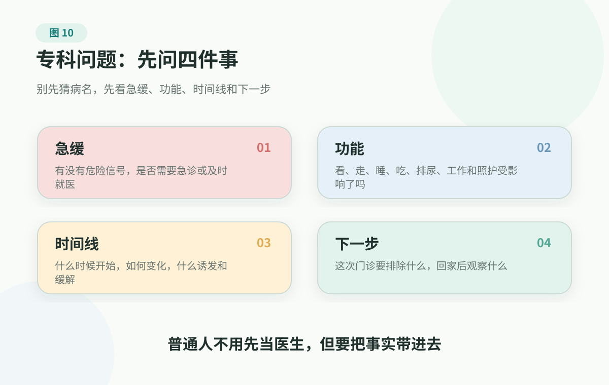

# 8. Common Specialty Problems: Improve Care Quality Without Becoming Your Own Doctor

> Sudden vision loss, eye injury, danger signs during pregnancy or within one year postpartum, serious injury, severe pain, blood in urine with fever, clear trouble urinating, altered consciousness, numbness or weakness, self-harm or suicide risk, and similar situations need urgent care, the emergency department, or local professional support. This page helps you prepare information and choose an entry point. It does not provide specialty diagnosis.

## Not Every Problem Looks Serious At First

Many families are not knocked down all at once by a major illness. They are slowly held back by a string of "it probably isn't that serious."

A father has back and leg pain for half a year. At first he calls it an old problem, uses patches and massage, and walks less. Later he goes from walking through the market to barely making it to the community gate. A mother gets up again and again at night, avoids drinking water during the day, and sometimes sees blood in urine but says it is "heat," because urinary problems and leakage are embarrassing to discuss with her children. A partner is several months postpartum, still leaking urine, sleeping poorly, and emotionally collapsing, while older relatives say, "Everyone is like that after giving birth." You keep seeing floaters and flashes and wonder whether you looked at the phone too much, so you buy eye drops first. Toothache keeps coming back, but you feel a few more days of waiting may solve it.

Not all of these are dangerous, but none of them should be handed only to endurance, guessing, or remedies.

The hardest thing about specialty problems is that they often do not give you a clear label between "emergency now" and "nothing at all." They are more like a gray hallway: common, embarrassing, repeated, affecting life, yet not severe enough for the whole family to become tense immediately. The longer someone stays in that hallway, the easier it is to be pushed by four forces:

- **Endure.** Thinking everyone has this kind of small problem, so just wait for it to pass;
- **Guess.** Watching many search results and short videos, then starting to name the disease yourself;
- **Shame.** Feeling embarrassed about urination, periods, postpartum issues, sex, skin, and mood;
- **Experience.** Older people saying, "We all got through it that way," and younger people saying, "The internet says this is how to handle it."

I prefer to treat specialty material as an on-demand map rather than a self-diagnosis manual. Its value is not to let ordinary people judge disease names for clinicians, but to help families recognize boundaries earlier and organize messy feelings into facts clinicians can use.

## Ask Four Things Before Asking Which Specialist

When people get a symptom, the first reaction is often "which specialist should I see?" That question matters, but it is not the first question.

A steadier order has four steps:

1. **Are there warning signs?** If yes, handle urgency first and do not get stuck on the department name.
2. **What function is affected?** Vision, walking, sleep, urination, work, caregiving, school, social life, and mood are all important information.
3. **What is the timeline?** When did it start, sudden or gradual, better or worse, what triggers or relieves it.
4. **What should this visit clarify?** The risk that most needs ruling out, what the test is meant to answer, when to return early or use urgent care, and the next plan.

<figure class="book-figure">
  
</figure>

If you are unsure whether to use emergency care, outpatient care, or observation, start with the [Symptom Action Guide](../../handbook/playbooks/symptom-action-guide.md). If you do not know the entry point, use [Department And Specialty Navigation](../../handbook/playbooks/department-navigation-guide.md). Once you know you are going to an outpatient visit, prepare with the [Doctor Visit Checklist](../../handbook/playbooks/doctor-visit-checklist.md).

## One Symptom Card Is More Useful Than Ten Guessed Disease Names

Specialty visits are short. The more you only say "I feel unwell" or "something has been off," the more time the clinician needs to reconstruct the background. You do not need medical terminology, but you can write the facts clearly first.

| What To Write | More Useful Detail |
| --- | --- |
| Time | When it started, sudden or gradually worsening, how long it has lasted |
| Location | Exactly where it is, whether it moves, radiates, or changes places |
| Quality | Bloating, sharp pain, pressure, burning, numbness, itch, cramping, throbbing, foreign-body feeling, or hard to describe |
| Severity | Roughly 0-10, whether it is getting worse, whether it is obvious at night |
| Triggers and relief | Whether activity, position, eating, urination, periods, sleep, stress, or medication changes it |
| Function impact | Whether it affects seeing, walking, sleeping, working, eating, urinating, sex, caregiving, school, or social life |
| Associated signs | Fever, bleeding, numbness or weakness, dizziness, shortness of breath, rash, weight change, mood change |
| What has been tried | Medicines, patches, supplements, physical therapy, devices, eye drops, skin products, and effects or side effects |

This card is not meant to make you speak like a doctor. It lets the clinician spend less time guessing background and more time judging the next step.

## Women's Health And Pregnancy/Postpartum: Do Not Turn Body Problems Into Moral Questions

Women's health is too easily covered by one phrase: "women are all like that." Period pain, trying-to-conceive anxiety, guilt after miscarriage, postpartum leaking and emotional collapse, poor sleep, hot flashes, and mood changes around menopause are all often pushed back into personal endurance.

I do not like that sentence. It quietly pushes a problem that may need medical judgment, family support, and long-term management back onto the individual.

A better view is this: women's health is not one organ's small problem. It is a life course. Periods, trying to conceive, pregnancy, birth, postpartum, menopause, and older age are not isolated from one another. Each stage has normal fluctuation, and each stage has boundaries that should not be hidden under "everyone is like that."

### Period And Pelvic Problems: First Record How Much Life Is Affected

Periods are not an exam score, but they are one signal about body state. Severe period pain, clear change in bleeding amount, sudden cycle changes, abnormal bleeding, pelvic pain, pain with sex, abnormal discharge, and difficulty conceiving should not be managed long-term only with painkillers, heating pads, and endurance.

Before a visit, record the cycle, bleeding days and rough amount, pain location and intensity, whether school or work is affected, whether there is fever or abnormal discharge, and whether it relates to sex, exercise, stress, or medicines. The point of recording is not to diagnose yourself; it is to let the gynecologist see the pattern faster.

### Trying To Conceive And Miscarriage: Take It Out Of Shame First

Fertility is first a matter of probability, body conditions, partner factors, age, disease, lifestyle, and medical evaluation. It is not a moral grade. After trying for a long time without pregnancy, or after miscarriage, the worst family reaction is blame, hints that "maybe you did not take good enough care of your body," or searching everywhere for remedies.

More useful preparation includes age, menstrual history, how long trying has been going on, prior pregnancies and miscarriages, partner-related evaluation, chronic diseases, medicines, surgical history, lifestyle, and tests already done. Whether to test, what to test, and how to handle it belongs with obstetrics/gynecology or reproductive medicine.

### During Pregnancy And Within One Year Postpartum, Warning Signs Count More

CDC HEAR HER lists several signs during pregnancy and within one year postpartum that need immediate medical care: severe headache that does not go away or gets worse, vision changes, fainting, fever, chest pain or abnormal heartbeat, trouble breathing, severe belly pain, a clear decrease in the baby's movement, heavy bleeding or fluid leaking, severe nausea and vomiting, severe swelling or pain in one limb, and thoughts of harming yourself or the baby. Families do not need to memorize every English item, but should remember one sentence: during pregnancy and within one year postpartum, "something feels wrong" deserves more caution.

Postpartum care is not only about incision or tear healing. Sleep, mood, feeding pressure, pain, urinary leaking, pelvic-floor discomfort, bleeding, fever, family roles, and follow-up can all be discussed. A caregiver's job is not to supervise someone into "doing postpartum right," but to help her speak about body, emotion, and caregiving load.

## Dental Care: Local Work Still Needs Whole-Body Information

Many people seeing a dentist remember to say which tooth hurts, but forget to say what diseases they are being treated for and what medicines they use. Dental care looks local, but it is not always "minor repair." Cleaning, fillings, and x-rays are not the same risk category as extraction, implants, periodontal surgery, or oral and maxillofacial surgery. Once bleeding, infection, anesthesia, cutting, suturing, implants, or bone healing are involved, the whole-body history and medicine history need to be complete.

Especially tell the dentist whether you use medicines that affect clotting, long-term steroids or immune-suppressing medicines, whether you are in cancer treatment, and whether you have used medicines that affect bone metabolism, such as denosumab or bisphosphonates. You do not need to remember medication classes, and you should not decide by yourself whether extraction or implants are safe. Just remember: these facts matter to the dentist's risk judgment.

The easiest wrong move is stopping medicine on your own. People using anticoagulants or antiplatelet medicines may understandably worry about dental bleeding, but stopping medicines yourself can create another kind of risk. Medication questions and dental-procedure planning should be judged by the dentist based on procedure risk, with the prescribing clinician involved when needed.

Another easily misunderstood area is osteoporosis medicine or cancer-related bone medicine. These medicines do not mean "you can no longer see a dentist." In fact, they make regular oral care and early handling of infection sources more important. What needs caution is work involving extraction, implants, bone injury, and wound healing. If you wait until dental infection becomes severe and urgent, there may be fewer choices.

Families can prepare one sentence in advance: what chronic conditions I have, which medicines I use, when the last dose was, whether I have a history of bleeding, clots, cancer treatment, long-term steroids or immune suppression, and whether past extractions or operations caused prolonged bleeding, infection, or poor wound healing. You do not need to judge for the clinician; just do not let the information be missed.

This logic does not apply only to dentistry. Eye procedures, minor skin surgery, endoscopy, and needle biopsy can also involve bleeding, infection, anesthesia, cutting, suturing, implants, or wound healing. Ordinary people do not need to learn every medical rule in advance. Remember one thing: when a test or treatment may involve these risks, do not talk only about the local symptom; give the disease and medication picture too.

## Common Specialty Situations: Start With Function And Boundary

The following is not a specialty-diagnosis table. It only helps families organize "what to say clearly" first.

| Situation | What To Look At First |
|---|---|
| Eyes and vision | Record which eye, whether vision changed suddenly, whether there are distorted lines, floaters, flashes, field loss, double vision, red eye, pain, light sensitivity, headache, nausea, injury, or chemical exposure. Sudden vision loss, eye pain with vision change, eye injury, chemical injury, or red eye with clear vision change should not be handled only with eye drops. |
| Urinary and bladder symptoms | Record day and night urination frequency, urgency, leaking, inability to urinate, burning, blood in urine, fever, back/flank pain, lower abdominal pain, and whether sleep, leaving home, or intimacy is affected. Blood in urine, fever with flank pain, clear inability to urinate, and severe pain should not be handled only with water, "clearing heat," kidney tonics, or self-medication. |
| Orthopedics and movement | Record whether the person can stand, walk, bear weight, climb stairs, raise the arm, turn, squat, and whether there was injury or fall, numbness or weakness, radiating pain, bowel or bladder changes, or fever. Inability to bear weight after injury, rapidly worsening pain, numbness or weakness, persistent pain after an older adult falls, night pain, or basic activity limits should not be delayed. |
| Skin and external products | Prepare clear photos and date comparisons. Record location, itching or pain, drainage or crusting, recent skincare, ointments, oral medicines, supplements, and exposures. Rapid worsening, fever, severe pain, spreading infection, clear face/eye-area swelling and pain, or severe skin problems in higher-risk groups should move to care earlier. |
| ENT, thyroid, digestive, breast, anorectal, and pain problems | Record duration, recurrence, what has been tried, whether sleep, work, and life are affected, and whether there is weight change, trouble swallowing, obvious bleeding, or whole-body worsening. Rapid worsening, fever, severe pain, trouble swallowing or breathing, obvious bleeding, and weight loss should raise the urgency level. |
| Children, older adults, pregnancy/postpartum, immune suppression, or many medications | Add age, pregnancy/postpartum stage, underlying diseases, medicines, recent surgery or hospitalization, cancer treatment, or immune status to the same symptom. Do not directly apply the experience of a low-risk adult; escalate earlier when symptoms worsen, function declines, or the family feels "something is wrong." |

Children's and adolescents' body and mental changes have their own chapter: [7. Children And Adolescents: Body And Mind Grow Together](children-and-adolescent-health.md). If you already have a concrete symptom, use the [Symptom Action Guide](../../handbook/playbooks/symptom-action-guide.md) first to sort red, yellow, and green actions.

## Ask Four Sentences Before Leaving The Visit

Do not ask only, "What disease is this?" More useful questions are:

1. What risk do we most need to rule out now?
2. What question does this test or treatment answer?
3. What situations mean we should come back early or go to urgent/emergency care?
4. If this is not better in 1-2 weeks, one month, or one treatment cycle, what is the next step?

If the person is a child, older adult, pregnant or postpartum, in cancer treatment, immunocompromised, or using many medicines, add one more question: does this person's situation change the observation and follow-up boundary?

## Preparation You Can Do Today

- Choose one specialty problem that is bothering you and write a symptom card;
- Put prior tests, medicines, external products, supplements, photos, and reports into the [Family Health Record And Chronic Marker Log](../../handbook/templates/family-health-record.md);
- Prepare only the 3 most important questions before the visit;
- After the visit, record the clinician's judgment, test plan, medication or handling instructions, follow-up time, and early-return boundary;
- If you are accompanying a parent or partner, first ask whether they want your help taking notes; do not turn accompanying into taking over.

## References

As of 2026-06-28, this chapter mainly uses MedlinePlus information on choosing a doctor or health care service, AHRQ information on patient engagement, HealthIT.gov information on obtaining and using health records, CDC HEAR HER information on maternal warning signs, National Eye Institute and MedlinePlus information on eye health and eye emergencies, NIDDK/NIH information on bladder control problems, NIAMS/NIH information on back pain, and American Dental Association and SDCEP information on osteoporosis medicines, anticoagulants/antiplatelets, and medication-related jaw risk in dental procedures to calibrate specialty-care preparation, health records, maternal warning signs, eye emergencies, urinary quality of life, back-pain boundaries, and whole-body medication information in dental care.

These materials are used to calibrate specialty-care preparation, health records, maternal warning signs, eye emergencies, urinary quality of life, back-pain boundaries, whole-body medication information in dental procedures, and medication-related jaw risk reminders. This page does not provide specialty diagnosis, medication advice, medication changes, treatment priority, individualized screening, or individualized treatment plans.

Start directly with: [MedlinePlus Choosing a Doctor or Health Care Service](https://medlineplus.gov/choosingadoctororhealthcareservice.html), [AHRQ Be More Engaged in Your Healthcare](https://www.ahrq.gov/questions/be-engaged/index.html), [HealthIT.gov Health Records](https://www.healthit.gov/how-to-get-your-health-record/), [CDC HEAR HER Urgent Maternal Warning Signs](https://www.cdc.gov/hearher/maternal-warning-signs/index.html), [National Eye Institute Eye Health Information](https://www.nei.nih.gov/eye-health-information), [American Dental Association Osteoporosis Medications and MRONJ](https://www.ada.org/resources/ada-library/oral-health-topics/osteoporosis-medications), and [SDCEP Anticoagulants and Antiplatelets](https://www.sdcep.org.uk/published-guidance/anticoagulants-and-antiplatelets/). More sources are in the [source registry](../../references/source-registry.md). This book's evidence rules are in the [evidence policy](../../references/evidence-policy.md).

## Summary

Specialty judgment is not self-diagnosis. It is knowing when not to wait, which entry point to use, and what facts to bring.

Women's health and pregnancy/postpartum issues should not be covered over by "everyone is like that"; dental care needs whole-body disease and medication history; other specialties can be prepared with a symptom card, photos, timeline, and functional impact.

Shame, habitual endurance, and online self-diagnosis all reduce care quality. One symptom card and four visit questions are often more useful than ten guessed disease names.

---

## Reading Navigation

- [Back to English book contents](../README.md)
- Previous chapter: [7. Children And Adolescents: Body And Mind Grow Together](children-and-adolescent-health.md)
- Next chapter: [1. What A Family Health System Actually Manages: Facts And Boundaries, Not People](../part-3-family-health-os/what-to-manage.md)
