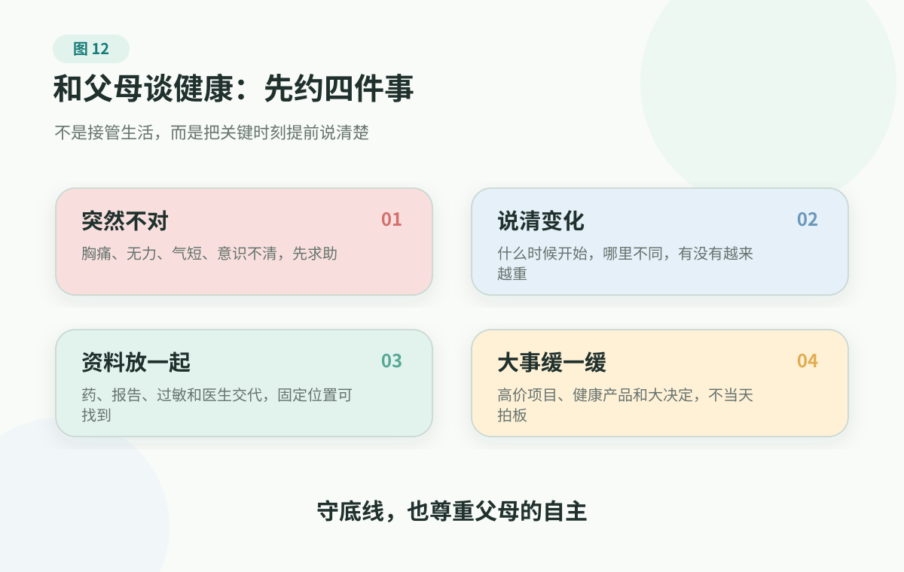

# 3. Talking With Parents About Health: Do Not Turn Care Into Control

> If there is chest pain, stroke-like symptoms, severe trouble breathing, altered consciousness, sudden vision loss, severe pain, risk of self-harm or suicide, or a major change in medication, treatment, or follow-up, contact a clinician, emergency services, or the relevant professional support promptly. This chapter helps families communicate about facts, records, and boundaries. It does not replace medical judgment.

The information before a visit can be organized into tables: symptom timeline, medication list, test reports, and questions for the clinician. The truly hard part often comes before the table.

How do you even bring it up with your parents?

Many families have had a moment like this. Your father's checkup has a few elevated markers, and the clinician asks him to repeat testing in three months. Six months later, you ask on the phone, "Did you go for the follow-up?" He says, "I feel fine. Stop worrying about it."

You get anxious and the words come out sharply: "Why do you never take this seriously?" The other side hardens just as quickly: "I know my own body."

The conversation ends there. Nobody is wrong, and nobody is persuaded. You hang up still worried; he may hang up even less willing to talk. The health issue is still there, the follow-up is still not scheduled, and the next opening will be harder.

Many families want to talk about parents' health well, but actually starting the conversation is difficult. Push too hard and it sounds like nagging; say nothing and you worry that everyone will panic when something really happens. Body changes, follow-up visits, medication, visit records, and health products all look small in daily life, until one missing piece of information makes the family take a long detour.

So the goal of talking with parents about health is not to win an argument, and it is not to make them finally admit that "you were right." The goal is more practical: set a few key agreements so red flags are not delayed, follow-up and medication do not depend on fighting, and when care is truly needed the records can be found, the story can be told, and the family can act together.

What we are really trying to protect is not a perfect set of numbers forever. It is more concrete: being able to walk, sleep, eat, and leave the house; being willing to say when the body changes; and having the family know what to bring, what to ask, and whom to contact when a visit is needed.

What I hope adult children keep is not another set of tricks for "making parents listen." It is a steadier stance: your concern is real, and your parents' autonomy is real too. You need to protect red flags, follow-up, and medication boundaries, while trying not to make care sound like takeover.

## Do Not Treat Your Parents As A Health Project

Many conversations get stuck not because anyone lacks love, but because health carries more than health.

Some parents avoid follow-up because they think "no symptoms means no problem." Some avoid mentioning discomfort because they do not want their children to worry, spend money, or be inconvenienced. Some half-trust a clinician's advice because past medical experiences were not smooth. Some hear a child's reminder and immediately feel treated like an incapable person.

For adult children, the health issue is risk. For parents, it may also mean aging, loss of control, loss of independence, or the fear of becoming a burden.

If we start with arranging, correcting, or negating, what the other person hears is often not care. It is control.

A better starting point is to lower the posture a little: I am not here to manage you. I want us to talk through the important moments before they happen. In ordinary times, you make your own decisions; for a few situations, our family needs shared rules.

## First Agree On Four Things As A Family

<figure class="book-figure">
  
</figure>

These four agreements are not meant to restrict parents. They are meant to reduce panic. If the family has rules before something happens, people do not have to argue while they are scared.

## Do Not Start With Negation

When parents refuse follow-up, say they do not need help, fear the hospital, or become interested in a health product, there is often a real wish underneath: they want to trouble their children less, keep control, feel a little better, or avoid bad news.

If the first words are "Why are you so stubborn?" or "You never listen," the conversation quickly becomes defensive.

You can acknowledge the wish first, then keep the boundary:

```text
I know you feel there is no rush because you do not have symptoms. But the clinician asked for follow-up not because it is already serious, but because they need to see the change. Let's schedule the date first and decide after the results.
```

```text
I know you do not want to trouble me. Then let's make it the other way around: I will not ask every day, but if any of these things happen, you tell me right away.
```

```text
I understand that you want to feel better. Let's first make sure this product will not affect the medicines you already take, and let's not let it delay the follow-up.
```

Gentleness is not giving in. Gentleness keeps the other person able to listen. A real boundary is not a louder voice; it is a clearer next step.

## Check In Regularly: Do Not Only Ask "How Are You?"

Whether parents live with you, live alone, or live far away, the family can have a light health check-in habit.

Families living together can talk after dinner, during a walk, or on the weekend. Families living apart can use phone calls, video calls, or a family chat. Parents who live alone or far away, have hearing or vision problems, or recently saw a clinician simply need this to be more concrete.

"How have you been?" often does not reveal much. Not because anyone refuses to talk, but because many changes are hard to describe at first and people do not know whether they matter.

Use four entry points: **seeing, walking, eating-sleeping-bathroom, and medication/follow-up**.

<div class="decision-grid">
  <section class="decision-card decision-card-blue">
    <span class="decision-label">Seeing</span>
    <h3>Has vision or seeing changed?</h3>
    <p>Any sudden vision loss, eye pain, red eye with vision change, dark shadows, injury, or new severe discomfort? Do not handle these only with over-the-counter eye drops.</p>
  </section>
  <section class="decision-card decision-card-blue">
    <span class="decision-label">Walking</span>
    <h3>Has walking, grip, or speech changed?</h3>
    <p>Any fall, unsteady walking, one-sided weakness or numbness, slurred speech, swallowing trouble, sudden dizziness, or clearly slower response?</p>
  </section>
  <section class="decision-card decision-card-green">
    <span class="decision-label">Eat-sleep-bathroom</span>
    <h3>Are eating, sleep, bowel, or urination different?</h3>
    <p>Any major appetite loss, poor sleep, urinary frequency or pain, bloody or black stool, persistent abdominal pain or diarrhea, or several days of not being like themselves?</p>
  </section>
  <section class="decision-card decision-card-yellow">
    <span class="decision-label">Medication and follow-up</span>
    <h3>Any missed medicines, refills, or delayed follow-up?</h3>
    <p>Any change in long-term medicines, eye drops, topical products, supplements, or herbs? Any self-stopping, switching, dose increase, or clinician-requested follow-up that has not happened?</p>
  </section>
</div>

These questions are not for remote diagnosis. They help decide the next step: keep recording, contact a clinician soon, or seek help immediately. If you are unsure, use the [symptom action guide](../../handbook/playbooks/symptom-action-guide.md).

## Chronic Conditions Are Not Managed By Feeling

Blood pressure, blood sugar, cholesterol, uric acid, bone density, and other long-term issues may not cause obvious symptoms, but risk can accumulate quietly over time.

This is also where chronic care most easily turns into family conflict. Parents think, "I do not feel bad." Adult children think, "Why are you still not taking this seriously?" Both sides are holding half the truth: having no symptoms can be real, and so can risk.

Chronic condition management does not work well as one big conversation, and it does not hold together through daily reminders. It is more like a small repeated task: record a little change, follow the clinician's follow-up plan, know whether medicines and markers have been adjusted, and ask a professional when something looks abnormal.

If chronic care is explained only as "do not eat this" and "do not do that," it quickly starts to feel like punishment. A better approach is to turn the restriction into a small task that can be noticed and completed.

For example, instead of saying "You can never eat salty food again," find two lower-sodium dishes together that still taste acceptable. Instead of saying "You must exercise," take a ten-minute walk downstairs after dinner and pick up a small errand on the way. Instead of saying "You forgot your blood pressure again," put the monitor and notebook in a fixed place and choose two days a week to record the trend.

I have seen one very light method work.

A friend's mother needed to manage blood sugar and weight for a while. At first the family said many correct things: eat less, move more, keep recording. All of it was reasonable, but every conversation ended with the adult children supervising and the mother being reminded. Later they changed the format. They stopped calling it "management" and turned the time after dinner into a small challenge: who could walk a little longer today, who could keep a simple movement going, who could write down dinner and how the day felt. The father kept time, the children joined in, and the mother slowly became interested. She was not being ordered to finish a task; she could see herself doing a little more than yesterday in a small family game.

This story is useful not because it gives a universal exercise. Diet, activity, medication, and follow-up in chronic care all need to follow clinical advice and individual circumstances. What it really shows is that parents often fear being treated as a project. What lasts is usually not one correct suggestion, but a family format that preserves dignity, includes companionship, and makes progress visible.

So chronic care does not have to be perfect, but it should be as stable as possible:

- ask a clinician before changing, stopping, or deciding how to use medicines;
- do not judge markers from one reading only; look for trends;
- do not rely on memory alone for follow-up timing; write it down or let family help with reminders;
- for food, activity, sleep, and weight, do not chase an instant overhaul; start with small changes that can actually continue.

The family's useful role is not to monitor every day. It is to make recording, follow-up, and medication reminders simpler. The simpler the arrangement, the less likely it is to become a fight.

## If Everyone Knows It But Cannot Keep Doing It, Make The Action Smaller

Many health principles are not hard to understand. The hard part is doing them every day.

Eat a little less, take a walk after dinner, keep follow-up appointments, take medicines regularly, and avoid impulsive product purchases: one conversation rarely keeps these going for long. Especially when an action is too big, too inconvenient, or too unlike normal life, the body and the habit will push back.

Inside a family, the steadier approach is to make the action smaller and more fixed:

- agree on one small action, such as walking 10 minutes after dinner, measuring blood pressure twice a week, or putting tomorrow's medicines out before bed;
- use environmental reminders: pill organizers, calendars, phone reminders, and a fixed photo album are steadier than reminders made up on the spot;
- allow imperfection: doing it three or four times a week is more useful than waiting for a perfect plan;
- review without criticism: next time, ask only "where did it get stuck?" and make the action smaller together.

If parents are willing, health actions can also be tied to something they look forward to in life. Going out is not just completing an exercise task; it can mean seeing flowers in the park, buying vegetables at the market, meeting a friend for tea, or joining a community activity. Once an action has a life reason, it is no longer only a task someone is demanding.

Long-term health depends more on small arrangements that are easy to repeat than on a sudden big transformation.

## Do Not Understand Health Only As Medical Visits

The things that shape quality of life in later years are not only tests and medicines inside a clinic.

Whether someone moves a little each day, whether meals are too salty or too sweet, how sleep is going at night, whether they have recently gone out to see people, and whether they still have something they want to do are also part of health.

Many parents do not fear only dying a few years earlier. They fear losing independence, being unable to go out, and being unable to do what they still want to do. When children get anxious, they can turn health into markers; when parents get defensive, those markers can feel like control.

Change the question.

Do not only ask, "What was your blood pressure?" Also ask, "Do you feel tired when you walk lately?"

Do not only ask, "Did you go for follow-up?" Also ask, "Is there anywhere you would like to go next month?"

Do not only ask, "Did you take the medicine?" Also ask, "Who have you seen lately? Has anything felt interesting?"

Better family support protects four ordinary goals together:

- being able to move: even a little more walking or more housework helps protect legs and stamina;
- eating steadily: do not chase miracle foods; first reduce excess, too much sugar, too much salt, and long-term heavy drinking;
- having a role: something they want to join, a small task they can do, or something they still want to learn;
- staying connected: regular contact with friends, relatives, neighbors, or community, not only passing time on a phone.

These goals do not sound dramatic, but they deserve more long-term investment than many expensive products. They also make health conversations feel less pressured and more like life.

## When Health Product Disagreements Come Up, First Try To Pause

Supplements, health devices, anti-aging programs, and expensive tests really can create disagreement in a family.

But do not put this conflict at the very beginning of the whole conversation, and do not immediately place parents in the role of "the person being fooled." Often, they simply want less suffering, a little more comfort, and a little more control over the future.

The first communication boundary is this: **do not let a product replace medical care or follow-up, do not keep stacking products when ingredients, evidence, and risk are unclear, and do not make a same-day decision under sales pressure or fear.**

If parents already have chronic conditions, take medicines, have had surgery, or are considering multiple supplements, it is best to photograph the products and ask a clinician or pharmacist to look. Evidence, regulation, price, and risk can be checked more slowly later; the immediate point is not to win an argument on the spot, but to slow down buying, stopping medicines, stockpiling, and payment.

Use the [health product checklist](../../handbook/templates/health-product-checklist.md) for product decisions.

## Do Not Wait For An Emergency Or Major Illness To Discuss The Basics

Some health conversations feel awkward in ordinary times, but when it is midnight, an emergency department visit is happening, forms need signatures, or a clinician must be contacted, it is already too late to start.

Agree on a few questions in advance.

First, who is the emergency contact? If parents live alone, live far away, or only an older couple is at home, be especially clear: how bad does discomfort need to be before they call someone, who can go with them, and who knows where the insurance card, ID, records, and medication list are?

Second, where are emergency records kept? Recent checkups, hospital records, imaging materials, long-term medication lists, allergies, and important diagnoses should ideally have both paper backups and phone photos. In emergency care, one of the worst situations is everyone panicking while nobody can clearly say what conditions were already present or what medicines were being used.

Third, talk a little about preferences for serious illness. If a major illness really happens in the future, how much does your parent want to know? Who do they want to accompany them? What matters most: trying to extend time as much as possible, staying clear-minded, suffering less, or being with family? These questions do not need to be finished in one conversation, but the earlier there is some shared understanding, the less the family has to guess in a critical moment.

This is not asking family members to make medical judgments, and it is not deciding treatment plans in advance. It simply brings basic family information and value preferences into the open. Medical questions belong with clinicians; the family's job is not to lose records, misunderstand each other, or miss help in a panic.

## Some Things Should Not Be Carried Alone

No matter how well a family communicates, it cannot replace clinicians.

Do not rely on endurance, search engines, or family-chat voting in these situations:

- chest pain, stroke-like symptoms, severe trouble breathing, altered consciousness, sudden vision loss, severe pain, or other red flags;
- head injury after a fall or a clear change in movement, especially in an older adult;
- stopping, switching, or increasing medication on one's own, or planning to replace regular treatment with a supplement;
- clear changes in memory, judgment, personality, or daily function;
- persistent hopelessness, self-harm thoughts, suicide risk, or a severe emotional crisis;
- being controlled by high-priced health products, multilevel-marketing lectures, investment-return promises, or miracle-cure sellers.

At that point, the job is not to keep arguing about who is right. It is to get professional help first.

## References

As of 2026-06-15, this chapter mainly uses CDC materials on healthy aging, MedlinePlus materials on healthy aging, talking with your doctor, eye emergencies, and taking multiple medicines safely, NIA/NIH materials on cognitive health in older adults, HealthIT.gov materials on getting and using health records, FDA and FTC materials on health scams, and SAMHSA materials on the 988 crisis line to calibrate boundaries around healthy aging, care collaboration, health records, cognitive change, health scams, and mental health crisis response when talking with parents.

These materials help families turn concern into records, collaboration, and timely help. They should not be used to diagnose parents, decide medication, stop medication, rank treatments, arrange screening, or replace emergency care or mental health crisis services.

Direct sources: [CDC Healthy Aging](https://www.cdc.gov/healthy-aging/about/index.html), [MedlinePlus Healthy Aging](https://medlineplus.gov/healthyaging.html), [NIA Cognitive Health and Older Adults](https://www.nia.nih.gov/health/brain-health/cognitive-health-and-older-adults), [HealthIT.gov Health Records](https://www.healthit.gov/how-to-get-your-health-record/), [FDA Health Fraud Scams](https://www.fda.gov/consumers/health-fraud-scams), [FTC Common Health Scams](https://consumer.ftc.gov/node/78372), [SAMHSA 988 Suicide & Crisis Lifeline](https://www.samhsa.gov/find-help/988), [source registry](../../../../shared/source-registry.md), and [evidence policy](../../references/evidence-policy.md).

## Summary

The best version of health communication is this: people can talk in ordinary times, records can be found, and key moments are not delayed. The best outcome is not that your parents finally listen to you. It is that the whole family knows how to act together when it matters.

---

## Reading Navigation

- [Back to English book contents](../README.md)
- Previous chapter: [2. How To Prepare For A Doctor Visit: Bring Facts Into The Room](doctor-visit-preparation.md)
- Next chapter: [4. Elder Care Basics: Protect The Ability To Keep Living](elder-care-basics.md)
