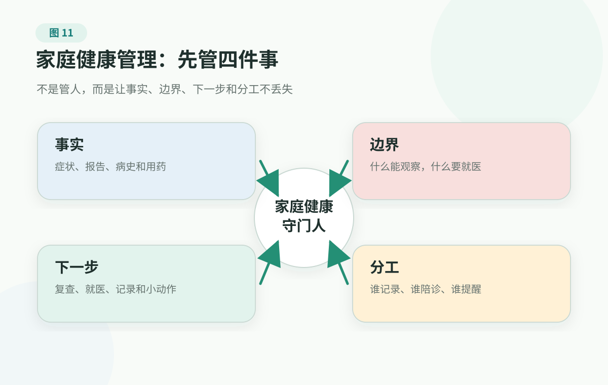

<p class="chapter-subtitle">Chapter 3 · When Health Becomes A Family Matter</p>

# 1. What A Family Health System Actually Manages: Facts And Boundaries, Not People

> Family records and collaboration workflows cannot replace clinician diagnosis, treatment, medication decisions, stopping medication, screening decisions, or emergency judgment. If warning signs such as chest pain, breathing difficulty, stroke-like symptoms, altered consciousness, serious injury, abnormal bleeding, self-harm or suicide risk appear, seek medical care or contact local emergency services promptly.

Many risk judgments eventually land at home. There is no triage desk at home and no medical-record system, only a few people, a few phones, scattered files in photo albums and chat histories, and many worries that are hard to say out loud.

Imagine an ordinary Friday night.

Your father says on the phone that his chest feels a little tight, then adds, "I will rest and it will pass." Your mother finds lab results from six months ago and asks whether the abnormal flag still needs follow-up. The child says for the third time this week that their stomach hurts and they do not want to go to school. Your partner asks whether there is any of the medication from last time left at home. Meanwhile the family group chat receives a relative's liver-protection product link.

At that moment, what the family lacks is often not care, and not search ability. What is missing is a few things that can be pulled out immediately: are there warning signs now, where are the old records, who goes with whom, what should be asked in the clinic, and what happens after coming home?

Many families do not lack love in health management. They start from zero every time. Reports are buried in the phone camera roll; the imaging link has expired; an older parent has taken several long-term medications and nobody can say the dose; the follow-up timing a clinician gave last time is hidden in some chat; when the family reaches the emergency department, everyone is panicking and asking, "Do you remember?"

Family health management is not turning the home into a small hospital, and not turning each person into someone else's health supervisor. It is more like installing a basic but reliable operating system for the family: usually quiet and small, but able to start when it matters.

What this system truly manages is not family members themselves. It manages what repeatedly gets lost at key moments: facts, boundaries, next steps, and roles.

## First Take Health Out Of "Are The Results Flagged?"

When many people say health management, the first image in their mind is a lab report or screening result.

No flags, and everyone relaxes; many flags, and the body feels broken. That reaction is natural, but it cannot carry all health judgment.

WHO's classic definition of health reminds us that health is not only the absence of disease, but also physical, mental, and social well-being. Put into family language, the simpler version is: can a person's body and mind support the life they are living now?

Dental health affects whether someone can enjoy eating. Knees and back affect grocery shopping, stairs, holding a child, and travel. Sleep and energy affect work, caregiving, and emotional steadiness. Memory and judgment affect taking medications on time, handling bills, recognizing unknown phone calls, and resisting health marketing.

So family health cannot only ask, "Are the markers normal?" It also needs three questions closer to daily life:

First, is function enough for life? Can this person walk, sleep, eat, work, study, care for others, socialize, and has anything clearly changed compared with before?

Second, is risk accumulating? Blood pressure, glucose/A1C, cholesterol and triglycerides, weight, waist circumference, sleep, smoking and alcohol, activity, and stress may not cause trouble today, but they change the future risk curve.

Third, has the abnormality been handed off? If a report has an abnormal flag, symptoms keep recurring, a clinician recommended follow-up, or medications changed, did anyone record it, follow up, and ask the next step clearly?

This is also why family health management cannot be the same as an annual preventive visit or routine checkup. That visit is an important clue, but still only a clue. What often changes the family's health state is whether the family catches the clue afterward, whether daily defaults change, and whether return precautions are clarified in advance.

## Four Things Families Most Often Manage Wrong

First, treating health management as saving articles.

No matter how many health articles are forwarded in the family group chat, that does not mean the family knows who has which conditions, which medications they take, what cannot wait, or where follow-up is. Articles can inform judgment, but they cannot replace a fact packet.

Second, turning health management into mutual inspection.

Watching a parent's blood pressure, a partner's weight, or a child's sleep every day can easily turn care into control. Adults do not like being taken over, and children should not feel they have become a problem waiting to be fixed. Family collaboration needs boundaries. Not everyone becomes someone else's health supervisor.

Third, collecting data but not looking at life.

Blood pressure, glucose/A1C, cholesterol and triglycerides, uric acid, and weight are important. But so are sleeping, walking, eating, remembering, taking medications, and living independently. If numbers cannot turn into next steps, they become another source of anxiety.

Fourth, waiting until something happens to organize.

When records are truly needed, the family is usually already panicking. Searching for reports at the emergency department door, asking medication names before admission, and debating who will stay with the patient before signing papers all amplify fear.

The goal of a family health system is not to make everyone more nervous. It is to make everyone steadier.

## The Four Things That Actually Need Managing

<figure class="book-figure">
  
</figure>

Facts are not opinions or guesses. They include: when symptoms started and how they changed; prior diseases, surgeries, and hospitalizations; current prescription medications, over-the-counter medications, supplements, and herbs; drug or food allergies; and where recent preventive visit notes, labs, imaging, pathology, and discharge summaries are.

The family does not need to diagnose every problem, but it needs to know when not to keep waiting. If there is chest pain, breathing difficulty, fainting, stroke-like symptoms, altered consciousness, serious injury, uncontrolled bleeding, severe allergic reaction, self-harm or suicide risk, first use [Red Flags](../../handbook/playbooks/red-flags.md). Do not let a family chat vote replace action.

What families most often lose is not whether someone "saw a doctor," but what the next step is after seeing the doctor. Should there be repeat testing? When? What records are needed? How should medication be used? What should make the person come back early? If symptoms do not improve, which care entry point is next? If these questions live only in one person's memory, they disappear quickly.

Roles are not cold. Roles give care a place: who keeps records, who takes notes at visits, who reminds about follow-up, who handles transportation and costs, who manages daily care, and who gives the main caregiver a little breathing room.

## Defaults: Small Switches Worth Adjusting In Ordinary Time

Most of the value in family health does not come from one expensive screening package or one amazing project. It comes from small things that happen repeatedly every day.

WHO materials on noncommunicable diseases list cardiovascular disease, cancer, chronic respiratory disease, and diabetes among major burdens, and repeatedly emphasize tobacco, unhealthy diet, physical inactivity, harmful alcohol use, and air pollution as risk factors. In family language, many long-term risks form not only in hospitals, but also in the kitchen, at the table, on the couch, beside the bed, on the phone, in the medicine cabinet, and in the stairwell.

A default means this: do not force willpower to make the same decision from scratch every time.

The home's default meal is a little lower in salt and oil. A ten-minute walk after dinner is the default. A wind-down period before bed is the default. Secondhand smoke does not enter the home. The medicine cabinet is cleared periodically. Lab results and visit summaries go in the same place by default. Photos of older adults' long-term medications are kept by default. A child's vaccination record is findable by default.

None of these actions is dramatic, but they reduce long-term household friction.

Sustainable family health is not the whole family suddenly vowing to change. It is gradually adjusting a few wrong defaults. Less "starting tomorrow we change completely," more "today put the report into the fixed folder," "this week clear expired medications from the cabinet," "this month make after-meal walking feel normal."

## The Record Packet Should Be Small Enough To Carry

Do not start with a complicated spreadsheet.

If you only build the minimum version, each family member first needs one [One-Page Family Health Card](../../handbook/templates/family-health-record.md#_1-one-page-family-health-card). It can be short:

- basic information and emergency contacts;
- important medical history, surgeries, and hospitalizations;
- allergies;
- current prescription medications, over-the-counter medications, supplements, and herbs;
- recent important tests, lab results, visit summaries, imaging, and discharge summaries;
- usual clinics, care teams, specialists, or hospital systems;
- next recheck or follow-up plan;
- where records are stored.

HealthIT.gov's patient and caregiver guidance on health records reminds readers that health records usually include medications, treatments, tests, immunizations, and clinician visits. Their value is not only "keeping a file," but also sharing, coordinating, checking, and confirming. A family health card does this small job: it makes key records available when needed.

There is also a privacy boundary here. Health information is sensitive. Who can see it, where it is stored, and when it can be shown to a visit companion or clinician should have basic family agreement. Preparing records is not about making everyone transparent. It is about not missing key information when it is necessary.

Families with more complex records can expand to the [Family Health Record And Chronic Marker Log](../../handbook/templates/family-health-record.md). If there are long-running markers such as blood pressure, glucose/A1C, cholesterol and triglycerides, uric acid, and kidney function, use the [Chronic Marker Log](../../handbook/templates/family-health-record.md#_2-chronic-marker-log) separately to watch trends.

## Triggers: Less Debate When Time Is Tight

At key moments, many families do not lack care; each person's fear simply points in a different direction.

Someone wants to go to the hospital immediately, someone says to keep watching, someone is busy searching online, and someone is calling relatives. The longer the debate, the easier it is to slow the action that truly matters.

So the family can agree on a few triggers ahead of time:

- chest pain, chest pressure, obvious breathing difficulty;
- sudden slurred speech, face drooping, one-sided limb weakness, abnormal vision;
- fainting, seizure, altered consciousness, severe headache;
- serious injury, suspected fracture, inability to bear weight, uncontrolled bleeding;
- severe allergic reaction, throat swelling, cannot breathe;
- an older adult after a fall with headache, vomiting, altered consciousness, or clear loss of mobility;
- during pregnancy or within one year postpartum: clear bleeding, severe abdominal pain, breathing difficulty, persistent severe headache, vision changes, or thoughts of harming self/baby;
- self-harm, suicide, or risk of harming others.

Triggers are not a diagnosis table. They answer only one question: should this enter the medical system quickly now?

If someone already has a chronic disease, cancer treatment, surgical recovery, immune suppression, or specific instructions from a clinician, write the clinician's "come back early if..." instructions into the trigger list too. That reduces arguing and hesitation when time is tight.

## Care Loop: Bring Facts In, Bring Instructions Back

A medical visit does not begin with booking an appointment, and it does not end when you leave the room.

A more complete loop is:

```text
Symptom or abnormal result appears
Organize facts and records
Enter the appropriate care entry point
Ask what the clinician is judging
Turn instructions into family actions
Record follow-up and early-return conditions
```

Families lose the two ends most easily.

Before entering the room, symptoms are unclear, medication names are unclear, and reports cannot be found. After leaving, test purpose, medication changes, follow-up time, and "when to come back early" remain only in memory.

Before a visit, you do not need to diagnose for the clinician, but you do need to bring the real situation in. After the visit, do not record only "the doctor said it is fine" or "the doctor said to recheck." More useful notes are:

- what the clinician thinks now;
- what other tests are needed, and what question each test answers;
- how to carry out medication or care instructions, and what changes should lead to contacting the clinician;
- when to follow up;
- what should make the person seek care earlier or use the emergency department;
- what care, rehabilitation, food, or records the family needs to support.

AHRQ and MedlinePlus materials on patient communication both emphasize preparing questions, explaining symptoms and medications, and confirming understanding of the clinician's explanation. Put into family language: bring facts in, and bring the plan back out.

Before a visit, use the [Doctor Visit Checklist](../../handbook/playbooks/doctor-visit-checklist.md). If you do not know whether this is emergency care, a clinic visit, urgent care, or which specialist office to use, start with [Care Entry And Specialist Navigation](../../handbook/playbooks/department-navigation-guide.md).

## Review: No Need To Hold A Meeting Every Day

A family health system does not need to run beautifully every day.

It is more like low-frequency calibration. Once a month, twenty minutes is enough. Ask a few questions:

- whose sleep, food, activity, or stress has clearly worsened lately;
- whether parents, children, or someone with chronic disease has any new changes;
- whether the medicine cabinet, vaccines, preventive visits, follow-up, or reports have pending tasks;
- whether any health product, test, or complex treatment information needs to be written down and checked with a clinician or professional first;
- what one default should be changed next month.

The goal of review is not to criticize who did badly. It is to notice where things are stuck.

If after-meal walking never happens, it may not be willpower; time, weather, route, or companionship may be wrong. If parents never mention body changes, it may not be stubbornness; they may fear burdening children, or not know what counts as important. If chronic markers are not recorded, the form may be too complicated; starting with only the few markers the clinician cares about may work better.

The smaller the health system, the easier it is to continue. Continuity matters more than beauty.

## Preparation You Can Do Today

This weekend, build only the smallest version.

Create one health card for one family member: emergency contacts, important medical history, allergies, current medications, recent important tests, and where records are stored.

Put long-term medications, supplements, allergies, and the most recent important report in one place.

Write down five family triggers that should not be delayed.

Change one default: after-meal walking, bedtime wind-down, medicine-cabinet cleanup, report filing, less salt in the kitchen, no secondhand smoke at home. Any of these counts.

Schedule one 20-minute family review, and ask only one question: where does chaos happen most easily, and what small action should we change next month?

If you are organizing records for a parent, partner, or child, ask first: "Would you like me to help keep these records in one place?" Family collaboration starts with respect, not takeover.

## References

As of 2026-06-28, this chapter mainly uses WHO materials on the definition of health and noncommunicable diseases, HealthIT.gov materials on getting and using health records, MedlinePlus materials on talking with clinicians and medication safety, AHRQ materials on patient engagement, and CDC materials on adult vaccines and older-adult fall prevention to calibrate family health management, chronic-disease risk, health records, clinician communication, vaccine records, polypharmacy, and fall boundaries.

These materials are used to calibrate health definitions, chronic-disease risk, health records, clinician communication, vaccine records, polypharmacy, and older-adult fall boundaries. This page does not provide diagnosis, medication advice, medication changes, treatment priority, individualized screening, or individualized health plans.

Start directly with: [WHO Constitution](https://www.who.int/about/governance/constitution), [WHO Noncommunicable diseases](https://www.who.int/news-room/fact-sheets/detail/noncommunicable-diseases), [HealthIT.gov Health Records](https://www.healthit.gov/how-to-get-your-health-record/), [MedlinePlus Talking With Your Doctor](https://medlineplus.gov/talkingwithyourdoctor.html), [AHRQ Be More Engaged in Your Healthcare](https://www.ahrq.gov/questions/be-engaged/index.html), [CDC Recommended Vaccines for Adults](https://www.cdc.gov/vaccines-adults/recommended-vaccines/index.html), and [CDC Older Adult Fall Prevention](https://www.cdc.gov/falls/about/index.html). More sources are in the [source registry](../../references/source-registry.md). This book's evidence rules are in the [evidence policy](../../references/evidence-policy.md).

## Summary

Family health management is not about controlling everyone. It is about not starting from zero at key moments.

It manages facts, boundaries, next steps, and roles; what it really changes is the family's defaults. When records can be found, risks can be seen, and someone owns the next step, care does not have to keep getting consumed by panic.

---

## Reading Navigation

- [Back to English book contents](../README.md)
- Previous chapter: [8. Common Specialty Problems: Improve Care Quality Without Becoming Your Own Doctor](../part-2-body-risk-map/specialty-care-map.md)
- Next chapter: [2. How To Prepare For A Medical Visit: Bring Facts Into The Room](doctor-visit-preparation.md)
