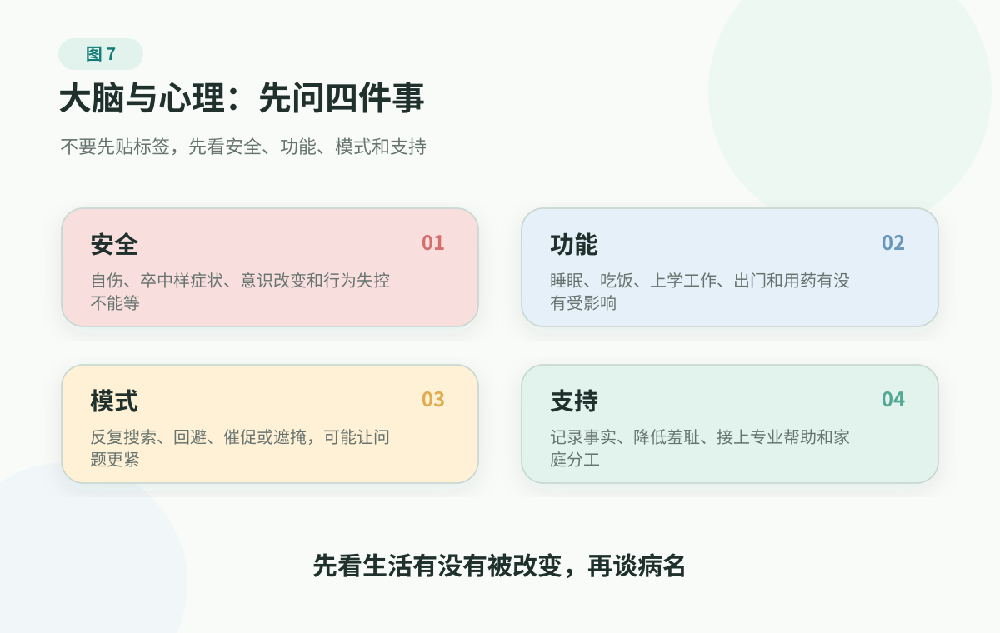

# 5. 大脑与心理健康：先看安全、功能和支持

> 本文不是医疗建议。出现卒中样症状、意识改变、自伤或自杀风险、严重抑郁焦虑、幻觉妄想、明显认知或行为变化时，请及时寻求专业帮助或急救服务。本文帮助家庭识别边界、整理信息和建立支持，不做诊断、用药、停药、心理治疗或个体化干预建议。

长期恢复不足会先影响注意力、情绪、记忆和判断。可有时候，问题不只是睡不好，而是一个人开始变得“不太像自己”。这时家庭最需要的不是贴标签，而是知道该怎样判断。

这种变化常常不是以病名出现的。

一个成年人连续几周睡不稳，白天心慌、胃不舒服，反复查体检报告，家人说“医生都说没事了，你别想太多”；一个老人开始漏服药，做饭忘关火，转账给陌生人，家里说“年纪大了都这样”；一个孩子突然不想上学，白天躲在房间，晚上睡不着，父母第一反应是“是不是太脆弱、太叛逆、手机玩多了”。

这些话未必没有关心，但它们有一个共同问题：太快把状态解释成性格、年龄或意志力。

大脑和心理健康最容易被两种极端误解。一种是过度轻视：心情不好就是矫情，老人记性差就是正常，注意力下降就是不努力。另一种是过度贴标签：一忘事就怀疑痴呆，一焦虑就觉得自己完了，一段时间低落就急着给自己下诊断。

对普通家庭来说，更稳妥的起点不是先判断“这到底是什么病”，而是先看四件事：安全、功能、模式和支持。这四件事放在一起，能让家庭少在“是不是想太多”和“是不是得了某种病”之间来回摆，而是先看生活有没有被真实改变。

<figure class="book-figure">
  
</figure>

## 先看四件事

第一，安全吗？

突然出现一侧肢体无力、口角歪斜、说话含糊、视物异常、剧烈头痛、意识改变、抽搐，或者出现自伤自杀想法、计划、行为，严重冲动失控、幻觉妄想，都先按急症或心理危机处理。安全风险一出现，就不要继续开导、争论或观察。

第二，功能受影响了吗？

心理状态和认知变化真正需要重视，往往不是因为某个词听起来吓人，而是它已经持续改变了生活。能不能睡、吃、上学、工作、照护家人、出门、做饭、用药、处理钱和信息，并和人保持基本连接，这些比“到底叫什么病”更接近家庭该观察的事实。

偶尔焦虑，不等于焦虑障碍；但如果一个人因为害怕出错、害怕检查、害怕见人，开始反复确认、反复搜索、逃避出门，生活半径越来越窄，就不能只说“想多了”。

偶尔低落，不等于抑郁症；但如果一个人连续一段时间兴趣下降、睡眠食欲改变、行动变慢、注意力变差，觉得自己无价值、无助、无望，甚至说到想消失、想伤害自己，就不能再靠鼓励和讲道理硬扛。

偶尔忘事，也不等于痴呆；但如果老人开始反复问同一个问题、找词困难、做熟悉的事出错、判断力明显下降、出门迷路、财务和用药安全受影响，就不应该被一句“老了都这样”带过。

第三，我们的应对方式有没有把问题越推越紧？

家庭里常见的解决办法，有时会变成新的压力。家人越催，孩子越躲；家人越说“没事”，焦虑的人越觉得没人理解，只能继续查；家人越替老人遮掩，医生越拿不到真实变化；家人越用“你要积极一点”鼓励抑郁的人，对方越觉得自己拖累全家。

这不是谁坏，也不是谁不爱谁。只是需要停下来问一句：我们一直在做的办法，有没有可能正在维持问题？

第四，支持能不能接上？

支持不是把家人变成心理医生，也不是全天候监控。支持是把事实记录下来，把羞耻感降下来，把就医、复诊、学校沟通、陪伴和家庭分工接上。很多时候，真正有用的不是一句正确的话，而是一个具体动作：我陪你预约，我帮你整理一周记录，我今晚不让你一个人扛，我和医生一起问清下一步。

## 为什么我们容易看错

心理问题常常被道德化。

很多人会说“你想开点”“别想太多”“大家都累”。这些话可能出于好意，但听在当事人耳朵里，常常变成另一句话：你现在这样，是你自己不够坚强、不够懂事、不够努力。

这会制造第二层痛苦。焦虑本来已经难受，又开始责怪自己“怎么这么没用”；失眠本来已经疲惫，又开始害怕“今晚再睡不着就完了”；抑郁的人本来已经行动困难，听到“出去走走就好了”，可能更觉得自己连最简单的事都做不到。

认知变化也容易被年龄掩盖。

老人忘事不一定是痴呆。随着年龄增长，偶尔找不到钥匙、一下想不起某个名字，可能只是正常记忆变化。但如果变化影响到日常生活、判断、语言、方向感和安全，就不再只是“记性差”。尤其是突然出现的意识混乱、行为异常、走路明显变差，可能和感染、脱水、药物、代谢、脑血管事件等有关，需要专业判断。

还有一种误解，是把大脑健康只当成“脑子里的事”。

大脑不孤立工作。睡眠、血压、血糖、血脂、运动、听力、视力、疼痛、社交、药物和慢病管理，都会影响注意力、情绪和认知。一个老人变沉默，可能是心情低落，也可能是听不清、看不清、疼痛、怕跌倒，或者长期失去能参与的日常角色。一个成年人心慌胸闷，也可能是焦虑，也可能需要先排除心脏、甲状腺、贫血、药物等身体因素。

所以更好的问法不是“这是心理问题还是身体问题”，而是：身体、情绪、睡眠、关系和功能，最近一起发生了什么变化？

## 情绪困扰：别只问开不开心

低落、悲伤、压力大，每个人都会经历。真正需要重视的，是它有没有持续影响功能，尤其有没有把人的未来感、行动力和连接感关掉。

家人不要只问“你是不是不开心”。还要看：

- 兴趣和快感是不是明显下降；
- 睡眠、食欲、体重、精力、注意力有没有改变；
- 上学、工作、照护、社交和日常生活有没有受影响；
- 是否长期自责、无价值、无助、无望；
- 是否出现想消失、自伤、自杀、告别、交代后事等信号。

有些抑郁不是哭，而是麻木、疲惫、迟钝、空洞、无法行动。一个人外表还能工作，不代表内部没有严重困难。

家庭的角色是承认痛苦是真实的，陪伴就医和复诊，帮助整理症状、睡眠、食欲、用药和功能变化，识别自伤自杀和绝望信号，并在专业帮助之外维持最低限度的生活结构。诊断和用药判断交给专业人员。

## 焦虑：先把警报翻译成信息

焦虑本来不是敌人。

它像一个警报，提醒你可能有危险、准备不足、失控或不确定。演讲前焦虑，可能提醒你再准备；体检报告异常后焦虑，可能提醒你预约复查；孩子状态变化时焦虑，可能提醒你先记录睡眠、上学、社交和安全信号。

问题是，警报也会劫持生活。

一个人担心身体出问题，于是每天反复搜索、反复问人、反复买检测；短暂安心之后，新的不确定又回来。一个人害怕在会议上出错，于是不断回避发言，最后工作机会越来越少。一个父母担心孩子没前途，于是把一次撒谎、一次成绩波动、一次不愿出门，迅速拉成灾难故事，越想越怕，越怕越控制。

我也见过另一种很典型的困局。

一个人反复心慌、胸闷、气短，发作时觉得自己快要出事，几次跑急诊，也做过心电、抽血和其他检查。危险的情况一次次被排除，但他的恐惧没有消失。家人说“医生都说没事了，你别想太多”，他反而更害怕：如果真没事，为什么身体这么难受？于是他继续搜索、继续复查、越来越不敢运动，也越来越不敢一个人出门。

后来有医生没有简单否定他的身体感受，而是把问题换了一个问法：这些发作什么时候出现，之前发生了什么，过后他开始回避什么，睡眠和压力怎样，急诊排除了哪些危险情况，还有哪些症状是检查解释不了的。等身体危险边界被认真处理过，心理评估才接了进来。对他来说，那不是“你没病”，而是终于有人承认：警报是真的响了，只是警报系统本身也需要被照看。

这个故事绝不是让人把胸闷、心慌、呼吸困难都归因于焦虑。胸痛、呼吸困难、卒中样症状、意识改变和严重疼痛，永远先按危险信号处理。它真正提醒的是另一件事：当身体检查无法解释全部痛苦，或者一个人开始围着恐惧反复检查、回避生活，把心理评估接进来，不是丢脸，也不是医生“不管身体了”，而是让身体、情绪和功能终于被放到同一张图里看。

这时可以把“我很焦虑”翻译成四句话：

```text
我担心的是：
我害怕的后果是：
现在确定的事实是：
我下一步能做的最小动作是：
```

焦虑被翻译出来，才可能从一团雾变成一个问题。担心报告异常，就整理资料、问清复查；担心孩子状态，就先记录睡眠、上学、社交和安全；担心父母认知变化，就记录具体功能，而不是直接说“你是不是老糊涂了”。

如果焦虑持续数周到数月，明显影响睡眠、学习、工作、社交或家庭关系；出现惊恐发作、严重回避、创伤反应、强迫行为、物质使用，或者心悸、胸痛、呼吸困难等身体信号无法排除躯体问题，就不要只靠自助。

## 认知变化：记录生活功能

判断老人认知变化，家庭最需要记录的不是“他记性不好”，而是具体生活功能。

可以看六个方向：注意力和反应有没有明显变慢，做饭、开车、照护是否变得危险；记忆和语言有没有反复问同一个问题、忘记重要约定、找词困难、说话明显不连贯；判断和计划有没有影响缴费、用药、出门路线、简单财务，是否更容易被骗局说服；情绪和睡眠有没有持续低落、易怒、焦虑、失眠或明显波动；运动和平衡有没有走路不稳、频繁跌倒、动作变慢、手抖或突然一侧无力；社会连接和兴趣有没有明显减少，是否放弃过去喜欢的活动、长时间孤立。

这些观察不是为了给父母下诊断，而是为了让就医沟通有事实基础。医生需要知道的不是“我们觉得他变了”，而是“最近两个月漏服药三次，做饭忘关火一次，转账给陌生人一次，晚上睡得很差，走路比以前不稳”。

## 长期维护：把底盘和连接留住

没有明显症状时，也不是“什么都不用管”。大脑长期维护，靠的不是某个补脑产品，而是身体底盘和生活连接。

身体底盘包括血压、血糖、血脂、睡眠、活动、疼痛、听力、视力、牙齿、用药和慢病管理。它们听起来分散，但会一起影响脑血管、注意力、情绪、认知和生活半径。大脑健康不是单独养脑，而是让身体继续能用，让生活继续有支点。

生活连接同样重要。出门见人、参与家务、联系老朋友、照顾花草、买菜做饭、带孙辈散步，这些看似普通的活动，都是大脑和心理健康的日常支架。对老人来说，把听不清、看不清、疼痛、怕跌倒这些基础障碍处理好，有时比催他“多动脑”更实际。

## 家庭里怎么开口

不要一上来就说：“你是不是抑郁了？”“你是不是认知出问题了？”“你是不是心理有问题？”

可以换成更具体、更少伤害的话：

- “我发现你最近睡得很差，白天也很累，我们要不要一起记一周？”
- “这几次你出门都有点走不稳，我担心跌倒，我们先把情况写下来问医生。”
- “你最近好像很难开心起来，也不想见人。你不是一个人扛，我们一起找专业人士聊聊。”
- “我先不问你为什么这样。今天我们先看，怎么让你安全一点、轻一点。”
- “这件事不是谁对谁错，我们先把变化说清楚。”

家庭沟通的重点是降低羞耻感，增加行动可能。尤其面对孩子、伴侣和父母，不要把关心做成审判，也不要把安全做成长期控制。有明确危险时，短时间陪在身边、移开可能造成伤害的工具、联系急救或专业帮助，是保护；危机缓下来以后，要尽快让专业人员参与，重新评估边界和支持方式。

## 什么时候不要继续观察

以下情况需要及时求助：

- 突然出现一侧无力、口角歪斜、说话困难、视物异常、剧烈头痛、眩晕、走路不稳或意识改变；
- 有自伤、自杀想法、计划、工具、行为，或出现告别、交代后事等信号；
- 严重抑郁、焦虑、惊恐、失眠已经影响基本生活；
- 出现幻觉、妄想、明显行为失控，或连续很久不睡且行为明显异常；
- 孩子或青少年提到不想活、伤害自己、伤害别人，或出现明显不安全行为；
- 老人突然意识混乱、认不清人、行为反常、走路明显变差；
- 近期跌倒、感染、脱水、新用药或药物调整后出现认知和行为变化。

在中国大陆，当下有安全风险时，优先联系 120、110、急诊或精神专科急诊；12356 心理援助热线可以作为心理支持入口。其他地区请联系所在地急救电话、危机热线或急诊入口。

家庭可以陪伴、记录和推动就医，但不要用鼓励、劝说或道理替代专业帮助。

## 做一张一周观察卡

找一个你关心的人，或观察自己，做一张一周大脑功能卡。不用写长篇病历，重点是让变化被看见：

```text
安全：有没有自伤、自杀、伤害他人的想法、计划、工具或行为？

功能：睡眠、吃饭、上学、工作、家务、用药、出门、社交、财务和判断，哪一项变了？

身体和情绪：心慌、胸闷、疼痛、跌倒、走路不稳、低落、焦虑、烦躁、麻木，持续多久？

下一步：明天最小的一件支持动作是什么？是否需要预约医生、急诊或心理健康帮助？
```

每晚写两三句话即可。重点不是证明谁有问题，而是让变化被看见。如果观察对象是父母或老人，把这张卡放进 [家庭健康档案与慢病记录](../../handbook/templates/family-health-record.md)，复诊前配合 [就医前问题清单](../../handbook/playbooks/doctor-visit-checklist.md) 使用。

## 参考资料

截至 2026-06-15，本章主要用 CDC 关于卒中症状、痴呆症状和降低痴呆风险的资料，NIMH 关于抑郁、焦虑障碍和自杀预防的资料，NIA/NIH 关于老年认知健康的资料，以及国家卫生健康委关于 12356 心理援助热线的通知，来校准卒中、认知变化、抑郁焦虑和心理危机边界。

这些资料用于校准卒中、认知变化、抑郁焦虑和心理危机边界。本文不提供诊断、用药、停药、心理治疗方案、个体化筛查或个体化干预建议。

可直接查看：[CDC Stroke Signs and Symptoms](https://www.cdc.gov/stroke/signs-symptoms/index.html)、[CDC Signs and Symptoms of Dementia](https://www.cdc.gov/alzheimers-dementia/signs-symptoms/index.html)、[NIMH Depression](https://www.nimh.nih.gov/health/publications/depression)、[NIMH Anxiety Disorders](https://www.nimh.nih.gov/health/topics/anxiety-disorders/index.shtml)、[NIMH Suicide Prevention](https://www.nimh.nih.gov/health/topics/suicide-prevention)、[NIA Cognitive Health and Older Adults](https://www.nia.nih.gov/health/brain-health/cognitive-health-and-older-adults)。更多来源登记见 [来源登记](../../../../shared/source-registry.md)。本书的证据规则见 [证据政策](../../references/evidence-policy.md)。

## 小结

大脑和心理健康的第一步，不是贴标签，而是认真看见安全、功能、模式和支持。

当家庭遇到更大的诊断恐惧时，这个原则仍然成立：先分清阶段和下一步，不让恐惧替你决定。

---

## 阅读导航

- [回到中文主书目录](../README.md)
- 上一章：[4. 睡眠与恢复：身体修复的隐形工程](sleep-and-recovery.md)
- 下一章：[6. 癌症与重大疾病：分清阶段，别让恐惧替你决定](cancer-and-major-illness.md)
