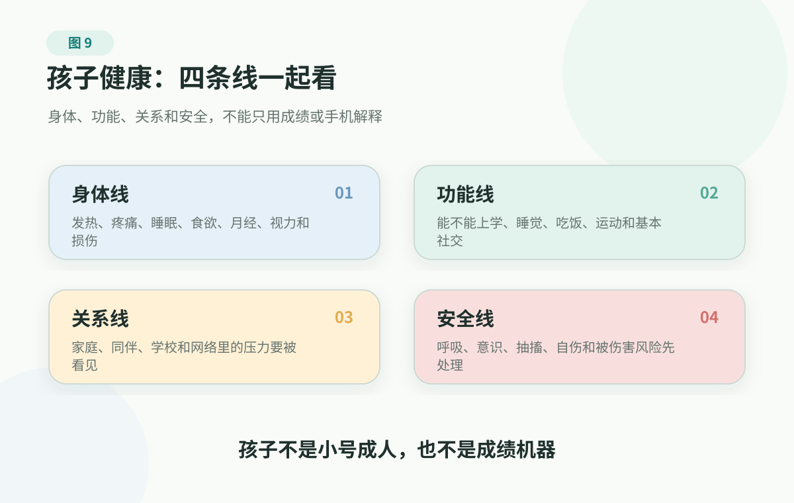

# 7. 儿童与青少年：身体和心理一起长大

> 孩子出现呼吸困难、意识改变、抽搐、严重外伤、明显脱水、剧烈疼痛、自伤自杀风险、被伤害风险或严重精神行为异常时，请及时联系急救、急诊或当地专业支持。本文帮助家庭理解孩子的身体和心理变化、整理信息和选择支持入口，不做诊断。

有些健康问题沉重、明确，常常需要医疗系统迅速接手。孩子的问题换了一种样子：很多事一开始没有那么明确，却天天发生在家里。

孩子早上说肚子痛，不想去学校；晚上刷手机停不下来，第二天又起不来；青春期女孩因为月经、痘痘和体型变得敏感；男孩突然不愿说话，顶嘴、熬夜、关门；成绩下降，家长第一反应是学习态度，孩子自己却说不清哪里不对。

这些场景一出现，大人很容易立刻找一个解释：手机害的，学习压力太大，到了青春期都这样，装病，偷懒，不懂事，心理出问题了。

这些解释有时碰到了一部分事实，但常常太快了。太快的解释会让家长错过更重要的问题：孩子的身体有没有危险？生活功能有没有被拖下去？他正在经历什么发育变化？学校、同伴和网络里有没有压力？家里的反应，是在帮他恢复，还是让他更不敢说？

这里不做儿科百科，也不做育儿方法大全。更重要的是帮家庭用健康的眼光看孩子，而不是只用成绩、听话、手机和情绪来解释孩子。

可以先记住一句话：**儿童和青少年的健康，不只是“有没有病”，也不只是“听不听话”；它是一个正在发育的人，怎样在身体变化、心理变化和关系变化中保持安全、功能和连接。**

## 孩子不是小号成人

成年人身体不舒服，通常能说得比较清楚：哪里痛，什么时候开始，什么动作会加重，休息后会不会缓解。孩子不一定能这样表达。

他们可能只会说：“肚子痛”“头痛”“累”“烦”“不想去学校”“没意思”“我不知道”“别管我”。

这些话背后可能是感染、过敏、睡眠不足、近视、月经问题、运动损伤，也可能是焦虑、被排挤、家庭冲突、同伴关系、网络事件，或者几件事一起发生。孩子越小，身体和情绪越容易混在一起说；进入青春期后，身体、外貌、自尊和同伴评价又会缠在一起。

所以看孩子的健康，最怕两种误判。

一种是把身体问题道德化。孩子说肚子痛，家长只听成“不想上学”；孩子说累，家长只听成“懒”；孩子睡不着，家长只听成“玩手机太晚”。

另一种是把成长变化病理化。孩子情绪波动、想要空间、在意同伴、开始有身体和性方面的好奇，家长立刻担心“是不是坏了”“是不是心理有病”。

更稳的做法，是先把孩子当成一个正在发育的人。发育意味着两件事：很多变化确实有年龄特点；同时，孩子的表达能力、调节能力和风险判断还没有完全成熟，需要大人托住边界。

## 四条线：身体、功能、关系、安全

看孩子的问题，可以先抓四条线。

<figure class="book-figure">
  
</figure>

这四条线的顺序很重要：先看安全和身体，再看功能和关系；但不要只看身体，也不要只看关系。孩子的问题经常不是单线条的。

## 该管的是底盘，不是所有细节

很多家长一说“管孩子健康”，就会不自觉地管到每一个细节：几点洗澡、鞋怎么放、字写得整不整齐、坐姿像不像样、手机每一分钟在看什么、跟谁聊天、为什么关门。

这些事有些当然要提醒，但如果它们占据了全部注意力，真正该管的事反而会被挤掉。

儿童和青少年阶段，家庭最应该管的是健康底盘。

第一，睡眠。睡眠不是学习之后剩下的时间，而是生长、注意力、情绪调节和身体恢复的底座。孩子长期睡不够，很多问题会一起变糟：白天困、烦躁、注意力差、运动少、食欲乱、手机更难停。

第二，运动和户外。运动不只是“锻炼身体”，也是孩子获得挫败、协作、胜任感和同伴连接的方式。比起把运动做成又一个任务，更重要的是帮孩子找到一个愿意长期玩的身体活动。

第三，食物环境和体重趋势。孩子吃什么、家里买什么、零食和含糖饮料是否随手可得，很大程度上由家庭决定。这里不适合用羞辱和嘲笑管理体型。真正要看的，是长期趋势、饮食结构、身体活动、睡眠和心理状态。

第四，基本就医和安全边界。发热、腹痛、头痛、过敏、视力、月经、运动损伤、情绪和行为变化，都需要知道什么时候观察、什么时候门诊、什么时候急诊。安全问题不能只靠“孩子自己会说”。

第五，逐渐把主导权还给孩子。青春期孩子需要从“被安排的人”变成“参与决定的人”。家长可以给边界、给资源、给后果解释，但不能把所有健康问题都变成控制。管得太细，孩子会把信息藏起来；放得太空，孩子又可能独自承担超出年龄的风险。

家庭可以把原则放得很简单：该管的要管住，尤其是底盘和红线；不该管太死的，要给空间，尤其是身份、隐私和逐渐长出的自主感。

## 身体线：青春期不是一句“叛逆期”

青春期不是一句“叛逆期”能概括的。

身体先开始变化：身高、体重、体味、体毛、声音、痘痘、月经、梦遗、性好奇、对外貌的敏感。孩子会一边好奇，一边尴尬，一边害怕被看见。早发育、晚发育、比同龄人高很多或矮很多，都可能影响自尊和社交。

心理也在重组。孩子开始更认真地问：我是谁？我在别人眼里是什么样？我有没有价值？我属于哪里？我能不能自己决定一些事？

这些问题不会以论文的方式出现。它们会落在衣服、发型、朋友圈、游戏、成绩、兴趣、恋爱、身体、隐私和“你不要管我”里。

所以，家长最需要避免的，是用羞辱管理身体。

不要嘲笑孩子的体味、痘痘、体型、发育速度和外貌焦虑。不要把月经、梦遗、自慰和性好奇说成肮脏或可怕。不要一边说“这有什么”，一边在亲戚朋友面前拿孩子的身体变化开玩笑。

身体变化不是羞耻，身体问题也不该被迫忍着。月经疼痛、出血异常、周期突然改变、视力明显下降、运动后持续疼痛、体重快速变化、反复头痛腹痛，都可以记录时间线，再带着事实去问医生；如果疼痛剧烈、出血明显、状态变差或伴随危险信号，就不要先等记录完整。家庭要做的不是给孩子下判断，而是让孩子知道：身体问题可以说，尴尬问题也可以问，危险问题不能一个人扛。

## 功能线：先看日子还能不能过

孩子的心理健康，不只是开不开心，也不是有没有诊断。对家庭来说，更实用的观察，是看一个孩子的日子还能不能运转。

他还能不能睡觉？能不能起床？能不能吃饭？能不能去学校？能不能完成基本任务？还能不能和至少一个人保持连接？还有没有一点点让自己觉得“我能做到”的事情？

青春期本来就会有波动。孩子会敏感，会别扭，会在意同伴，会想要空间，也会有一段时间不那么愿意和父母说话。问题不是孩子有没有情绪，而是这些变化有没有持续把生活功能拖下去。

美国国家心理健康研究所（NIMH）给儿童心理健康的家庭边界很值得借鉴：如果孩子的情绪或行为持续数周以上，造成明显痛苦，或影响学校、家庭、朋友功能，就应该考虑寻求帮助；如果行为不安全，或谈到伤害自己或别人，应立即求助。

换成家庭语言，就是：**不是一有情绪就看病，也不是功能已经塌了还继续讲道理。**

世界卫生组织（WHO）估计，全球 10-19 岁青少年中约七分之一经历心理健康状况；抑郁、焦虑和行为问题是青少年疾病和残疾的重要原因之一。这些数据不是为了吓家长，而是提醒我们：孩子的心理困难不是“小题大做”，也不是少数家庭才会遇到的意外。

## 身体和压力常常互相说话

很多孩子的心理压力，不会一开始就说成“我很焦虑”“我很低落”。它可能先变成身体和行为。

一个孩子每到周一早上就肚子痛，检查没有发现明确问题。大人很容易说：“你就是不想上学。”但更好的问法是：疼痛什么时候出现？周末有没有？吃饭、排便、发热、体重、睡眠有没有变化？进校门、进教室、见同学、上某一门课，哪一步最难？

这里不是说腹痛就是心理问题。腹痛要看腹痛，头痛要看头痛，月经、过敏、近视、感染、贫血、甲状腺、药物和慢病都可能影响状态。身体线永远不能跳过。

但如果身体症状、情绪和生活功能一起变化，就不能只说“检查没事”或“就是不努力”。压力会通过睡眠、食欲、胃肠反应、肌肉紧张和自主神经反应表现出来。孩子说不清，不等于身体不难受；检查暂时没有明确解释，也不等于孩子在装。

家庭可以先做一件很朴素的事：把症状放回时间线。什么时候开始？每天什么时候最明显？是否和上学、考试、同伴冲突、家庭争吵、睡眠不足、网络事件有关？孩子自己的解释是什么？有没有危险信号？

这张时间线，比一句“你到底怎么了”更有用。

## 手机不是唯一原因，但常常是压力出口

手机、游戏和短视频当然会制造问题：睡眠被挤掉，注意力被切碎，户外活动减少，眼睛疲劳，久坐和低头变多，网络冲突、网暴、色情暴力内容、打赏消费和隐私风险也可能出现。

但如果家长把所有问题都归因于手机，往往会错过真正的入口。

孩子可能不是因为手机才不去学校，而是去学校太痛苦，手机成了唯一能逃开的地方。孩子可能不是因为游戏才没动力，而是现实生活里长期没有胜任感、归属感和能承担的小任务。孩子可能不是因为短视频才脾气差，而是睡眠不足、身体紧张、家庭冲突和同伴压力一起把系统推到过载。

所以，限制屏幕使用有时是必要动作，但不能是唯一动作。只拿走手机，不补上睡眠、运动、同伴、兴趣、成就感和可沟通关系，孩子很可能只是换一种方式继续痛苦。

更好的拆法，是问五个问题。

第一，手机有没有挤掉睡眠？第二，有没有影响上学、吃饭、运动、作业和家庭互动？第三，孩子接触的内容有没有危险，比如网暴、色情、暴力、诈骗、危险挑战或极端内容？第四，线上关系是在帮助他连接，还是让他更孤立、更焦虑？第五，现实生活里有没有替代空间，比如运动、朋友、兴趣、社团、户外、一个不只看成绩的大人？

如果没有替代空间，单纯控制手机会变成一场消耗战。

## 关系线：孩子需要不止一个支持点

孩子的健康不只在身体里，也不只在家庭里。

一个孩子不愿上学，可能是学习跟不上，也可能是被孤立、被嘲笑、被欺凌、与老师冲突，害怕考试、害怕课堂发言，或害怕某段上学路。

一个孩子突然沉默，可能不是“变乖了”，而是失去一个重要朋友，被群聊排除，或在网上经历了羞辱。

一个孩子反复腹痛、头痛，可能确实需要儿科评估；也可能每到上学前更明显，说明身体正在替他说“我撑不住了”。

CDC 的青少年心理健康资料强调，学校、家庭、朋友和社区里的连接感，是保护青少年心理健康的重要因素。换成家庭语言，就是孩子需要不止一个支持点。

这个支持点可以是父母，也可以是亲戚、老师、校医、心理老师、教练、咨询师、朋友的父母、运动队、兴趣小组或社区活动。很多孩子的生活只有家庭和学校，而这两个地方都充满评价，于是手机、游戏、网络群聊、虚拟身份，成了他自己找到的第三空间。

第三空间不等于家长完全不管。安全、费用、成年人边界、网络隐私和时间安排仍然要看。但如果孩子只有“被检查”和“被评价”的地方，没有任何能释放、试错、被同伴接纳、体验自己有价值的地方，心理系统会变得很窄。

## 怎么和孩子谈健康

很多父母不是不关心，而是一开口就像审问。

“你为什么不上学？”

“你为什么总玩手机？”

“你到底怎么了？”

“你是不是抑郁了？”

“谁欺负你了？”

这些问题背后是担心，但孩子听到的常常是审判。可以把“为什么”换成“哪一步”。

比如，不问“你为什么不上学”，而问：“早上起床、出门、进校门、进教室、见同学，哪一步最难？”

不问“你为什么总玩手机”，而问：“手机里哪一部分让你最放松？现实里最近是不是有什么太难了？”

不问“你到底怎么了”，而问：“最近一天里，最难熬的是哪个时刻？”

不问“谁欺负你了”，而问：“最近在学校有没有让你害怕、丢脸、不想见到的人或事？”

如果孩子愿意说一点，先接住，不要立刻纠正。可以说：“谢谢你告诉我。这件事听起来真的很难。我先不急着评价你，我们一起看看下一步怎么让你安全一点、轻一点。”

如果孩子不愿说，也不要把沉默当成敌意。可以留下一个入口：“你现在不想说也可以。但如果你觉得不安全，或者有伤害自己的想法，这件事必须告诉我或另一个可信赖的大人。其他事情我们可以慢慢说。”

这不是沟通技巧表演。它背后的健康逻辑是：孩子一旦觉得说出来只会被审判，就会把更多信息藏起来；信息一旦断掉，身体问题、心理风险和学校风险都会更难被及时发现。

## 安全线：不要继续在家里猜

下面这些情况，不适合继续观察、讲道理或搜索资料。

呼吸困难、口唇发紫、明显喘憋；意识改变、叫不醒、抽搐后不能恢复、严重头部外伤；持续高热伴精神很差、明显嗜睡、反应差；反复呕吐、明显脱水、无法进水；剧烈腹痛、腹部越来越痛、走路都受影响，或伴发热、呕吐、便血；突发剧烈头痛，或头痛伴神经症状、视力改变、意识异常；外伤后不能负重、明显畸形、大量出血、怀疑骨折或关节严重损伤。

心理和安全方面，也有红线：孩子明确说想死、想消失、想伤害自己或别人；已经准备工具、地点或开始告别；出现自伤行为；被欺凌、虐待、性侵、严重威胁；幻觉、妄想、严重混乱、极度兴奋、连续很久不睡且行为明显异常；家长强烈觉得“这个孩子今晚不能一个人待着”。

这些时候，家庭动作要简单：别让孩子独处，移开可能造成伤害的工具，找一个可信赖的大人陪在现场，尽快联系急救、急诊、儿科急诊、精神专科急诊、学校应急负责人或当地危机支持。不同地区入口不同，但原则一样：先保安全，再谈原因。

如果不知道急诊、门诊还是挂什么科，可以先看 [就医科室与专科导航](../../handbook/playbooks/department-navigation-guide.md)；准备门诊前，用 [就医前问题清单](../../handbook/playbooks/doctor-visit-checklist.md) 把材料压缩成 1 页。

## 把变化记录一周

孩子的问题越复杂，越需要减少信息损耗。连续记录一周，不需要写成长日记，只要把关键变化留下来。

可以记什么时候开始，身体、睡眠和食欲有没有变化，上学、作业、运动、社交和洗漱这些功能有没有变，情绪、行为、学校同伴和家庭环境有没有明显变化。孩子自己的原话尤其重要；网络和手机如果牵涉睡前使用、群聊冲突、隐私、消费或打赏，也记下来。

红色信号不能等记录完成。任何自伤、自杀、伤人、被伤害、离家出走、严重失控或无法保证安全的信号，都要先保安全、先求助。

带着这份记录去看儿科、儿童保健、眼科、妇科、骨科、学校心理老师、儿童青少年精神心理或其他专业入口，都会比一句“最近状态不好”更有帮助。不要一次解决所有问题；先选一个你最担心的变化，找一个低压力时间，问孩子一个具体问题，不追问到底，比如“最近上学哪一步最难？”或者“睡前最停不下来的是什么？”如果可以，再给孩子补一个支持点：一次户外运动，一个可信赖老师，一个亲戚，一个兴趣活动，一次门诊预约，或者一次家长自己的心理支持。

很多时候，孩子不是缺少道理，而是缺少一个能让他重新获得安全、连接、掌控和一点点希望的环境。

## 参考资料

截至 2026-06-15，本章主要参考：

- WHO: [Adolescent mental health](https://www.who.int/news-room/fact-sheets/detail/adolescent-mental-health)
- CDC: [Youth Mental Health](https://www.cdc.gov/healthy-youth/mental-health/index.html)
- NIMH: [Children and Mental Health](https://www.nimh.nih.gov/health/publications/children-and-mental-health)
- MedlinePlus: [Teen Health](https://medlineplus.gov/teenhealth.html)
- MedlinePlus: [Children's Health](https://medlineplus.gov/childrenshealth.html)
- HealthyChildren.org/AAP: [Teen](https://www.healthychildren.org/English/ages-stages/teen/Pages/default.aspx)
- HealthyChildren.org/AAP: [Health Issues](https://www.healthychildren.org/English/health-issues/Pages/default.aspx)
- SAMHSA: [988 Suicide & Crisis Lifeline](https://www.samhsa.gov/find-help/988)

这些资料共同提醒：青春期是身体、情绪和社会关系快速变化的阶段；健康习惯、家庭和学校支持、同伴连接、及时就医和危险信号识别，都属于儿童青少年健康的一部分。

更多来源登记见 [source registry](../../../../shared/source-registry.md)。本书的证据规则见 [证据政策](../../references/evidence-policy.md)。

## 小结

- 儿童和青少年健康不是成人健康的缩小版。身体发育、表达能力、心理任务、学校同伴和就医入口都不同。
- 家长先看四条线：身体、功能、关系、安全。不要只看症状，也不要只看行为。
- 真正该管的是睡眠、运动、食物环境、基本就医和安全边界，不是用健康名义控制孩子的每个细节。
- 手机、拒学、腹痛、头痛、暴躁和沉默，常常是信号，不要只看表面行为。
- 有危险信号、持续功能受损或安全风险时，及时进入儿科、学校支持、儿童青少年精神心理或急诊。

---

## 阅读导航

- [回到中文主书目录](../README.md)
- 上一章：[6. 癌症与重大疾病：分清阶段，别让恐惧替你决定](cancer-and-major-illness.md)
- 下一章：[8. 常见专科问题：提高看病质量，而不是自己当医生](specialty-care-map.md)
