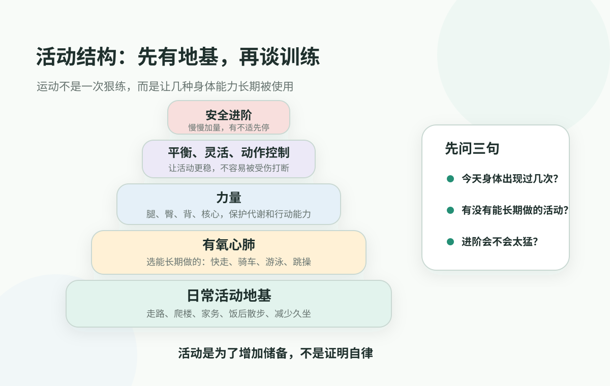
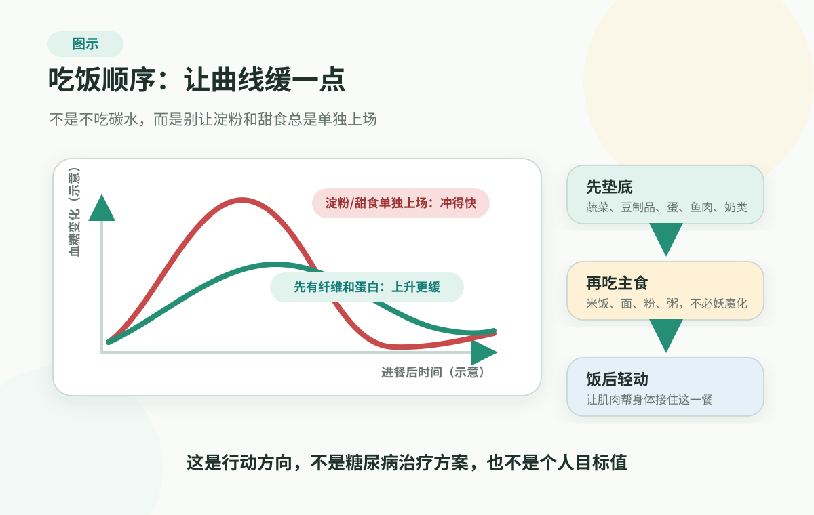

# 3. 共同上游：还没变成病时，先把风险往回拉

> 本文不是医疗建议，不能替代医生诊断、治疗、用药、停药、复查、康复、运动处方或饮食处方。已经确诊慢病、正在用药、指标明显异常、多项异常、属于高风险人群，或出现胸痛胸闷、明显气短、晕厥、卒中样症状、意识改变、严重疼痛、异常出血等危险信号时，请及时寻求医生或急救帮助。

前两节讲完，很多人会有一点紧张。

血压、血脂、血糖和尿酸，原来不是四个孤立数字；心梗、卒中这类大事，也常常不是毫无征兆地突然发生。风险像一条往前走的坡，有时走了很久，人才第一次看见报告上的箭头。

接下来先不把气氛继续往下压，而是把问题拉回日常：如果还没有走到严重疾病，身体其实常常给过我们一段往回调的时间。

最典型的场景，是体检后医生说：“先改善生活方式，过一段时间复查。”

这句话听起来温和，真正落到家里却很难。它不是急症指令，也不像诊断书那样有重量，很多人就把它理解成“问题不大”。可对慢性风险来说，这句话常常正好说明你还站在有主动空间的阶段：还没到必须讨论复杂治疗，但已经不适合继续放任默认生活。

接下来的问题是：到底改善什么？少吃海鲜，还是少喝酒？每天跑步，还是先睡觉？体重、尿酸、甘油三酯、血压和腰围都在变，是不是要从今天开始什么都不能吃？

很多人就卡在这里：轻了，觉得反正没病；重了，立刻给自己安排一套难以坚持的计划。更常见的是，买一堆补剂，收藏十几个食谱，下载运动 App，第一周很用力，第二周生活一忙又回到原样。

我更愿意把这件事叫作把趋势往回拉，而不是靠生活方式治疗某个病。它不替代医生，不替代药物，也不替代复诊；但在很多风险还没有变成严重后果之前，日常生活确实有一段可以介入的空间。

这个空间不在某个神奇动作里，而在一套日常默认值里：身体是否经常被调用，吃喝是不是总让系统加班，睡眠有没有恢复窗口，压力和关系有没有长期把人推在警戒状态里，以及你能不能用反馈看见变化。

把这五个入口放在一起看，生活方式就不再是四套禁令，而是一套可以调低上游负荷的日常地图：先动高频的，不先纠结偶尔的；先动容易重复的，不先设计完美的；先动能同时影响多个指标的，不先迷信某个单点技巧。活动有结构，饮食有质量，恢复有窗口，压力有出口，反馈能看见趋势。

先把压力放低一点：你不需要先变成一个很自律的人，才配开始管理健康。很多慢性风险不是被某次放纵推高的，而是被默认生活一点点推高的。把默认值改掉一点，身体就少一点被迫加班。

<figure class="book-figure">
  
</figure>

## 先把默认值调回来

到了生活方式这里，可以先把四高放回同一张日常背景里看：这些指标背后，是否有一组默认生活在反复加负荷。

一个人的血压、血脂、血糖、尿酸、体重腰围、脂肪肝、睡眠和情绪状态，经常不是一条线单独变坏。长期久坐、肌肉用得少、外卖和夜宵多、甜饮料和酒精变成习惯、睡眠被压缩、压力一直下不来，都会把身体推向同一个高负荷背景。

所以，先别追求厉害，也别指望一夜变成“健康达人”。更稳的思路，是给身体换一套日常默认值：身体经常被用到，餐盘结构不会天天把系统推到高负荷，夜里有恢复，压力来时有出口，指标和体感变化能被看见。

每天都喝的甜饮料，比一年吃几次甜点更值得先改；每晚都拖到很晚的睡眠，比偶尔一次聚餐更值得先救；每天坐十几个小时，比周末突然拼命运动更值得先处理。慢性风险最怕的不是某一天不完美，而是一个高负荷日子被复制了几年。

## 第一件事：让身体重新出现在一天里

现代生活最反常的地方，不是人不够努力，而是身体太久没有被完整使用。

很多人一天很忙，却几乎不怎么动。早上坐车，白天坐工位，吃饭靠外卖，晚上靠沙发和手机放松。身体好像一直在线，真正参与生活的却主要是眼睛、手指和大脑。腿、臀、背、心肺和肌肉，只在上下楼、赶地铁、搬东西时短暂出现一下。

这和身体原本的工作方式很不一样。血糖需要肌肉帮忙处理，血压和血管需要活动带来的调节，体重和腰围需要能量出口，睡眠也需要白天有足够的身体活动来建立节律。

所以，第一步不一定是“开始运动”，而是先让身体重新出现在一天里。

走路、爬楼、买菜、做饭、打扫、搬东西、饭后散步、站起来接电话、周末带家人出门，这些看起来不像训练，却是在给身体保留日常活动的地基。一个人如果一天从床到车、从车到椅子、从椅子到沙发，再好的训练计划也会变成生活之外的一件事。

所以，别一开始就问“我该练什么项目”。先问一个更诚实的问题：我的一天里，身体到底出现过几次？

饭后能不能先走十分钟，再坐回去；能不能把一段通勤、一层楼梯、一通电话变成站起来的机会；能不能在周末把“出去走走”变成家庭默认安排，而不是只有体检异常后才突然跑步。对血糖来说，饭后活动是在帮肌肉接住这一餐；对血压和血管来说，日常活动是在给调节系统一点弹性；对体重和尿酸来说，它是在给能量和代谢一个出口。你不是在用散步“抵消”一顿饭，而是在告诉身体：这一餐进来的能量，马上有地方去。

等这个地基稳住，再谈运动结构。

<figure class="book-figure">
  
</figure>

对已经开始认真关注健康的人来说，真正值得维护的不是“今天有没有打卡”，而是身体的几种能力有没有被长期使用。图里的地基是日常活动：走路、爬楼、家务、饭后散步、减少久坐。地基上面，才是能长期做的有氧活动、让肌肉真正用力的力量训练，以及平衡、灵活性和动作控制。

图里的顺序很简单：先让身体在生活里出现，再让心肺、肌肉和动作能力有机会被维护。进阶也要安全，太久没动的人，不需要用一次狠练证明自己改过自新；五分钟、十分钟不丢人，真正有价值的是这件事能不能变成下周、下个月还会发生的动作。

世界卫生组织把身体活动定义得很宽：工作、交通、家务、休闲中的身体移动都算。它也反复强调，任何活动都比完全不动好，所有活动都可以累积。这个表述对普通家庭很重要，因为它把“运动”从一种仪式，重新放回了生活。

当然，活动也有边界。运动中出现胸痛胸闷、明显气短、晕厥感、出冷汗、严重心悸，或者原本有心血管病、近期心梗卒中、心衰、房颤、严重关节疼痛，或出现脸歪、一侧无力、说话异常等疑似神经问题，就不要用普通健身建议硬套。活动是为了增加储备，不是用危险证明自律。

## 第二件事：让吃喝少一点系统加班

普通家庭先不用把每一克营养都算清楚，也不用一上来研究所有食物的 GI、嘌呤表和脂肪酸比例。更有用的，是先抓两个问题：每天反复出现的负荷有没有太高，餐盘里有没有足够能让身体慢慢处理这一餐的东西。

最值得先调整的，往往是那些经常出现的默认：甜饮料是不是成了日常，酒精是不是经常出现，夜宵是不是越吃越晚，外卖汤汁和酱料是不是越吃越重，白米白面和加工零食是不是一顿接一顿。单看哪一件都不像大事，连起来就是身体每天都在应付高负荷。

所以，餐盘结构比禁忌表更好用。先让蔬菜、豆类、全谷物和优质蛋白占到主位，再看主食需要多少；油、盐、糖、酒和加工食品尽量做配角。碳水、脂肪或肉类都不是天生的敌人，但来源、组合和出现频率，会决定这一餐是让身体从容处理，还是一上来就把系统推到高负荷。

控糖这件事尤其适合说明：很多行动可以从顺序和组合开始。理解血糖曲线以后，更低风险、也更容易执行的起点，是别让淀粉和甜食总是单独上场：一餐里先有几口蔬菜、豆制品、鸡蛋、鱼肉、奶类或其他蛋白质食物，再吃主食；想吃甜的，尽量放在正餐后，而不是空腹当加餐；吃主食时，旁边配一点纤维、蛋白质或健康脂肪。饭后轻轻走一走，也比吃完立刻坐回去更接近身体原本的使用方式。

<figure class="book-figure">
  
</figure>

很多时候，行动不必从“戒掉一切”开始，而可以从让这一餐少一点冲击开始。已经确诊糖尿病或正在用药的人，仍然要按医生建议管理。

尿酸特别能说明这个问题。很多人一听尿酸高，就只想到海鲜和啤酒，可尿酸还和身体生成、肾脏排泄、体重、酒精、含糖饮料、胰岛素抵抗、某些药物和遗传背景有关。NIAMS 关于痛风的资料也把酒精、含糖饮料、肥胖、代谢综合征、肾脏问题、某些药物和家族背景放在风险因素里，而不是只盯某一种食物。

这能提醒我们：改善生活方式更适合从反复出现的负荷开始。尿酸高的人如果只盯海鲜，却继续喝酒、喝甜饮料、熬夜、体重腰围往上走，方向就很容易跑偏。相反，先把酒精从常态里拿出来，换掉甜饮料，避免脱水和极端减肥，收回夜宵和大份主食，少一点外卖汤汁和重口味酱料，让蔬菜、豆类、全谷物、优质蛋白和足够饮水重新回到日常，往往更接近上游。每一种食物都不必被审判，真正值得盯住的是那些天天出现、反复推高负荷的习惯。

也不用承诺“这样就能降多少”。身体不是自动售货机，投进去一个动作，就吐出一个数字。更稳的判断是：如果吃喝结构长期更稳定，体重腰围、血糖、血脂、尿酸、脂肪肝和白天精力，才有机会一起往好的方向走。

已经确诊糖尿病、痛风、高血压、肾病、心血管病，或者正在用降糖、降压、降脂、降尿酸、利尿剂、抗凝等药物的人，不要把饮食调整当成治疗替代品。怎么吃、怎么复查、是否需要药物和目标值，都要和医生协作。

## 第三件事：给身体留出恢复窗口

睡眠不是努力一天之后的奖励，而是身体每天的维护窗口。

长期睡眠不足、节律混乱、睡了也不解乏，会影响血压、血糖调节、食欲、体重、情绪、注意力和活动意愿。人睡不好，第二天更容易靠咖啡、甜食、短视频和硬撑续命；白天越乱耗，晚上越难恢复。这样一圈转下来，很多人会误以为自己只是懒、馋、不自律，其实是恢复系统没有接上。

先把睡眠放在共同上游里看。它不只影响“困不困”，也会影响代谢、心血管、大脑和家庭情绪。下一节会单独展开睡眠与恢复，因为它太常见，也太容易被单一数据、熬夜文化和“补觉就行”误导。

先记住一个判断：如果一个生活方式计划会继续牺牲睡眠，它很难长期保护健康。一个人靠少睡、多练、少吃、硬扛来换短期指标，最后常常只是把身体从一种负荷推向另一种负荷。

所以，睡眠这里的起点，是先守住一个恢复窗口。睡前最后半小时少处理工作消息，夜里不要把短视频刷成第二天的疲劳，咖啡、酒精、夜宵和加班不要天天挤占睡眠。你不是在浪费时间，而是在给血压、血糖、食欲、情绪和第二天的行动力留维修时间。一个长期牺牲睡眠换来的“健康计划”，很可能从一开始就走偏了。

## 第四件事：别只靠意志力，给压力找出口

压力管理最容易被写成一句空话：想开点，别焦虑。

这句话通常没用。真正处在压力里的人，不是听不懂道理，而是身体已经进入警戒状态。心跳快，呼吸浅，肩颈紧，睡前还在想事；明明很累，却忍不住刷手机；明明知道该动一动，却提不起劲；明明想和家人好好说话，出口又变成指责。

这时继续骂自己不自律，往往只会再增加一层压力。很多坏循环不是因为人不知道该怎么做，而是因为人已经累到只能抓最快的安慰：甜食、酒精、短视频、熬夜报复、继续拖延。

更好的做法，是给身体设计能恢复的生活。

人不是纯靠理性驱动的机器。身体和大脑会回应进展、连接、平静和安全感。它们不是万能钥匙，但能解释一件事：如果一个动作能带来小进展、真实连接、身体放松或一点点正向体验，它就更容易坚持。

这也是为什么目标感和关系不是鸡汤。一个人如果只是在“减少风险”，很容易疲惫；如果他还有想完成的项目、想陪伴的人、想继续参与的生活，运动、饮食、睡眠和复查才更容易变成长期动作。健康行为不是悬在空中的自律，它需要嵌进一个人愿意继续生活、继续负责、继续连接的理由里。

恢复也有主动和被动之分。

短视频、甜食和酒精也能让人短暂好受，但它们的问题是太快、太密、太容易重复。它们更像短暂麻醉，不像恢复。真正能把人慢慢托起来的，往往是低刺激但可重复的东西：走路、阳光、规律作息、真实聊天、做饭、整理房间、陪孩子或父母出门、完成一个不大的任务。

主动恢复的特点，是人参与其中，而不是被信息推着走。饭后先出门走几分钟，不讨论今天走得够不够标准；困难任务先做一个小开头，让自己看见“我已经开始了”；压力很高时，先找一个真实的人说几句，而不是继续刷短视频。

这些动作很小，却有实际意义。它们在帮身体重新确认三件事：我还有一点行动感，我和别人还有连接，我还能从真实生活里得到一点恢复。压力出口的价值，就是让身体少一点长期警戒。

如果压力、焦虑、低落、惊恐、睡眠问题或躯体不适已经持续影响生活，或者出现自伤自杀风险，就不要把它当成生活方式问题自己扛。那已经进入专业帮助边界。

## 第五件事：用反馈看趋势，不靠感觉猜

生活方式最容易失败的地方，是只靠感觉。

感觉很会骗人。今天累一点，就觉得所有努力都没用；体重两天没变，就怀疑方向错了；尿酸或血脂一次没降，就开始换偏方；某天精神好一点，又觉得没必要复查。

更稳的方式，是把生活方式变成一组小实验。

小实验不是自己给自己看病，也不是每天把生活变成报表。它只是把动作、场景和结果放在一起看：这周晚饭后走十分钟，睡眠和第二天精神有没有变化？把甜饮料换掉两周，下午困倦、体重和尿酸趋势有没有变化？先吃蔬菜和蛋白质，再看主食需要多少，餐后犯困有没有变化？睡前少处理工作消息，第二天血压、情绪和专注有没有不同？

这里最重要的不是“限制”，而是“发现”。

发现自己饭后走十分钟比晚上硬练更容易坚持；发现甜饮料换成无糖茶后，下午困倦少了一点；发现先吃蔬菜和蛋白质后，饭后没那么困；发现睡前继续工作消息，第二天血压和情绪都更糟；发现尿酸、体重和饮酒、甜饮料、熬夜之间可能有关系。这些发现比口号有用，能让家庭从“你应该自律”变成“我们看见什么模式，下一步小改哪里”。

反馈不需要很复杂。你可以只看几条线：体重和腰围有没有慢慢变化，血压有没有趋势，血糖或 A1C、血脂、尿酸按医生建议复查后有没有方向，睡眠和白天精力有没有改善，活动是否能维持，哪些场景最容易让自己失控。

CDC 关于糖尿病前期的资料中，有一个很值得家庭吸收的方向：生活方式改变不是靠一句决心，而是通过小而可管理的步骤，学习健康饮食、增加活动、管理压力、保持动力和解决问题。这不只适用于血糖。很多慢性风险都需要这种“能放进生活里”的方法。

## 如果只做一件事：先做 7 天小实验

读到这里，不用立刻改造生活。先做一个小实验就够。

接下来 7 天，不要同时改十件事。先从下面三类里选一类：

- 身体类：每天饭后走 10 分钟，或把一通电话、一次通勤、一段家务变成站起来和动起来；
- 吃喝类：先拿掉一个高频负荷，比如甜饮料、夜宵、酒精、外卖汤汁或空腹甜食；
- 恢复类：睡前留出半小时，不处理工作消息，不把短视频刷到很晚。

不评分，不惩罚，也不急着发朋友圈立计划。7 天后只问三个问题：哪一个小动作最容易继续做？身体有没有给一点反馈？这个动作能不能放进下一个 7 天？

如果饭后散步最容易，就先保留它；如果换掉甜饮料最明显，就先保留它；如果睡前少处理工作消息让第二天舒服一点，就先从这里开始。一个能坚持的小动作，比一套坚持不了的完美计划更有价值。真正改变趋势的，常常不是某一天很猛，而是一个小动作被安静地重复了很久。开始不需要仪式感，下一顿饭、下一次坐久了起身、今晚睡前那半小时，就够了。

这就是共同上游最朴素的意思：不用等到病名出现，身体也可以通过趋势告诉你，哪里正在变重，哪里还有机会往回调。

## 什么情况不能只靠生活方式

共同上游很重要，但它不是安全垫。

有三类情况不要只靠自己调整。

第一，指标已经明显异常、持续异常，或多项一起异常。第二，已经确诊慢病、正在用药，或属于儿童、老人、孕产期、肝肾功能异常、免疫低下、多药使用、近期手术住院等更需要专业判断的人群。第三，出现胸痛胸闷、明显气短、晕厥、单侧无力、言语不清、意识改变、严重疼痛、异常出血，或生活方式调整后反而明显不适。

生活方式最好的位置，是和医疗判断协作：前面帮你降低负荷，中间帮医生看见趋势，后面帮助慢病和康复长期稳定。它不是用来替代诊断、药物、复诊或急救判断的。

## 参考资料

截至 2026-06-19，本章主要用 WHO 关于身体活动和久坐行为的资料、WHO 关于健康饮食的资料、American Heart Association 的 Life's Essential 8、CDC 关于糖尿病前期生活方式干预的资料、NIAMS 关于痛风原因和风险因素的资料，校准“共同上游”里活动、吃喝、睡眠恢复、压力管理和反馈记录的边界。

这些资料用于帮助家庭理解生活方式如何影响长期风险，不应用来替个人制定运动处方、饮食处方、药物方案、筛查计划或治疗优先级。

可直接查看：[WHO Physical activity](https://www.who.int/news-room/fact-sheets/detail/physical-activity)、[WHO Healthy diet](https://www.who.int/news-room/fact-sheets/detail/healthy-diet)、[American Heart Association Life's Essential 8](https://www.heart.org/en/healthy-living/healthy-lifestyle/lifes-essential-8)、[CDC On Your Way to Preventing Type 2 Diabetes](https://www.cdc.gov/diabetes-prevention/lifestyle-change-program/on-your-way-to-preventing-type-2-diabetes.html)、[NIAMS Gout Symptoms, Causes, and Risk Factors](https://www.niams.nih.gov/health-topics/gout/symptoms-causes-risk-factors)。更多来源登记见 [来源登记](../../../../shared/source-registry.md)。本书的证据规则见 [证据政策](../../references/evidence-policy.md)。

## 小结

共同上游不是让人背更多健康纪律，而是把风险从病名和指标里拉回日常生活。很多长期风险，常常藏在每天重复的默认动作里：身体很少被用到，吃喝反复高负荷，睡眠不断被挤掉，压力没有出口，变化也没人记录。

如果只能记住一个方向，就是先动那些每天都会重复的地方。生活方式可以把趋势往回拉，但不能替代医生判断、药物、复诊或急救。

下一节单独看睡眠与恢复。它是共同上游里最容易被低估的一项：不是偷懒，也不是空白时间，而是身体和大脑每天的系统维护。

---

## 阅读导航

- [回到中文主书目录](../README.md)
- 上一章：[心血管事件链：心梗和卒中不是突然发生的](cardiovascular-event-chain.md)
- 下一章：[睡眠与恢复：恢复不是偷懒，而是系统维护](sleep-and-recovery.md)
- 相关工具：[慢病指标记录表](../../handbook/templates/family-health-record.md#_2-慢病指标记录)、[体检前怎么选项目](../../handbook/playbooks/checkup-planning-guide.md)、[常见异常指标速查](../../handbook/playbooks/common-checkup-markers.md)
