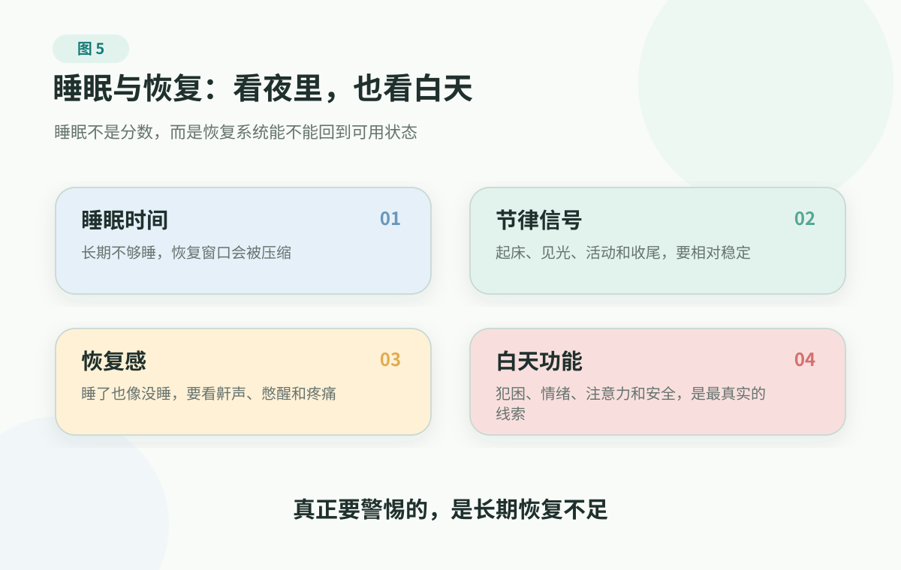

# 4. 睡眠与恢复：身体修复的隐形工程

> 本文不是医疗建议，不能替代医生诊断、治疗、用药、停药或睡眠障碍评估。长期失眠、明显日间功能受损、疑似睡眠呼吸暂停、重大疾病相关睡眠问题、自伤或自杀风险，请及时寻求医生或专业睡眠/心理健康帮助。

上一章把共同上游放回日常生活里看：活动、吃喝、恢复、压力连接和反馈，都会影响长期风险。这里单独拎出睡眠，是因为它太容易被低估，也太容易被误解。

睡眠不是偷懒，也不是空白时间。它是身体每天把许多系统从高负荷里拉回来的维护窗口。

很多人谈睡眠时，脑子里只有两个词：睡够了吗，睡深了吗。睡眠数据提示深睡少，开始焦虑；晚上没睡好，第二天觉得整个人都废了；一段时间工作忙，就指望周末猛睡来“补”；家里老人鼾声很重，白天坐着就打盹，却说“我睡得挺香”。

同一个家庭里，可能有四种完全不同的问题：有人是睡得太少，有人是节律乱了，有人是压力太高、身体停不下来，有人可能已经有睡眠呼吸暂停、疼痛、焦虑抑郁或药物影响。它们都表现为“睡不好”或“总是累”，但处理方式不是同一个。

睡眠不是每天晚上的一场考试。它更像身体系统的维护窗口：大脑要整理信息，心血管和代谢系统要降负荷，免疫和内分泌系统要重新校准，情绪系统也需要从持续紧绷里退下来。

真正值得警惕的，不是少睡一晚，而是长期恢复不足。

一两晚睡差通常不是大事。真正值得认真对待的是：睡眠长期不足、节律长期混乱，或者睡了也没有恢复感。它影响的不是“睡觉”这一件事，而是大脑、血管、代谢和白天状态能不能持续恢复。

恢复这件事，要把夜里和白天放在一起看：睡了多久、节律稳不稳、醒来有没有恢复感，以及白天还能不能安全、专注、情绪稳定，合起来才接近真实状态。

<figure class="book-figure">
  
</figure>

## 先看恢复，不看分数

不要追逐某一天的睡眠分数。更重要的是看：睡眠、白天精神、情绪稳定、身体恢复和日常功能，是否长期处在一个能支撑生活的水平。

一晚睡得好不好，当然会影响心情。但如果连续一段时间都睡不够、睡不稳、睡醒不解乏，影响就会从夜里扩散到白天。

  <section class="decision-card decision-card-blue">
    
大脑与认知风险

    <h3>反应、记忆和判断会先变粗</h3>
    
睡眠不足会影响学习、记忆、专注、反应和决策。开车、照护老人孩子、处理重要工作时，这不是小问题。

  </section>
  <section class="decision-card decision-card-green">
    
血管与代谢风险

    <h3>不是孤立的“睡觉问题”</h3>
    
睡眠不足会牵动血压、血糖调节、食欲、体重和心血管系统负担。它不是孤立的“睡觉问题”，而是很多系统共用的恢复时间。

  </section>
  <section class="decision-card decision-card-yellow decision-card-wide">
    
白天安全与情绪

    <h3>越累，越可能继续难睡</h3>
    
睡得差，白天更累；白天更累，活动更少、咖啡更多、情绪更紧，晚上又更难睡。长期下来，人容易把自己误解成“懒”或“不自律”。

  </section>

如果这些情况已经持续出现，睡眠就值得像血压、血糖、体重一样被记录和调整。

## 睡眠不是按下开关，而是三个条件

很多人改善睡眠，一上来就要求自己“今晚早点睡”。问题是，身体不是靠命令入睡的。夜里能不能顺利睡下去，往往取决于三个条件：动力、阻力和节律。

第一，是睡眠动力。

人清醒得越久，白天活动越充分，到了晚上越容易产生睡意。现代人的麻烦是，白天长期在室内久坐，晒不到光，身体活动不足，脑子却一直被会议、消息、短视频和工作输入刺激着。身体不够累，大脑很兴奋，夜里自然很难顺利降档。

第二，是睡眠阻力。

阻力不只来自噪音和灯光，也来自心理环境。睡前还在回工作消息、与家人争吵、刷刺激内容，或担心明天安排，都会让身体维持清醒。对睡眠本身的恐惧也是阻力：越担心“今晚又睡不着”，床就越像一个考场。

身体张力也常被低估。明明关灯了，也放下手机了，但肩颈绷着、牙关咬紧、呼吸浅，腰背或髋腿怎么放都不舒服。问题看起来在睡眠，其实身体还停在白天的撑住、代偿和防御状态里。

第三，是节律。

节律不是“所有人都必须早睡早起”，而是身体需要稳定信号：什么时候一天开始，什么时候逐渐收尾。固定起床时间、早晨见光、白天活动、相对稳定的进食和睡前降刺激，都是在告诉身体：现在该醒，晚上该睡。

很多人把睡眠管理理解成睡前半小时的事。其实，夜里能不能恢复，常常从早晨拉开窗帘、白天动一动、下午不把咖啡拖太晚、晚上把工作和娱乐降噪开始。

## 深睡重要，但不要追逐深睡

睡眠不是一个整块的“大觉”。一晚通常会经历多个睡眠周期，深睡通常在前半夜更多，是醒来后有没有恢复感的重要环节之一。

先抓三个重点：

- **身体降速：** 深睡时心率和呼吸更慢，身体进入更低唤醒状态，也和组织修复、生长激素释放等过程有关。
- **大脑恢复：** 睡眠不足会让人更难学习、记忆、集中和快速反应。
- **代谢清理线索：** 有研究提示，睡眠状态下脑内代谢废物清除更活跃。这是机制线索，不能简化成“深睡少就会得痴呆”。

对普通家庭更有用的判断是：

- 这段时间的睡眠是否长期不足；
- 白天功能是否明显下降；
- 是否有打鼾、憋醒、晨起头痛、白天嗜睡等疑似睡眠呼吸暂停表现；
- 是否伴随焦虑、抑郁、疼痛、夜尿、用药变化或重大压力；
- 是否已经影响安全，比如开车犯困、跌倒风险增加。

可穿戴设备可以帮助观察趋势，但不能替代医生判断。深睡、REM、睡眠质量这些指标有参考价值，也有测量局限。一个分数低，不等于身体已经出问题；一个分数好，也不等于白天功能一定正常。

如果答案指向持续问题，就该进入专业评估，而不是继续和设备分数较劲。

我见过一个很有画面感的例子。

一个年轻人陪母亲去医院看病。电梯刚上几层，他就靠着墙快睡着了。母亲第一反应是：“是不是昨晚又熬夜打游戏？”他也说不清，只觉得自己睡了像没睡，上车能睡、坐下能睡，白天总像被抽走了电。后来医生多问了几句，才发现他不只是困：晚上鼾声很重，家人听过他睡着时呼吸不顺，白天又明显嗜睡，血压也偏高。最后真正该接上的，不是再责备他自律差，而是把这些线索带去做睡眠相关评估。

这个故事不是让家人在电梯里诊断谁有病。它只是提醒我们：睡眠问题最真实的线索，常常不在设备分数里，而在白天功能里。一个人长期“睡了也像没睡”、鼾声很重、白天控制不住犯困，尤其还合并血压、体重、晨起头痛或憋醒等情况，就不该只被说成懒、熬夜或年纪大。

## 睡够了还累，问题可能在白天的耗电方式

有些人睡够了仍然累。这时不要急着再找一个助眠技巧，因为问题可能已经不只在睡眠。

可以把白天精力拆成四层：

- **体能：** 睡眠、运动、饮食、疾病和疼痛，决定能不能稳定供能；
- **情绪：** 焦虑、压力、冲突和持续低落，会让身体长期高唤醒；
- **注意力：** 消息、短视频、会议和任务切换，会把最好的清醒窗口切碎；
- **意义感：** 如果好精力总是被低价值事务拿走，人会越来越觉得“休息也没用”。

这不是要把健康书写成效率课，而是提醒一个常见误区：恢复不是只在床上发生。夜里能睡，白天少乱耗，情绪能降档，注意力不被持续打碎，人醒来后才更容易回到可用状态。

如果一个人白天一直在硬撑、急切切换、压住情绪、靠咖啡顶着，晚上躺下时，身体并不会因为关灯就立刻相信“安全了，可以修复了”。这就是为什么有些人明明很累，却睡不着；明明睡了，却不觉得恢复。

## 别乱用工具：先分清是哪一种累

恢复工具最容易被误用。补觉、午睡、NSDR、呼吸冥想、睡前仪式、CBT-I 听起来都像“让人休息”，但它们解决的不是同一个问题。

先把两个术语说清楚：

- **NSDR：** 可以理解为“不睡着的引导休息”，常见形式是躺着听引导放松、身体扫描或类似瑜伽休息术的练习。目标是短时间降唤醒，不是替代夜间睡眠。
- **CBT-I：** 失眠的认知行为治疗，是一套针对长期失眠的专业治疗方法，通常需要专业人员评估和指导，不是普通睡前小技巧。

  <section class="decision-card decision-card-green">
    
短时恢复

    <h3>白天掉电，但没有危险信号</h3>
    
<strong>适合什么：</strong>午后困倦、注意力下滑、前一晚睡少但仍需要继续工作。

    
<strong>可以试什么：</strong>短午睡、晒光、散步、喝水、NSDR 或呼吸觉察。目标是短时恢复，不是替代夜间睡眠。

  </section>
  <section class="decision-card decision-card-yellow">
    
回到节律

    <h3>熬夜、出差、周末作息漂移</h3>
    
<strong>适合什么：</strong>不是单纯睡少，而是起床、光照、活动、咖啡和晚间输入都乱了。

    
<strong>可以试什么：</strong>先稳住起床时间，早晨接触自然光，白天轻活动，午睡短一点且别太晚，晚上减少高刺激输入。

  </section>
  <section class="decision-card decision-card-blue">
    
降低唤醒

    <h3>身体很累，脑子和身体停不下来</h3>
    
<strong>适合什么：</strong>压力、争吵、工作切换、身体紧绷，让人躺下后仍像在警戒。

    
<strong>可以试什么：</strong>3 分钟呼吸觉察、身体扫描、睡前仪式、放松练习或 NSDR。它们是降档工具，不是失眠治疗的替代品。

  </section>
  <section class="decision-card decision-card-red">
    
专业路径

    <h3>已经形成失眠模式或有危险边界</h3>
    
<strong>看到什么：</strong>入睡困难、夜醒、早醒反复出现并影响白天功能；或怀疑睡眠呼吸暂停、抑郁焦虑、自伤风险、药物/酒精依赖、持续疼痛。

    
<strong>下一步：</strong>带着睡眠记录去找医生或专业睡眠/心理健康帮助。CBT-I 是失眠治疗路径的一部分，但不适合照着网上片段自行激进操作。

  </section>

补觉和午睡可以帮忙，但不能把长期透支合法化；NSDR、呼吸和冥想可以降唤醒，但不能替代夜间睡眠；CBT-I 比“睡眠卫生”更系统，但它是治疗路径，不是普通技巧清单。

工具不用越加越多，先把自己现在是哪类问题分清。

## 家庭能做的，不是监督谁几点睡

家庭里谈睡眠，很容易变成互相指责：“你又熬夜”“你又刷手机”“你就是不自律”。这通常没有用。

更有用的是一起减少恢复阻力。

比如，晚上约定一个不处理家庭争吵和重大决定的时间；睡前不在卧室里继续工作；家里有人早睡，就减少客厅强光、电视外放和反复开门；照护老人时，不只问睡了多久，也问夜里有没有憋醒、起夜、跌倒、早晨头痛和白天嗜睡。

对孩子和青少年，睡眠不是学习的敌人。长期压缩睡眠，换来的不一定是更多有效学习时间，反而可能是注意力、情绪和记忆效率下降。

对中年人，睡眠不是“等忙完再说”的事。越是处在高压、慢病风险、照护父母和养育孩子的夹层里，越需要把恢复当成家庭运行的一部分。

## 把睡眠放回两周里看

如果没有明显危险信号，也没有需要专业帮助的情况，先记录两周。记录不需要精确到分钟，只要能看出模式。

可以把上床、起床、夜醒和午睡这些时间记下来，也把咖啡、酒精、晚间屏幕、工作输入、白天精力、情绪、注意力、开车或照护是否受影响放进去。如果同时有肩颈、下颌、胸口、腰背、髋腿这些疼痛或不适，也别漏掉。补觉、午睡、NSDR、呼吸觉察或身体扫描用完以后，是更清醒、更放松，还是更乱，也值得顺手记一句。

记录的目的不是把睡眠变成新的考试，而是发现模式：到底是睡得太少，还是节律漂移；是白天活动不足，还是晚上刺激太多；是压力高唤醒，还是已经有需要专业判断的睡眠障碍线索。

## 先从一个不伤身体的动作开始

先别急着要求自己今晚一定早睡。先只选一个动作：固定起床时间，醒来后尽快开始白天流程；或者白天 5-10 分钟见光和活动；或者睡前做一个降噪动作，比如调暗灯光、把未完成事项写下来、停止工作消息、做 3 分钟呼吸觉察。共同目标不是“立刻睡着”，而是让身体知道：白天的警戒可以慢慢放下了。

如果这些动作让你更疼、更焦虑，或者睡眠问题已经影响白天功能，就不要继续自己加码。带着记录去问医生或专业人士，比继续猜更有用。

## 什么时候必须找专业帮助

以下情况应寻求医生或专业帮助：

- 失眠持续存在，并明显影响白天功能；
- 打鼾严重、憋醒、白天嗜睡，怀疑睡眠呼吸暂停；
- 睡眠问题伴随抑郁、焦虑、惊恐、自伤或自杀风险；
- 长期依赖酒精、安眠药或其他药物入睡；
- 老人夜间跌倒、意识混乱或白天明显嗜睡；
- 睡眠问题出现在重大疾病、孕产期或新用药之后；
- 颈肩、腰背或其他疼痛持续影响睡眠，或伴随麻木、无力、外伤后疼痛、发热头痛并颈部僵硬、吞咽或呼吸困难、夜间痛醒、走路和平衡异常。

出现自伤自杀风险时，请不要独处；中国大陆优先联系 120、110、急诊或精神专科急诊，也可同时拨打 12356 心理援助热线。其他地区请联系所在地危机热线、急救服务或急诊。

如果已经准备买助眠设备、检测或补剂，先用 [健康产品购买前检查清单](../../handbook/templates/health-product-checklist.md) 判断它是否会替代真正该做的事。

## 参考资料

截至 2026-06-15，本章主要参考：

- CDC: [About Sleep](https://www.cdc.gov/sleep/about/index.html)
- CDC: [Benefits of Physical Activity](https://www.cdc.gov/physical-activity-basics/benefits/)
- CDC: [Health Benefits of Physical Activity for Adults](https://www.cdc.gov/physical-activity-basics/health-benefits/adults.html)
- NHLBI/NIH: [Why Is Sleep Important?](https://www.nhlbi.nih.gov/health/sleep/why-sleep-important)
- NHLBI/NIH: [Sleep Deprivation and Deficiency: How Sleep Affects Your Health](https://www.nhlbi.nih.gov/health/sleep-deprivation/health-effects)
- NHLBI/NIH: [Stages of Sleep](https://www.nhlbi.nih.gov/health/sleep/stages-of-sleep)
- NHLBI/NIH: [Insomnia - Treatment](https://www.nhlbi.nih.gov/health/insomnia/treatment)
- NINDS/NIH: [Brain Basics: Understanding Sleep](https://www.ninds.nih.gov/health-information/public-education/brain-basics/brain-basics-understanding-sleep)
- NIH Research Matters: [How Sleep Clears the Brain](https://www.nih.gov/news-events/nih-research-matters/how-sleep-clears-brain)
- NIH Research Matters: [Lack of sleep in middle age may increase dementia risk](https://www.nih.gov/news-events/nih-research-matters/lack-sleep-middle-age-may-increase-dementia-risk)
- MedlinePlus: [Insomnia](https://medlineplus.gov/insomnia.html)
- MedlinePlus: [Neck pain](https://medlineplus.gov/ency/article/003025.htm)
- 国家卫生健康委: [关于应用“12356”全国统一心理援助热线电话号码的通知](https://www.nhc.gov.cn/yzygj/c100068/202412/49a1a65386cd4be582d4702fd0926ee8.shtml)
- NCCIH/NIH: [Relaxation Techniques: What You Need To Know](https://www.nccih.nih.gov/health/relaxation-techniques-what-you-need-to-know)
- NCCIH/NIH: [Meditation and Mindfulness: Effectiveness and Safety](https://www.nccih.nih.gov/health/meditation-and-mindfulness-effectiveness-and-safety)

更多来源登记见 [source registry](../../../../shared/source-registry.md)。本书的证据规则见 [证据政策](../../references/evidence-policy.md)。

## 小结

睡眠不是一场分数比赛；它是身体每天能不能完成维护的信号。先看恢复，再看时长；先稳节律、降阻力，再谈工具。睡眠不用一次改完，但长期恢复不足不该一直被忽略。

长期恢复不足，最后会牵动注意力、情绪、记忆和判断。很多所谓“想开点”的问题，背后也可能有身体和心理系统一起过载的线索。

---

## 阅读导航

- [回到中文主书目录](../README.md)
- 上一章：[3. 共同上游：还没变成病时，先把风险往回拉](common-upstream.md)
- 下一章：[5. 大脑与心理健康：先看安全、功能和支持](brain-and-mental-health.md)
